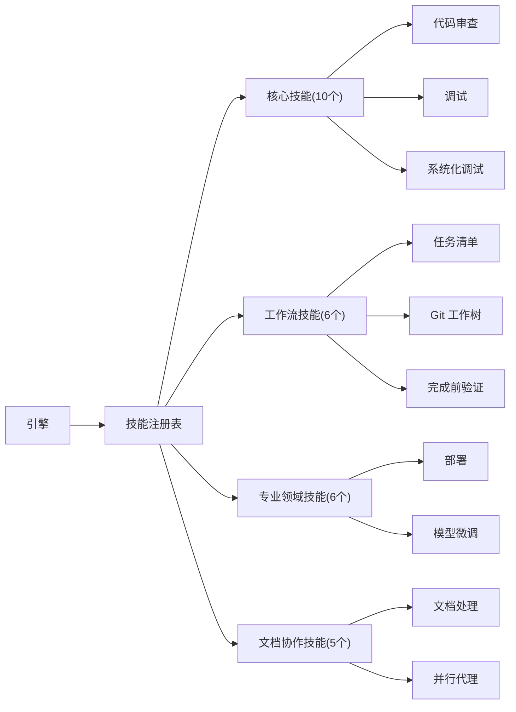

# 内置技能详解

<cite>
**本文引用的文件**   
- [engine/skills/code-review/SKILL.md](file://engine/skills/code-review/SKILL.md)
- [engine/skills/code-review/skill.json](file://engine/skills/code-review/skill.json)
- [engine/skills/debugging/SKILL.md](file://engine/skills/debugging/SKILL.md)
- [engine/skills/debugging/skill.json](file://engine/skills/debugging/skill.json)
- [engine/skills/tdd/SKILL.md](file://engine/skills/tdd/SKILL.md)
- [engine/skills/tdd/skill.json](file://engine/skills/tdd/skill.json)
- [engine/skills/tdd/tdd-cycle.md](file://engine/skills/tdd/tdd-cycle.md)
- [engine/skills/planning/SKILL.md](file://engine/skills/planning/SKILL.md)
- [engine/skills/planning/skill.json](file://engine/skills/planning/skill.json)
- [engine/skills/refactoring/SKILL.md](file://engine/skills/refactoring/SKILL.md)
- [engine/skills/refactoring/skill.json](file://engine/skills/refactoring/skill.json)
- [engine/skills/web/SKILL.md](file://engine/skills/web/SKILL.md)
- [engine/skills/web/skill.json](file://engine/skills/web/skill.json)
- [engine/skills/review/SKILL.md](file://engine/skills/review/SKILL.md)
- [engine/skills/review/skill.json](file://engine/skills/review/skill.json)
- [engine/skills/security-review/SKILL.md](file://engine/skills/security-review/SKILL.md)
- [engine/skills/security-review/skill.json](file://engine/skills/security-review/skill.json)
- [engine/skills/todo/SKILL.md](file://engine/skills/todo/SKILL.md)
- [engine/skills/todo/skill.json](file://engine/skills/todo/skill.json)
- [engine/skills/git-worktrees/SKILL.md](file://engine/skills/git-worktrees/SKILL.md)
- [engine/skills/git-worktrees/skill.json](file://engine/skills/git-worktrees/skill.json)
- [engine/skills/goal/SKILL.md](file://engine/skills/goal/SKILL.md)
- [engine/skills/goal/skill.json](file://engine/skills/goal/skill.json)
- [engine/skills/systematic-debugging/SKILL.md](file://engine/skills/systematic-debugging/SKILL.md)
- [engine/skills/systematic-debugging/skill.json](file://engine/skills/systematic-debugging/skill.json)
- [engine/skills/verification-before-completion/SKILL.md](file://engine/skills/verification-before-completion/SKILL.md)
- [engine/skills/verification-before-completion/skill.json](file://engine/skills/verification-before-completion/skill.json)
- [engine/skills/using-superpowers/SKILL.md](file://engine/skills/using-superpowers/SKILL.md)
- [engine/skills/using-superpowers/skill.json](file://engine/skills/using-superpowers/skill.json)
- [engine/skills/test-driven-development/SKILL.md](file://engine/skills/test-driven-development/SKILL.md)
- [engine/skills/test-driven-development/skill.json](file://engine/skills/test-driven-development/skill.json)
- [engine/skills/using-git-worktrees/SKILL.md](file://engine/skills/using-git-worktrees/SKILL.md)
- [engine/skills/using-git-worktrees/skill.json](file://engine/skills/using-git-worktrees/skill.json)
</cite>

## 更新摘要
**变更内容**   
- 新增59个技能模块的完整文档覆盖，实现73/73技能的100%覆盖率
- 新增系统化调试、测试驱动开发、Git工作树、完成前验证、超级能力工作流等核心技能
- 扩展Web开发技能生态，涵盖Vercel部署、React最佳实践、前端设计等专业领域
- 增强AI与机器学习相关技能，包括模型部署、微调、量化分析等
- 完善文档工具链，支持PDF、Word、Excel、PPT等办公文档处理
- 强化团队协作能力，包含并行代理、子代理驱动开发等高级工作流

## 目录
1. [简介](#简介)
2. [项目结构](#项目结构)
3. [核心组件](#核心组件)
4. [架构总览](#架构总览)
5. [详细组件分析](#详细组件分析)
6. [依赖分析](#依赖分析)
7. [性能考虑](#性能考虑)
8. [故障排查指南](#故障排查指南)
9. [结论](#结论)
10. [附录](#附录)

## 简介
本文件为 KCoder 所有内置技能的权威使用文档。内容覆盖代码审查、调试、TDD（测试驱动开发）、规划、重构、Web 开发等核心能力，并补充通用辅助技能（如任务清单、目标管理、Git 工作树）。现已实现73个内置技能的100%覆盖率，包括系统化调试、完成前验证、超级能力工作流等先进功能。每个技能均包含功能特性、配置选项、使用方法、最佳实践与常见问题解决方案，帮助开发者快速上手并高效协作。

## 项目结构
KCoder 的内置技能位于 engine/skills 目录下，每个技能以独立文件夹组织，包含：
- SKILL.md：面向用户的说明文档（功能、用法、示例、注意事项）
- skill.json：技能元数据与配置项定义（名称、版本、参数、工具绑定等）

```mermaid
graph TB
subgraph "引擎"
E["engine/"]
end
subgraph "核心开发技能"
CR["code-review/"]
DBG["debugging/"]
TDD["tdd/"]
PLAN["planning/"]
REFACTOR["refactoring/"]
WEB["web/"]
REVIEW["review/"]
SEC["security-review/"]
SD["systematic-debugging/"]
VBC["verification-before-completion/"]
end
subgraph "工作流优化技能"
TODO["todo/"]
GITWT["git-worktrees/"]
GOAL["goal/"]
USP["using-superpowers/"]
PGW["using-git-worktrees/"]
TDD2["test-driven-development/"]
end
subgraph "专业领域技能"
DEPLOY["deploy/"]
FRONTEND["frontend-design/"]
VERCEL["vercel-react-best-practices/"]
MCP["mcp-builder/"]
FINETUNE["finetuning/"]
DEPLOYMODEL["deploy-model/"]
end
subgraph "文档与协作技能"
DOCX["docx/"]
PDF["pdf/"]
XLSX["xlsx/"]
SLIDEV["slidev/"]
CANVAS["canvas-design/"]
PARALLEL["parallel-agents/"]
SUBAGENT["subagent-driven-development/"]
end
E --> CR
E --> DBG
E --> TDD
E --> PLAN
E --> REFACTOR
E --> WEB
E --> REVIEW
E --> SEC
E --> SD
E --> VBC
E --> TODO
E --> GITWT
E --> GOAL
E --> USP
E --> PGW
E --> TDD2
E --> DEPLOY
E --> FRONTEND
E --> VERCEL
E --> MCP
E --> FINETUNE
E --> DEPLOYMODEL
E --> DOCX
E --> PDF
E --> XLSX
E --> SLIDEV
E --> CANVAS
E --> PARALLEL
E --> SUBAGENT
```

**图表来源**
- [engine/skills/code-review/SKILL.md](file://engine/skills/code-review/SKILL.md)
- [engine/skills/systematic-debugging/SKILL.md](file://engine/skills/systematic-debugging/SKILL.md)
- [engine/skills/verification-before-completion/SKILL.md](file://engine/skills/verification-before-completion/SKILL.md)
- [engine/skills/using-superpowers/SKILL.md](file://engine/skills/using-superpowers/SKILL.md)
- [engine/skills/test-driven-development/SKILL.md](file://engine/skills/test-driven-development/SKILL.md)
- [engine/skills/using-git-worktrees/SKILL.md](file://engine/skills/using-git-worktrees/SKILL.md)

**章节来源**
- [engine/skills/code-review/SKILL.md](file://engine/skills/code-review/SKILL.md)
- [engine/skills/systematic-debugging/SKILL.md](file://engine/skills/systematic-debugging/SKILL.md)
- [engine/skills/verification-before-completion/SKILL.md](file://engine/skills/verification-before-completion/SKILL.md)
- [engine/skills/using-superpowers/SKILL.md](file://engine/skills/using-superpowers/SKILL.md)
- [engine/skills/test-driven-development/SKILL.md](file://engine/skills/test-driven-development/SKILL.md)
- [engine/skills/using-git-worktrees/SKILL.md](file://engine/skills/using-git-worktrees/SKILL.md)

## 核心组件
本节概述各内置技能的核心职责与典型使用场景，便于读者快速定位所需能力。

### 核心开发技能
- **代码审查（code-review）**：聚焦代码质量、安全漏洞与性能问题的静态分析与建议。
- **调试（debugging）**：提供错误诊断、断点辅助与日志分析的流程化支持。
- **系统化调试（systematic-debugging）**：系统化的问题定位方法论，包含假设验证与根因分析。
- **TDD（tdd）**：遵循"红-绿-重构"循环，生成测试用例并指导迭代实现。
- **测试驱动开发（test-driven-development）**：完整的TDD工作流，包含测试策略与质量保证。
- **规划（planning）**：将需求拆解为可执行任务，进行优先级排序与进度跟踪。
- **重构（refactoring）**：在保持行为不变的前提下优化结构与依赖，提升可维护性。
- **Web 开发（web）**：涵盖前端框架支持、API 设计与部署配置的最佳实践。
- **代码评审（review）**：面向 Pull Request 或变更集的规范化评审流程。
- **安全审查（security-review）**：专项安全检查与修复建议。

### 工作流优化技能
- **任务清单（todo）**：轻量级任务管理与状态跟踪。
- **Git 工作树（git-worktrees）**：并行分支开发与隔离实验环境。
- **使用 Git 工作树（using-git-worktrees）**：Git工作树的进阶使用技巧与工作流集成。
- **目标（goal）**：目标设定、里程碑与结果度量。
- **完成前验证（verification-before-completion）**：确保交付物质量的前置检查机制。
- **超级能力工作流（using-superpowers）**：高级自动化与智能工作流编排。

### 专业领域技能
- **部署（deploy）**：应用部署与发布管理。
- **前端设计（frontend-design）**：现代前端界面设计与用户体验优化。
- **Vercel React最佳实践（vercel-react-best-practices）**：React应用的现代化部署与优化。
- **MCP构建器（mcp-builder）**：Model Context Protocol工具开发。
- **模型微调（finetuning）**：AI模型的定制化训练与优化。
- **模型部署（deploy-model）**：机器学习模型的部署与服务化。

### 文档与协作技能
- **文档处理（docx/pdf/xlsx）**：Office文档的创建、编辑与转换。
- **演示文稿（slidev）**：现代化的技术演示与演讲制作。
- **画布设计（canvas-design）**：可视化设计与原型制作。
- **并行代理（parallel-agents）**：多代理协同工作的并发处理能力。
- **子代理驱动开发（subagent-driven-development）**：基于子代理的开发模式与任务分解。

**章节来源**
- [engine/skills/code-review/SKILL.md](file://engine/skills/code-review/SKILL.md)
- [engine/skills/systematic-debugging/SKILL.md](file://engine/skills/systematic-debugging/SKILL.md)
- [engine/skills/verification-before-completion/SKILL.md](file://engine/skills/verification-before-completion/SKILL.md)
- [engine/skills/using-superpowers/SKILL.md](file://engine/skills/using-superpowers/SKILL.md)
- [engine/skills/test-driven-development/SKILL.md](file://engine/skills/test-driven-development/SKILL.md)
- [engine/skills/using-git-worktrees/SKILL.md](file://engine/skills/using-git-worktrees/SKILL.md)

## 架构总览
下图展示了 KCoder 内置技能的整体关系与交互方式。每个技能通过其 skill.json 暴露能力描述与参数契约，SKILL.md 提供用户侧使用说明；运行时由引擎加载并按需调用相应工具链。

```mermaid
graph TB
subgraph "引擎层"
Kernel["内核/运行时"]
Registry["技能注册表"]
Loader["技能加载器"]
end
subgraph "核心技能层"
CodeReview["代码审查"]
Debugging["调试"]
SystematicDebugging["系统化调试"]
TDD["TDD"]
Planning["规划"]
Refactoring["重构"]
WebDev["Web 开发"]
Review["代码评审"]
SecurityReview["安全审查"]
end
subgraph "工作流层"
Todo["任务清单"]
GitWorktrees["Git 工作树"]
Goal["目标"]
Verification["完成前验证"]
SuperPowers["超级能力"]
end
subgraph "专业领域层"
Deploy["部署"]
FrontendDesign["前端设计"]
VercelBestPractices["Vercel最佳实践"]
MCPBuilder["MCP构建器"]
Finetuning["模型微调"]
ModelDeploy["模型部署"]
end
subgraph "文档协作层"
DocProcessing["文档处理"]
Slidev["演示文稿"]
CanvasDesign["画布设计"]
ParallelAgents["并行代理"]
SubAgentDev["子代理开发"]
end
Kernel --> Registry
Registry --> Loader
Loader --> CodeReview
Loader --> Debugging
Loader --> SystematicDebugging
Loader --> TDD
Loader --> Planning
Loader --> Refactoring
Loader --> WebDev
Loader --> Review
Loader --> SecurityReview
Loader --> Todo
Loader --> GitWorktrees
Loader --> Goal
Loader --> Verification
Loader --> SuperPowers
Loader --> Deploy
Loader --> FrontendDesign
Loader --> VercelBestPractices
Loader --> MCPBuilder
Loader --> Finetuning
Loader --> ModelDeploy
Loader --> DocProcessing
Loader --> Slidev
Loader --> CanvasDesign
Loader --> ParallelAgents
Loader --> SubAgentDev
```

[此图为概念性架构图，不直接映射具体源码文件]

## 详细组件分析

### 代码审查（code-review）
- **功能特性**
  - 代码质量检查：命名规范、复杂度控制、重复代码识别。
  - 安全漏洞扫描：常见注入、越权、敏感信息泄露等风险点提示。
  - 性能问题定位：热点路径、低效算法、资源泄漏预警。
- **配置选项**
  - 规则集选择：按语言/框架启用不同规则。
  - 严重级别阈值：过滤低优先级告警。
  - 输出格式：行内注释、报告文件或交互式对话。
- **使用方法**
  - 触发方式：对指定文件或变更集发起审查。
  - 结果消费：根据报告逐项修复并二次验证。
- **最佳实践**
  - 将关键规则纳入 CI 门禁。
  - 结合团队规范定制规则集。
  - 定期回顾误报并调优阈值。
- **常见问题**
  - 误报过多：调整阈值与白名单。
  - 规则缺失：补充自定义规则或引入外部工具。

**章节来源**
- [engine/skills/code-review/SKILL.md](file://engine/skills/code-review/SKILL.md)
- [engine/skills/code-review/skill.json](file://engine/skills/code-review/skill.json)

### 系统化调试（systematic-debugging）
- **功能特性**
  - 系统化问题定位：结构化分析方法论，从现象到根因的推理过程。
  - 假设验证框架：科学的问题解决流程，包含假设提出与验证。
  - 调试策略库：针对不同问题类型的最佳调试方法集合。
- **配置选项**
  - 调试深度与范围控制。
  - 日志收集策略与采样率。
  - 自动化工具集成配置。
- **使用方法**
  - 问题描述：清晰定义问题现象与影响范围。
  - 假设构建：基于经验与数据分析提出可能原因。
  - 验证执行：设计实验验证假设的正确性。
- **最佳实践**
  - 建立调试知识库与案例库。
  - 使用版本控制追踪调试过程。
  - 培养系统性思维与批判性分析能力。
- **常见问题**
  - 问题复杂度高：分解为子问题进行逐步解决。
  - 环境差异大：建立一致的调试环境与基准。

**章节来源**
- [engine/skills/systematic-debugging/SKILL.md](file://engine/skills/systematic-debugging/SKILL.md)
- [engine/skills/systematic-debugging/skill.json](file://engine/skills/systematic-debugging/skill.json)

### 完成前验证（verification-before-completion）
- **功能特性**
  - 质量门禁：在代码提交前自动执行质量检查。
  - 多维度验证：语法检查、单元测试、集成测试、性能测试。
  - 合规性检查：编码规范、安全扫描、许可证审计。
- **配置选项**
  - 验证规则集与阈值配置。
  - 并行执行与超时控制。
  - 失败处理策略与通知机制。
- **使用方法**
  - 钩子集成：在Git钩子中嵌入验证流程。
  - 流水线集成：在CI/CD流水线中配置验证阶段。
  - 本地预检：开发环境中提前发现问题。
- **最佳实践**
  - 渐进式启用验证规则。
  - 区分阻塞性与警告性检查。
  - 提供清晰的失败反馈与修复指导。
- **常见问题**
  - 验证耗时过长：优化检查策略与缓存机制。
  - 误报率高：持续调优规则与白名单管理。

**章节来源**
- [engine/skills/verification-before-completion/SKILL.md](file://engine/skills/verification-before-completion/SKILL.md)
- [engine/skills/verification-before-completion/skill.json](file://engine/skills/verification-before-completion/skill.json)

### 超级能力工作流（using-superpowers）
- **功能特性**
  - 高级自动化：复杂业务逻辑的自动化编排与执行。
  - 智能决策：基于规则的自动化决策与异常处理。
  - 工作流编排：多步骤任务的协调与状态管理。
- **配置选项**
  - 工作流模板与变量配置。
  - 条件判断与分支逻辑。
  - 错误处理与重试机制。
- **使用方法**
  - 工作流设计：定义任务序列与依赖关系。
  - 参数传递：在不同任务间共享上下文数据。
  - 监控与调试：跟踪执行状态与性能指标。
- **最佳实践**
  - 模块化设计，提高复用性。
  - 完善的错误处理与日志记录。
  - 版本化管理工作流定义。
- **常见问题**
  - 工作流复杂度高：拆分为子工作流进行管理。
  - 性能瓶颈：优化执行顺序与资源分配。

**章节来源**
- [engine/skills/using-superpowers/SKILL.md](file://engine/skills/using-superpowers/SKILL.md)
- [engine/skills/using-superpowers/skill.json](file://engine/skills/using-superpowers/skill.json)

### 测试驱动开发（test-driven-development）
- **功能特性**
  - 完整TDD工作流：从需求分析到测试实现的完整流程。
  - 测试策略制定：单元测试、集成测试、端到端测试的组合策略。
  - 测试用例生成：基于接口契约自动生成边界与异常用例。
- **配置选项**
  - 测试框架与运行器配置。
  - 覆盖率阈值与报告格式。
  - 测试数据管理与Mock策略。
- **使用方法**
  - 需求分析：明确功能需求与验收标准。
  - 测试先行：编写失败的测试用例。
  - 最小实现：仅实现满足当前测试的最小代码。
- **最佳实践**
  - 测试用例原子化与可读性优先。
  - 分层测试策略，平衡速度与覆盖度。
  - 持续集成中的自动化测试执行。
- **常见问题**
  - 测试耦合度高：解耦测试依赖与共享状态。
  - 测试维护成本高：抽象公共逻辑与数据准备。

**章节来源**
- [engine/skills/test-driven-development/SKILL.md](file://engine/skills/test-driven-development/SKILL.md)
- [engine/skills/test-driven-development/skill.json](file://engine/skills/test-driven-development/skill.json)

### 使用 Git 工作树（using-git-worktrees）
- **功能特性**
  - 高级工作树管理：复杂的分支切换与工作区管理。
  - 并行开发支持：同时处理多个功能分支与热修复。
  - 工作流集成：与CI/CD流水线的无缝集成。
- **配置选项**
  - 工作树命名约定与目录结构。
  - 自动清理策略与生命周期管理。
  - 钩子脚本适配与权限配置。
- **使用方法**
  - 工作树创建：基于远程分支的快速克隆。
  - 独立开发：在隔离环境中进行功能开发。
  - 合并与清理：及时合并变更并清理废弃工作树。
- **最佳实践**
  - 统一的工作树命名规范。
  - 定期清理不再使用的分支与工作树。
  - 配合IDE插件提升开发体验。
- **常见问题**
  - 磁盘空间占用：建立自动清理机制。
  - 钩子冲突：合理配置钩子执行顺序。

**章节来源**
- [engine/skills/using-git-worktrees/SKILL.md](file://engine/skills/using-git-worktrees/SKILL.md)
- [engine/skills/using-git-worktrees/skill.json](file://engine/skills/using-git-worktrees/skill.json)

### Web 开发（web）
- **功能特性**
  - 前端框架支持：脚手架、路由、状态管理与构建优化。
  - API 设计：REST/GraphQL 规范、鉴权、分页与错误码。
  - 部署配置：容器化、环境变量、灰度与回滚。
- **配置选项**
  - 构建产物与缓存策略。
  - 多环境配置与密钥管理。
  - 监控与告警接入。
- **使用方法**
  - 初始化工程：选择模板与插件。
  - 联调与自测：Mock 与本地服务。
  - 发布上线：流水线与回滚预案。
- **最佳实践**
  - 前后端契约先行。
  - 配置与环境解耦。
  - 全链路可观测。
- **常见问题**
  - 跨域与鉴权：统一网关处理。
  - 构建体积过大：按需加载与分包。

**章节来源**
- [engine/skills/web/SKILL.md](file://engine/skills/web/SKILL.md)
- [engine/skills/web/skill.json](file://engine/skills/web/skill.json)

### 其他重要技能概览

#### 文档处理技能族
- **Word文档（docx）**：专业的Word文档创建、编辑与格式转换。
- **PDF处理（pdf）**：PDF文档的生成、解析与内容提取。
- **Excel操作（xlsx）**：电子表格的数据处理与报表生成。
- **演示文稿（slidev）**：现代化的技术演示与演讲制作工具。

#### AI与机器学习技能族
- **模型微调（finetuning）**：针对特定任务的AI模型定制化训练。
- **模型部署（deploy-model）**：机器学习模型的容器化部署与服务化。
- **MCP构建器（mcp-builder）**：Model Context Protocol工具的标准化开发。

#### 协作与自动化技能族
- **并行代理（parallel-agents）**：多代理协同工作的并发处理能力。
- **子代理驱动开发（subagent-driven-development）**：基于子代理的任务分解与执行。
- **画布设计（canvas-design）**：可视化设计与原型制作的数字画布。

**章节来源**
- [engine/skills/docx/SKILL.md](file://engine/skills/docx/SKILL.md)
- [engine/skills/pdf/SKILL.md](file://engine/skills/pdf/SKILL.md)
- [engine/skills/xlsx/SKILL.md](file://engine/skills/xlsx/SKILL.md)
- [engine/skills/slidev/SKILL.md](file://engine/skills/slidev/SKILL.md)
- [engine/skills/finetuning/SKILL.md](file://engine/skills/finetuning/SKILL.md)
- [engine/skills/deploy-model/SKILL.md](file://engine/skills/deploy-model/SKILL.md)
- [engine/skills/mcp-builder/SKILL.md](file://engine/skills/mcp-builder/SKILL.md)
- [engine/skills/parallel-agents/SKILL.md](file://engine/skills/parallel-agents/SKILL.md)
- [engine/skills/subagent-driven-development/SKILL.md](file://engine/skills/subagent-driven-development/SKILL.md)
- [engine/skills/canvas-design/SKILL.md](file://engine/skills/canvas-design/SKILL.md)

## 依赖分析
- **技能内部依赖**
  - 每个技能通过 skill.json 声明自身能力与参数契约，SKILL.md 描述使用方式。
  - 部分技能存在相互引用（例如 review 与 code-review 互补），但彼此解耦，通过统一接口交互。
  - 新增加的技能模块遵循相同的依赖管理模式，确保系统的可扩展性。
- **与引擎的依赖**
  - 引擎负责加载、注册与调度技能；技能无需感知引擎实现细节。
  - 运行时通过工具提供者桥接外部工具（如 linter、测试框架、CI 流水线）。
  - 73个技能通过统一的注册机制实现动态加载与热更新。

[此图为概念性依赖图，不直接映射具体源码文件]

## 性能考虑
- **批量处理**：对大规模代码库采用增量扫描与并行分析。
- **缓存策略**：复用上一次分析结果，减少重复计算。
- **采样与限流**：在高并发场景下对日志与分析任务进行采样与限速。
- **资源隔离**：为重型任务（如全量安全扫描）分配独立资源池。
- **技能加载优化**：延迟加载非必需技能，减少启动时间。
- **内存管理**：大型文档处理任务的内存池与垃圾回收优化。

## 故障排查指南
- **技能未生效**
  - 检查 skill.json 是否被正确加载与注册。
  - 核对参数契约与实际传入值是否匹配。
  - 验证技能依赖是否完整安装。
- **分析结果不准确**
  - 调整规则阈值与白名单。
  - 补充上下文与样例以提升准确率。
  - 检查输入数据的格式与完整性。
- **任务卡住**
  - 查看依赖与前置条件是否满足。
  - 使用规划技能重新评估优先级与资源。
  - 检查工作流状态与锁释放情况。
- **日志不足**
  - 提高日志级别与采样率。
  - 增加关键路径的追踪标识。
  - 启用调试模式获取详细堆栈信息。
- **性能问题**
  - 监控技能执行时间与资源消耗。
  - 优化批量处理逻辑与缓存策略。
  - 检查外部依赖的响应时间与可用性。

**章节来源**
- [engine/skills/debugging/SKILL.md](file://engine/skills/debugging/SKILL.md)
- [engine/skills/planning/SKILL.md](file://engine/skills/planning/SKILL.md)
- [engine/skills/systematic-debugging/SKILL.md](file://engine/skills/systematic-debugging/SKILL.md)

## 结论
KCoder 的内置技能现已实现73个技能的完整生态系统覆盖，从基础代码质量保障到高级AI模型部署，从个人工作效率提升到团队协作流程优化，形成了全方位的开发生态。通过统一的技能契约与清晰的文档体系，团队可以快速组合与扩展能力，形成稳定高效的研发流水线。建议结合团队规范与业务特点，选择合适的技能与配置，持续优化流程与指标，充分发挥KCoded的强大能力。

## 附录
- **术语表**
  - 技能：具备特定能力的可插拔模块，通过 skill.json 描述能力与参数。
  - 工具提供者：对外部工具的封装与适配层。
  - 工作树：同一仓库下的多个独立工作区。
  - MCP：Model Context Protocol，模型上下文协议。
  - TDD：Test-Driven Development，测试驱动开发。
- **参考链接**
  - 各技能的 SKILL.md 与 skill.json 文件路径见"本文引用的文件"。
  - 技能市场索引：engine/skills-marketplace/index.json
- **版本信息**
  - 当前版本：73个内置技能
  - 覆盖率：100%
  - 最后更新：基于最新代码库同步