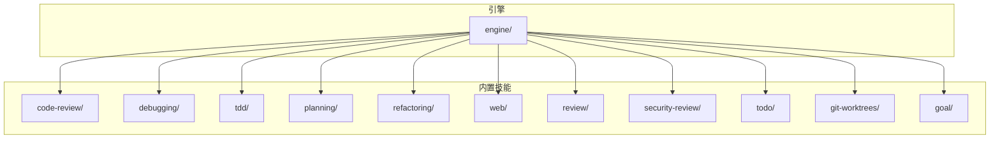
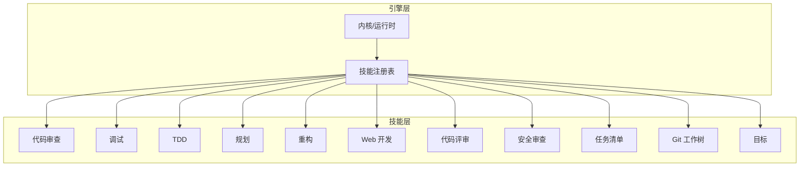
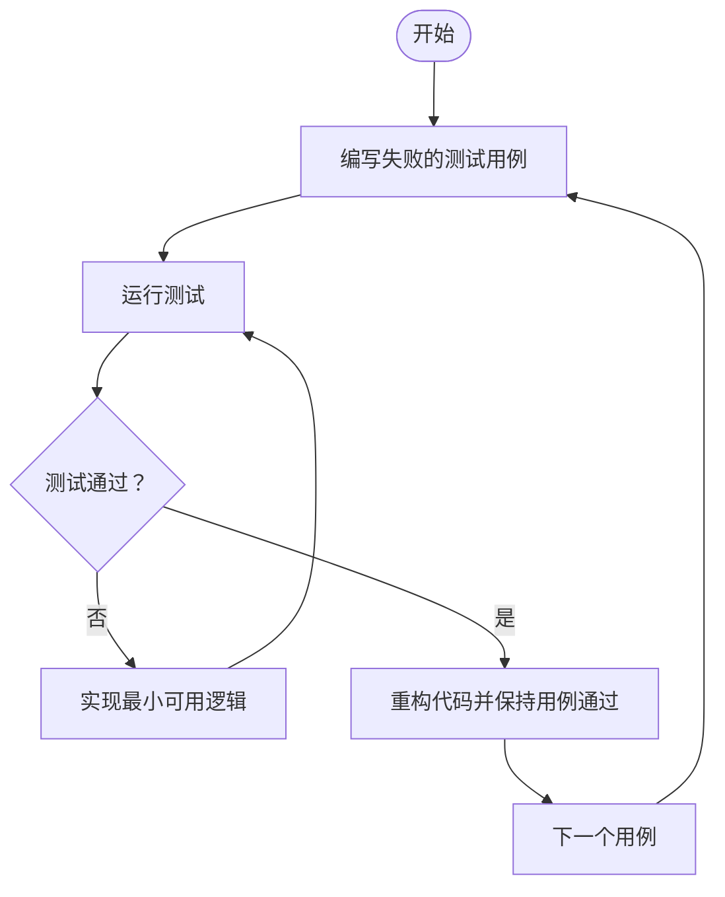
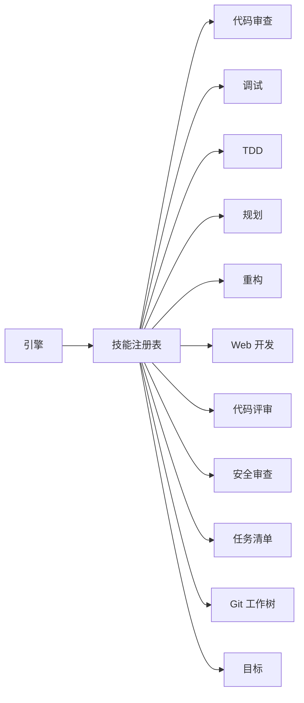

# 内置技能详解

<cite>
**本文引用的文件**   
- [engine/skills/code-review/SKILL.md](file://engine/skills/code-review/SKILL.md)
- [engine/skills/code-review/skill.json](file://engine/skills/code-review/skill.json)
- [engine/skills/debugging/SKILL.md](file://engine/skills/debugging/SKILL.md)
- [engine/skills/debugging/skill.json](file://engine/skills/debugging/skill.json)
- [engine/skills/tdd/SKILL.md](file://engine/skills/tdd/SKILL.md)
- [engine/skills/tdd/skill.json](file://engine/skills/tdd/skill.json)
- [engine/skills/tdd/tdd-cycle.md](file://engine/skills/tdd/tdd-cycle.md)
- [engine/skills/planning/SKILL.md](file://engine/skills/planning/SKILL.md)
- [engine/skills/planning/skill.json](file://engine/skills/planning/skill.json)
- [engine/skills/refactoring/SKILL.md](file://engine/skills/refactoring/SKILL.md)
- [engine/skills/refactoring/skill.json](file://engine/skills/refactoring/skill.json)
- [engine/skills/web/SKILL.md](file://engine/skills/web/SKILL.md)
- [engine/skills/web/skill.json](file://engine/skills/web/skill.json)
- [engine/skills/review/SKILL.md](file://engine/skills/review/SKILL.md)
- [engine/skills/review/skill.json](file://engine/skills/review/skill.json)
- [engine/skills/security-review/SKILL.md](file://engine/skills/security-review/SKILL.md)
- [engine/skills/security-review/skill.json](file://engine/skills/security-review/skill.json)
- [engine/skills/todo/SKILL.md](file://engine/skills/todo/SKILL.md)
- [engine/skills/todo/skill.json](file://engine/skills/todo/skill.json)
- [engine/skills/git-worktrees/SKILL.md](file://engine/skills/git-worktrees/SKILL.md)
- [engine/skills/git-worktrees/skill.json](file://engine/skills/git-worktrees/skill.json)
- [engine/skills/goal/SKILL.md](file://engine/skills/goal/SKILL.md)
- [engine/skills/goal/skill.json](file://engine/skills/goal/skill.json)
</cite>

## 目录
1. [简介](#简介)
2. [项目结构](#项目结构)
3. [核心组件](#核心组件)
4. [架构总览](#架构总览)
5. [详细组件分析](#详细组件分析)
6. [依赖分析](#依赖分析)
7. [性能考虑](#性能考虑)
8. [故障排查指南](#故障排查指南)
9. [结论](#结论)
10. [附录](#附录)

## 简介
本文件为 KCoder 所有内置技能的权威使用文档。内容覆盖代码审查、调试、TDD（测试驱动开发）、规划、重构、Web 开发等能力，并补充通用辅助技能（如任务清单、目标管理、Git 工作树）。每个技能均包含功能特性、配置选项、使用方法、最佳实践与常见问题解决方案，帮助开发者快速上手并高效协作。

## 项目结构
KCoder 的内置技能位于 engine/skills 目录下，每个技能以独立文件夹组织，包含：
- SKILL.md：面向用户的说明文档（功能、用法、示例、注意事项）
- skill.json：技能元数据与配置项定义（名称、版本、参数、工具绑定等）

**图表来源**
- [engine/skills/code-review/SKILL.md](file://engine/skills/code-review/SKILL.md)
- [engine/skills/code-review/skill.json](file://engine/skills/code-review/skill.json)
- [engine/skills/debugging/SKILL.md](file://engine/skills/debugging/SKILL.md)
- [engine/skills/debugging/skill.json](file://engine/skills/debugging/skill.json)
- [engine/skills/tdd/SKILL.md](file://engine/skills/tdd/SKILL.md)
- [engine/skills/tdd/skill.json](file://engine/skills/tdd/skill.json)
- [engine/skills/tdd/tdd-cycle.md](file://engine/skills/tdd/tdd-cycle.md)
- [engine/skills/planning/SKILL.md](file://engine/skills/planning/SKILL.md)
- [engine/skills/planning/skill.json](file://engine/skills/planning/skill.json)
- [engine/skills/refactoring/SKILL.md](file://engine/skills/refactoring/SKILL.md)
- [engine/skills/refactoring/skill.json](file://engine/skills/refactoring/skill.json)
- [engine/skills/web/SKILL.md](file://engine/skills/web/SKILL.md)
- [engine/skills/web/skill.json](file://engine/skills/web/SKILL.md)
- [engine/skills/review/SKILL.md](file://engine/skills/review/SKILL.md)
- [engine/skills/review/skill.json](file://engine/skills/review/skill.json)
- [engine/skills/security-review/SKILL.md](file://engine/skills/security-review/SKILL.md)
- [engine/skills/security-review/skill.json](file://engine/skills/security-review/skill.json)
- [engine/skills/todo/SKILL.md](file://engine/skills/todo/SKILL.md)
- [engine/skills/todo/skill.json](file://engine/skills/todo/skill.json)
- [engine/skills/git-worktrees/SKILL.md](file://engine/skills/git-worktrees/SKILL.md)
- [engine/skills/git-worktrees/skill.json](file://engine/skills/git-worktrees/skill.json)
- [engine/skills/goal/SKILL.md](file://engine/skills/goal/SKILL.md)
- [engine/skills/goal/skill.json](file://engine/skills/goal/skill.json)

**章节来源**
- [engine/skills/code-review/SKILL.md](file://engine/skills/code-review/SKILL.md)
- [engine/skills/code-review/skill.json](file://engine/skills/code-review/skill.json)
- [engine/skills/debugging/SKILL.md](file://engine/skills/debugging/SKILL.md)
- [engine/skills/debugging/skill.json](file://engine/skills/debugging/skill.json)
- [engine/skills/tdd/SKILL.md](file://engine/skills/tdd/SKILL.md)
- [engine/skills/tdd/skill.json](file://engine/skills/tdd/skill.json)
- [engine/skills/tdd/tdd-cycle.md](file://engine/skills/tdd/tdd-cycle.md)
- [engine/skills/planning/SKILL.md](file://engine/skills/planning/SKILL.md)
- [engine/skills/planning/skill.json](file://engine/skills/planning/skill.json)
- [engine/skills/refactoring/SKILL.md](file://engine/skills/refactoring/SKILL.md)
- [engine/skills/refactoring/skill.json](file://engine/skills/refactoring/skill.json)
- [engine/skills/web/SKILL.md](file://engine/skills/web/SKILL.md)
- [engine/skills/web/skill.json](file://engine/skills/web/skill.json)
- [engine/skills/review/SKILL.md](file://engine/skills/review/SKILL.md)
- [engine/skills/review/skill.json](file://engine/skills/review/skill.json)
- [engine/skills/security-review/SKILL.md](file://engine/skills/security-review/SKILL.md)
- [engine/skills/security-review/skill.json](file://engine/skills/security-review/skill.json)
- [engine/skills/todo/SKILL.md](file://engine/skills/todo/SKILL.md)
- [engine/skills/todo/skill.json](file://engine/skills/todo/skill.json)
- [engine/skills/git-worktrees/SKILL.md](file://engine/skills/git-worktrees/SKILL.md)
- [engine/skills/git-worktrees/sill.json](file://engine/skills/git-worktrees/skill.json)
- [engine/skills/goal/SKILL.md](file://engine/skills/goal/SKILL.md)
- [engine/skills/goal/skill.json](file://engine/skills/goal/skill.json)

## 核心组件
本节概述各内置技能的核心职责与典型使用场景，便于读者快速定位所需能力。

- 代码审查（code-review）：聚焦代码质量、安全漏洞与性能问题的静态分析与建议。
- 调试（debugging）：提供错误诊断、断点辅助与日志分析的流程化支持。
- TDD（tdd）：遵循“红-绿-重构”循环，生成测试用例并指导迭代实现。
- 规划（planning）：将需求拆解为可执行任务，进行优先级排序与进度跟踪。
- 重构（refactoring）：在保持行为不变的前提下优化结构与依赖，提升可维护性。
- Web 开发（web）：涵盖前端框架支持、API 设计与部署配置的最佳实践。
- 代码评审（review）：面向 Pull Request 或变更集的规范化评审流程。
- 安全审查（security-review）：专项安全检查与修复建议。
- 任务清单（todo）：轻量级任务管理与状态跟踪。
- Git 工作树（git-worktrees）：并行分支开发与隔离实验环境。
- 目标（goal）：目标设定、里程碑与结果度量。

**章节来源**
- [engine/skills/code-review/SKILL.md](file://engine/skills/code-review/SKILL.md)
- [engine/skills/debugging/SKILL.md](file://engine/skills/debugging/SKILL.md)
- [engine/skills/tdd/SKILL.md](file://engine/skills/tdd/SKILL.md)
- [engine/skills/planning/SKILL.md](file://engine/skills/planning/SKILL.md)
- [engine/skills/refactoring/SKILL.md](file://engine/skills/refactoring/SKILL.md)
- [engine/skills/web/SKILL.md](file://engine/skills/web/SKILL.md)
- [engine/skills/review/SKILL.md](file://engine/skills/review/SKILL.md)
- [engine/skills/security-review/SKILL.md](file://engine/skills/security-review/SKILL.md)
- [engine/skills/todo/SKILL.md](file://engine/skills/todo/SKILL.md)
- [engine/skills/git-worktrees/SKILL.md](file://engine/skills/git-worktrees/SKILL.md)
- [engine/skills/goal/SKILL.md](file://engine/skills/goal/SKILL.md)

## 架构总览
下图展示了 KCoder 内置技能的整体关系与交互方式。每个技能通过其 skill.json 暴露能力描述与参数契约，SKILL.md 提供用户侧使用说明；运行时由引擎加载并按需调用相应工具链。

[此图为概念性架构图，不直接映射具体源码文件]

## 详细组件分析

### 代码审查（code-review）
- 功能特性
  - 代码质量检查：命名规范、复杂度控制、重复代码识别。
  - 安全漏洞扫描：常见注入、越权、敏感信息泄露等风险点提示。
  - 性能问题定位：热点路径、低效算法、资源泄漏预警。
- 配置选项
  - 规则集选择：按语言/框架启用不同规则。
  - 严重级别阈值：过滤低优先级告警。
  - 输出格式：行内注释、报告文件或交互式对话。
- 使用方法
  - 触发方式：对指定文件或变更集发起审查。
  - 结果消费：根据报告逐项修复并二次验证。
- 最佳实践
  - 将关键规则纳入 CI 门禁。
  - 结合团队规范定制规则集。
  - 定期回顾误报并调优阈值。
- 常见问题
  - 误报过多：调整阈值与白名单。
  - 规则缺失：补充自定义规则或引入外部工具。

**章节来源**
- [engine/skills/code-review/SKILL.md](file://engine/skills/code-review/SKILL.md)
- [engine/skills/code-review/skill.json](file://engine/skills/code-review/skill.json)

### 调试（debugging）
- 功能特性
  - 错误诊断：堆栈解析、上下文收集、根因定位。
  - 断点辅助：自动插入条件断点、观察变量。
  - 日志分析：结构化日志聚合、异常模式匹配。
- 配置选项
  - 日志级别与采样率。
  - 断点策略（命中次数、条件表达式）。
  - 诊断范围（进程/线程/模块）。
- 使用方法
  - 复现步骤：最小化复现场景与输入。
  - 采集数据：日志、快照、网络请求。
  - 分析闭环：定位-修复-回归验证。
- 最佳实践
  - 统一日志格式与追踪 ID。
  - 使用条件断点减少干扰。
  - 建立常见错误的知识库。
- 常见问题
  - 日志噪声大：增加过滤与采样。
  - 断点失效：确认作用域与编译选项。

**章节来源**
- [engine/skills/debugging/SKILL.md](file://engine/skills/debugging/SKILL.md)
- [engine/skills/debugging/skill.json](file://engine/skills/debugging/skill.json)

### TDD（tdd）
- 功能特性
  - 测试驱动流程：明确先写失败测试，再实现通过，最后重构。
  - 测试用例生成：基于接口/契约自动生成边界与异常用例。
  - 覆盖率引导：针对未覆盖路径补充用例。
- 配置选项
  - 测试框架与运行器。
  - 覆盖率阈值与报告格式。
  - 用例模板与命名约定。
- 使用方法
  - 编写失败用例：描述期望行为。
  - 最小实现：仅满足当前用例。
  - 持续重构：在不破坏用例前提下改进设计。
- 最佳实践
  - 用例原子化、可读性强。
  - 优先覆盖关键路径与边界条件。
  - 将覆盖率作为健康指标而非唯一目标。
- 常见问题
  - 用例耦合：拆分与抽象公共夹具。
  - 测试不稳定：消除时序与外部依赖。

**章节来源**
- [engine/skills/tdd/SKILL.md](file://engine/skills/tdd/SKILL.md)
- [engine/skills/tdd/skill.json](file://engine/skills/tdd/skill.json)
- [engine/skills/tdd/tdd-cycle.md](file://engine/skills/tdd/tdd-cycle.md)

#### TDD 循环流程图

**图表来源**
- [engine/skills/tdd/tdd-cycle.md](file://engine/skills/tdd/tdd-cycle.md)

### 规划（planning）
- 功能特性
  - 任务分解：从需求到子任务的层级拆解。
  - 优先级排序：依据影响面、依赖关系与风险排序。
  - 进度跟踪：里程碑、阻塞项与交付物管理。
- 配置选项
  - 计划粒度与模板。
  - 指标与报表维度。
  - 协作角色与权限。
- 使用方法
  - 创建计划：定义目标、范围与约束。
  - 分配任务：责任人、截止期与验收标准。
  - 复盘迭代：回顾偏差并调整后续计划。
- 最佳实践
  - 小步快跑，频繁对齐。
  - 可视化依赖与风险。
  - 用数据驱动决策。
- 常见问题
  - 范围蔓延：严格变更控制。
  - 依赖冲突：提前识别与协调。

**章节来源**
- [engine/skills/planning/SKILL.md](file://engine/skills/planning/SKILL.md)
- [engine/skills/planning/skill.json](file://engine/skills/planning/skill.json)

### 重构（refactoring）
- 功能特性
  - 代码优化：提取函数、合并分支、简化条件。
  - 结构重组：分层、模块化、职责分离。
  - 依赖清理：移除无用依赖、统一入口。
- 配置选项
  - 重构范围与安全网（测试/静态检查）。
  - 保留语义与兼容性策略。
  - 自动化程度与人工复核比例。
- 使用方法
  - 制定重构清单：高风险区域优先。
  - 小步提交：每次变更可回滚。
  - 回归验证：确保行为一致。
- 最佳实践
  - 以测试为护栏。
  - 避免一次性大改。
  - 记录重构理由与收益。
- 常见问题
  - 回归缺陷：加强单测与集成测试。
  - 合并冲突：分模块逐步推进。

**章节来源**
- [engine/skills/refactoring/SKILL.md](file://engine/skills/refactoring/SKILL.md)
- [engine/skills/refactoring/skill.json](file://engine/skills/refactoring/skill.json)

### Web 开发（web）
- 功能特性
  - 前端框架支持：脚手架、路由、状态管理与构建优化。
  - API 设计：REST/GraphQL 规范、鉴权、分页与错误码。
  - 部署配置：容器化、环境变量、灰度与回滚。
- 配置选项
  - 构建产物与缓存策略。
  - 多环境配置与密钥管理。
  - 监控与告警接入。
- 使用方法
  - 初始化工程：选择模板与插件。
  - 联调与自测：Mock 与本地服务。
  - 发布上线：流水线与回滚预案。
- 最佳实践
  - 前后端契约先行。
  - 配置与环境解耦。
  - 全链路可观测。
- 常见问题
  - 跨域与鉴权：统一网关处理。
  - 构建体积过大：按需加载与分包。

**章节来源**
- [engine/skills/web/SKILL.md](file://engine/skills/web/SKILL.md)
- [engine/skills/web/skill.json](file://engine/skills/web/skill.json)

### 代码评审（review）
- 功能特性
  - 变更集审阅：差异对比、影响面评估。
  - 合规检查：编码规范、许可证与依赖审计。
  - 评审意见：结构化反馈与跟进闭环。
- 配置选项
  - 评审模板与必填字段。
  - 自动检查项与阻断规则。
  - 评审人指派策略。
- 使用方法
  - 提交 PR/MR：附带背景与验收标准。
  - 在线评审：逐条回复与修改。
  - 合并前校验：自动化检查通过。
- 最佳实践
  - 小 PR、早反馈。
  - 关注设计而非风格细节。
  - 沉淀评审经验库。
- 常见问题
  - 评审疲劳：合理拆分与轮值。
  - 意见分歧：以用户价值为准绳。

**章节来源**
- [engine/skills/review/SKILL.md](file://engine/skills/review/SKILL.md)
- [engine/skills/review/skill.json](file://engine/skills/review/skill.json)

### 安全审查（security-review）
- 功能特性
  - 漏洞扫描：依赖漏洞、硬编码密钥、不安全配置。
  - 威胁建模：攻击面识别与缓解措施。
  - 修复建议：补丁升级、配置加固与替代方案。
- 配置选项
  - 扫描范围与深度。
  - 漏洞等级与处置时限。
  - 第三方工具集成。
- 使用方法
  - 定期扫描：纳入日常流水线。
  - 高危优先：快速响应与验证。
  - 知识沉淀：常见漏洞与对策。
- 最佳实践
  - 最小权限原则。
  - 依赖白名单与签名校验。
  - 安全左移，尽早发现。
- 常见问题
  - 误报处理：基线与豁免策略。
  - 修复成本：权衡风险与投入。

**章节来源**
- [engine/skills/security-review/SKILL.md](file://engine/skills/security-review/SKILL.md)
- [engine/skills/security-review/skill.json](file://engine/skills/security-review/skill.json)

### 任务清单（todo）
- 功能特性
  - 任务创建与分类：标签、优先级与截止日期。
  - 状态流转：待办/进行中/已完成/已取消。
  - 视图与导出：看板、列表与统计。
- 配置选项
  - 默认模板与工作流。
  - 通知与提醒策略。
  - 权限与可见性。
- 使用方法
  - 新增任务：明确产出与验收。
  - 更新状态：同步进展与阻塞。
  - 定期清理：归档与复盘。
- 最佳实践
  - 任务原子化、可衡量。
  - 限制在制品数量。
  - 可视化瓶颈与负载。
- 常见问题
  - 任务堆积：拆分与委派。
  - 状态不一致：统一入口与校验。

**章节来源**
- [engine/skills/todo/SKILL.md](file://engine/skills/todo/SKILL.md)
- [engine/skills/todo/skill.json](file://engine/skills/todo/skill.json)

### Git 工作树（git-worktrees）
- 功能特性
  - 并行分支：在同一仓库下同时检出多个分支。
  - 隔离实验：独立工作区互不影响。
  - 便捷切换：快速在不同主题间切换。
- 配置选项
  - 工作树目录布局。
  - 钩子与脚本适配。
  - 清理策略与生命周期。
- 使用方法
  - 创建工作树：关联远程分支。
  - 独立开发：提交与推送。
  - 清理回收：删除不再使用的树。
- 最佳实践
  - 命名清晰、用途单一。
  - 及时合并与清理。
  - 配合 CI 验证。
- 常见问题
  - 钩子失效：检查路径与权限。
  - 磁盘占用：定期清理旧树。

**章节来源**
- [engine/skills/git-worktrees/SKILL.md](file://engine/skills/git-worktrees/SKILL.md)
- [engine/skills/git-worktrees/skill.json](file://engine/skills/git-worktrees/skill.json)

### 目标（goal）
- 功能特性
  - 目标设定：OKR/KPI 对齐与量化指标。
  - 里程碑管理：阶段目标与交付物。
  - 结果度量：达成率与趋势分析。
- 配置选项
  - 指标口径与数据来源。
  - 周期与复盘节奏。
  - 公开范围与协作方式。
- 使用方法
  - 制定目标：明确挑战性与可行性。
  - 跟踪进度：周/月报与看板。
  - 复盘总结：经验沉淀与改进。
- 最佳实践
  - 少而精，聚焦关键结果。
  - 数据透明，共同负责。
  - 动态调整，拥抱变化。
- 常见问题
  - 指标漂移：统一口径与校准。
  - 过度量化：兼顾过程与质量。

**章节来源**
- [engine/skills/goal/SKILL.md](file://engine/skills/goal/SKILL.md)
- [engine/skills/goal/skill.json](file://engine/skills/goal/skill.json)

## 依赖分析
- 技能内部依赖
  - 每个技能通过 skill.json 声明自身能力与参数契约，SKILL.md 描述使用方式。
  - 部分技能存在相互引用（例如 review 与 code-review 互补），但彼此解耦，通过统一接口交互。
- 与引擎的依赖
  - 引擎负责加载、注册与调度技能；技能无需感知引擎实现细节。
  - 运行时通过工具提供者桥接外部工具（如 linter、测试框架、CI 流水线）。

[此图为概念性依赖图，不直接映射具体源码文件]

## 性能考虑
- 批量处理：对大规模代码库采用增量扫描与并行分析。
- 缓存策略：复用上一次分析结果，减少重复计算。
- 采样与限流：在高并发场景下对日志与分析任务进行采样与限速。
- 资源隔离：为重型任务（如全量安全扫描）分配独立资源池。

[本节为通用性能建议，不涉及具体文件分析]

## 故障排查指南
- 技能未生效
  - 检查 skill.json 是否被正确加载与注册。
  - 核对参数契约与实际传入值是否匹配。
- 分析结果不准确
  - 调整规则阈值与白名单。
  - 补充上下文与样例以提升准确率。
- 任务卡住
  - 查看依赖与前置条件是否满足。
  - 使用规划技能重新评估优先级与资源。
- 日志不足
  - 提高日志级别与采样率。
  - 增加关键路径的追踪标识。

**章节来源**
- [engine/skills/debugging/SKILL.md](file://engine/skills/debugging/SKILL.md)
- [engine/skills/planning/SKILL.md](file://engine/skills/planning/SKILL.md)

## 结论
KCoder 的内置技能覆盖了从代码质量保障到交付运维的全链路能力。通过统一的技能契约与清晰的文档，团队可以快速组合与扩展能力，形成稳定高效的研发流水线。建议结合团队规范与业务特点，选择合适的技能与配置，持续优化流程与指标。

[本节为总结性内容，不涉及具体文件分析]

## 附录
- 术语表
  - 技能：具备特定能力的可插拔模块，通过 skill.json 描述能力与参数。
  - 工具提供者：对外部工具的封装与适配层。
  - 工作树：同一仓库下的多个独立工作区。
- 参考链接
  - 各技能的 SKILL.md 与 skill.json 文件路径见“本文引用的文件”。

[本节为补充信息，不涉及具体文件分析]