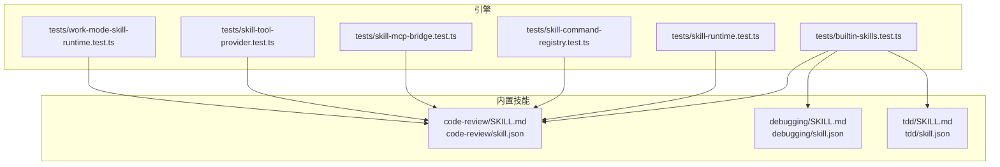
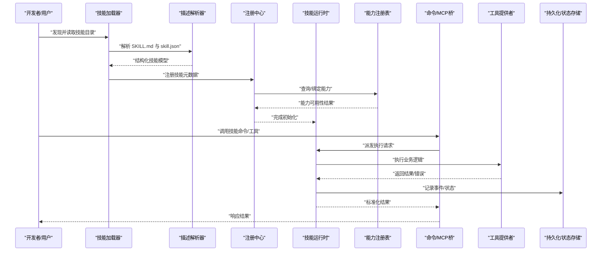
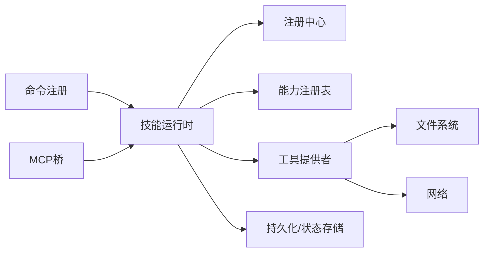
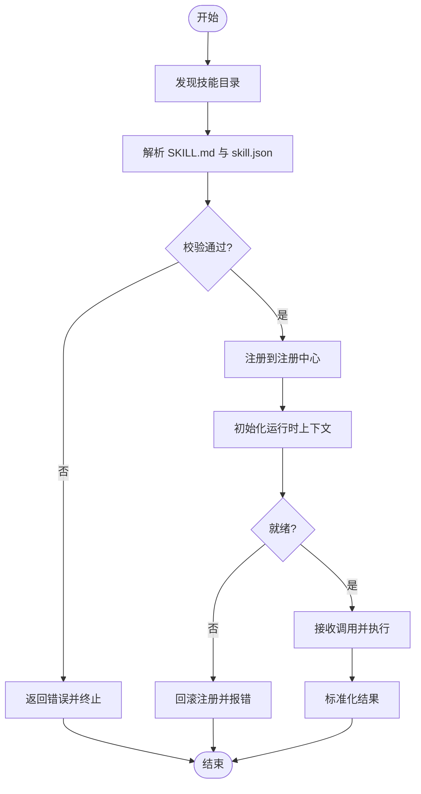

# 技能架构设计

<cite>
**本文引用的文件**   
- [engine/skills/code-review/SKILL.md](file://engine/skills/code-review/SKILL.md)
- [engine/skills/code-review/skill.json](file://engine/skills/code-review/skill.json)
- [engine/skills/debugging/SKILL.md](file://engine/skills/debugging/SKILL.md)
- [engine/skills/debugging/skill.json](file://engine/skills/debugging/skill.json)
- [engine/skills/tdd/SKILL.md](file://engine/skills/tdd/SKILL.md)
- [engine/skills/tdd/skill.json](file://engine/skills/tdd/skill.json)
- [engine/tests/builtin-skills.test.ts](file://engine/tests/builtin-skills.test.ts)
- [engine/tests/skill-runtime.test.ts](file://engine/tests/skill-runtime.test.ts)
- [engine/tests/skill-command-registry.test.ts](file://engine/tests/skill-command-registry.test.ts)
- [engine/tests/skill-mcp-bridge.test.ts](file://engine/tests/skill-mcp-bridge.test.ts)
- [engine/tests/skill-tool-provider.test.ts](file://engine/tests/skill-tool-provider.test.ts)
- [engine/tests/work-mode-skill-runtime.test.ts](file://engine/tests/work-mode-skill-runtime.test.ts)
- [engine/README.md](file://engine/README.md)
</cite>

## 目录
1. [简介](#简介)
2. [项目结构](#项目结构)
3. [核心组件](#核心组件)
4. [架构总览](#架构总览)
5. [详细组件分析](#详细组件分析)
6. [依赖关系分析](#依赖关系分析)
7. [性能考量](#性能考量)
8. [故障排查指南](#故障排查指南)
9. [结论](#结论)
10. [附录](#附录)

## 简介
本技术文档围绕KCoder的技能系统，系统性阐述其整体架构与实现要点，包括：
- 技能定义格式（SKILL.md 与 skill.json）
- 生命周期管理、注册机制与执行引擎
- 技能与能力系统的关系、上下文传递机制、参数验证与结果处理
- 运行时环境、依赖注入、错误处理与日志记录
- 版本管理与兼容性检查、热重载机制
- 加载、初始化与执行的端到端流程，并辅以架构图与数据流图

## 项目结构
KCoder 引擎侧将“内置技能”以目录形式组织在 engine/skills 下，每个技能包含 SKILL.md 与 skill.json 两个描述文件。测试用例覆盖技能运行、命令注册、MCP桥接与工具提供等关键路径。

图表来源
- [engine/tests/builtin-skills.test.ts](file://engine/tests/builtin-skills.test.ts)
- [engine/tests/skill-runtime.test.ts](file://engine/tests/skill-runtime.test.ts)
- [engine/tests/skill-command-registry.test.ts](file://engine/tests/skill-command-registry.test.ts)
- [engine/tests/skill-mcp-bridge.test.ts](file://engine/tests/skill-mcp-bridge.test.ts)
- [engine/tests/skill-tool-provider.test.ts](file://engine/tests/skill-tool-provider.test.ts)
- [engine/tests/work-mode-skill-runtime.test.ts](file://engine/tests/work-mode-skill-runtime.test.ts)
- [engine/skills/code-review/SKILL.md](file://engine/skills/code-review/SKILL.md)
- [engine/skills/code-review/skill.json](file://engine/skills/code-review/skill.json)
- [engine/skills/debugging/SKILL.md](file://engine/skills/debugging/SKILL.md)
- [engine/skills/debugging/skill.json](file://engine/skills/debugging/skill.json)
- [engine/skills/tdd/SKILL.md](file://engine/skills/tdd/SKILL.md)
- [engine/skills/tdd/skill.json](file://engine/skills/tdd/skill.json)

章节来源
- [engine/README.md](file://engine/README.md)

## 核心组件
- 技能描述层
  - SKILL.md：面向人类可读的技能说明、使用方式与约束。
  - skill.json：机器可读的元数据与配置，用于解析、校验与装配。
- 技能运行时
  - 负责加载、解析、注册、初始化与执行技能。
  - 提供上下文注入、参数校验、结果封装与错误传播。
- 命令与工具桥接
  - 将技能暴露为可被上层调用的命令或工具接口。
  - 支持 MCP 协议桥接，便于外部系统集成。
- 能力系统耦合
  - 技能通过能力系统进行权限与资源访问控制。
  - 能力注册表决定技能可用性与行为边界。
- 工作模式与策略
  - 不同工作模式下，技能的执行策略与上下文可能不同。

章节来源
- [engine/tests/builtin-skills.test.ts](file://engine/tests/builtin-skills.test.ts)
- [engine/tests/skill-runtime.test.ts](file://engine/tests/skill-runtime.test.ts)
- [engine/tests/skill-command-registry.test.ts](file://engine/tests/skill-command-registry.test.ts)
- [engine/tests/skill-mcp-bridge.test.ts](file://engine/tests/skill-mcp-bridge.test.ts)
- [engine/tests/skill-tool-provider.test.ts](file://engine/tests/skill-tool-provider.test.ts)
- [engine/tests/work-mode-skill-runtime.test.ts](file://engine/tests/work-mode-skill-runtime.test.ts)

## 架构总览
下图展示了从“技能定义”到“运行时执行”的整体链路，涵盖加载、注册、初始化、执行与结果返回的关键阶段。

图表来源
- [engine/tests/builtin-skills.test.ts](file://engine/tests/builtin-skills.test.ts)
- [engine/tests/skill-runtime.test.ts](file://engine/tests/skill-runtime.test.ts)
- [engine/tests/skill-command-registry.test.ts](file://engine/tests/skill-command-registry.test.ts)
- [engine/tests/skill-mcp-bridge.test.ts](file://engine/tests/skill-mcp-bridge.test.ts)
- [engine/tests/skill-tool-provider.test.ts](file://engine/tests/skill-tool-provider.test.ts)
- [engine/tests/work-mode-skill-runtime.test.ts](file://engine/tests/work-mode-skill-runtime.test.ts)

## 详细组件分析

### 技能定义格式（SKILL.md 与 skill.json）
- SKILL.md
  - 作用：描述技能用途、输入输出约定、注意事项与示例。
  - 消费方：人类读者、自动化文档生成、辅助提示工程。
- skill.json
  - 作用：机器可读的技能元数据与配置，供加载器与运行时解析。
  - 关键字段（概念性说明）：标识、版本、名称、描述、参数模式、依赖能力、执行入口等。
- 校验与兼容
  - 加载时进行字段存在性与类型校验。
  - 基于版本号进行兼容性检查，确保升级路径稳定。

章节来源
- [engine/skills/code-review/SKILL.md](file://engine/skills/code-review/SKILL.md)
- [engine/skills/code-review/skill.json](file://engine/skills/code-review/skill.json)
- [engine/skills/debugging/SKILL.md](file://engine/skills/debugging/SKILL.md)
- [engine/skills/debugging/skill.json](file://engine/skills/debugging/skill.json)
- [engine/skills/tdd/SKILL.md](file://engine/skills/tdd/SKILL.md)
- [engine/skills/tdd/skill.json](file://engine/skills/tdd/skill.json)

### 生命周期管理
- 阶段划分
  - 发现：扫描内置/扩展技能目录。
  - 解析：读取并解析 SKILL.md 与 skill.json。
  - 注册：写入注册中心，建立命令/工具映射。
  - 初始化：根据能力注册表准备上下文与依赖。
  - 执行：接收调用，进入具体业务逻辑。
  - 收尾：清理临时状态、记录审计与指标。
- 关键点
  - 幂等注册：重复注册需去重或合并。
  - 失败回滚：初始化失败应回滚已注册项。
  - 可观测性：各阶段埋点与日志。

章节来源
- [engine/tests/builtin-skills.test.ts](file://engine/tests/builtin-skills.test.ts)
- [engine/tests/skill-runtime.test.ts](file://engine/tests/skill-runtime.test.ts)

### 注册机制
- 注册中心职责
  - 维护技能清单、命令别名与工具映射。
  - 提供按名称/标签/能力的检索与过滤。
- 注册流程
  - 解析后向注册中心提交元数据。
  - 注册成功后暴露命令与工具接口。
- 冲突处理
  - 同名冲突时的优先级策略与告警。

章节来源
- [engine/tests/skill-command-registry.test.ts](file://engine/tests/skill-command-registry.test.ts)

### 执行引擎
- 调度与编排
  - 统一入口接收命令/工具调用。
  - 根据技能元数据选择执行路径。
- 上下文传递
  - 注入会话、工作区、用户与权限信息。
  - 支持跨步骤的状态保持与恢复。
- 参数验证
  - 基于 skill.json 的模式对入参进行校验。
  - 不合法参数直接拒绝并返回明确错误。
- 结果处理
  - 标准化返回结构，包含成功数据、错误码与诊断信息。
  - 支持流式/增量结果（视具体实现）。

章节来源
- [engine/tests/skill-runtime.test.ts](file://engine/tests/skill-runtime.test.ts)
- [engine/tests/work-mode-skill-runtime.test.ts](file://engine/tests/work-mode-skill-runtime.test.ts)

### 与能力系统的关系
- 能力注册表
  - 定义技能可用的能力集合与访问范围。
  - 运行时依据能力决定是否允许执行。
- 权限与隔离
  - 结合工作模式限制敏感操作。
  - 能力不足时给出清晰提示与替代方案。

章节来源
- [engine/tests/skill-runtime.test.ts](file://engine/tests/skill-runtime.test.ts)
- [engine/tests/work-mode-skill-runtime.test.ts](file://engine/tests/work-mode-skill-runtime.test.ts)

### 命令与工具桥接（含 MCP）
- 命令注册
  - 将技能暴露为 CLI/IDE 命令。
- 工具提供
  - 将技能作为工具函数对外提供，供上层编排调用。
- MCP 桥接
  - 通过 MCP 协议将技能能力暴露给外部系统。

章节来源
- [engine/tests/skill-command-registry.test.ts](file://engine/tests/skill-command-registry.test.ts)
- [engine/tests/skill-tool-provider.test.ts](file://engine/tests/skill-tool-provider.test.ts)
- [engine/tests/skill-mcp-bridge.test.ts](file://engine/tests/skill-mcp-bridge.test.ts)

### 运行时环境、依赖注入、错误处理与日志
- 运行时环境
  - 提供文件系统、网络、进程等基础能力。
  - 支持沙箱与隔离策略（视部署模式）。
- 依赖注入
  - 通过容器/上下文注入服务实例（如存储、HTTP客户端、能力注册表）。
- 错误处理
  - 分层捕获与转换：业务异常、系统异常、超时与中断。
  - 错误码与诊断信息标准化。
- 日志记录
  - 结构化日志，包含请求ID、技能名、阶段与耗时。
  - 分级输出与采样策略。

章节来源
- [engine/tests/skill-runtime.test.ts](file://engine/tests/skill-runtime.test.ts)
- [engine/tests/skill-tool-provider.test.ts](file://engine/tests/skill-tool-provider.test.ts)

### 版本管理与兼容性检查
- 版本声明
  - 在 skill.json 中声明语义化版本。
- 兼容性矩阵
  - 定义最低兼容的引擎版本。
  - 升级时进行向后兼容检查。
- 迁移策略
  - 提供字段废弃与迁移脚本（必要时）。

章节来源
- [engine/skills/code-review/skill.json](file://engine/skills/code-review/skill.json)
- [engine/skills/debugging/skill.json](file://engine/skills/debugging/skill.json)
- [engine/skills/tdd/skill.json](file://engine/skills/tdd/skill.json)

### 热重载机制
- 触发条件
  - 监听技能目录变更或收到重载指令。
- 重载流程
  - 卸载旧实例 -> 重新解析 -> 校验 -> 注册新实例 -> 切换路由。
- 一致性保障
  - 原子切换，避免半更新状态。
  - 保留活跃请求的处理与优雅降级。

章节来源
- [engine/tests/builtin-skills.test.ts](file://engine/tests/builtin-skills.test.ts)
- [engine/tests/skill-runtime.test.ts](file://engine/tests/skill-runtime.test.ts)

## 依赖关系分析
- 内部依赖
  - 技能运行时依赖注册中心、能力注册表与工具提供者。
  - 命令与 MCP 桥依赖运行时提供的执行能力。
- 外部依赖
  - 文件系统、网络、持久化存储等基础设施。
- 潜在循环依赖
  - 通过接口抽象与依赖注入解耦，避免环状引用。

图表来源
- [engine/tests/skill-runtime.test.ts](file://engine/tests/skill-runtime.test.ts)
- [engine/tests/skill-command-registry.test.ts](file://engine/tests/skill-command-registry.test.ts)
- [engine/tests/skill-mcp-bridge.test.ts](file://engine/tests/skill-mcp-bridge.test.ts)
- [engine/tests/skill-tool-provider.test.ts](file://engine/tests/skill-tool-provider.test.ts)

章节来源
- [engine/tests/skill-runtime.test.ts](file://engine/tests/skill-runtime.test.ts)
- [engine/tests/skill-command-registry.test.ts](file://engine/tests/skill-command-registry.test.ts)
- [engine/tests/skill-mcp-bridge.test.ts](file://engine/tests/skill-mcp-bridge.test.ts)
- [engine/tests/skill-tool-provider.test.ts](file://engine/tests/skill-tool-provider.test.ts)

## 性能考量
- 解析缓存
  - 对 SKILL.md 与 skill.json 的解析结果进行缓存，减少重复IO。
- 懒加载
  - 按需加载技能模块，降低启动开销。
- 并发与限流
  - 对高并发调用进行限流与队列化，保护后端资源。
- 结果压缩与分页
  - 大结果集采用分页或流式传输。
- 可观测性
  - 关键路径埋点，监控延迟与错误率。

[本节为通用指导，无需代码来源]

## 故障排查指南
- 常见问题定位
  - 技能未生效：检查注册中心是否包含该技能、能力是否满足。
  - 参数校验失败：核对 skill.json 中的参数模式与实际入参。
  - 执行超时/中断：查看运行时日志与依赖服务健康状态。
  - MCP 不可用：确认桥接服务端口与鉴权配置。
- 建议的诊断手段
  - 开启调试日志，关注请求ID与阶段标记。
  - 复现最小用例，逐步缩小问题范围。
  - 对比不同工作模式的差异，定位策略相关缺陷。

章节来源
- [engine/tests/skill-runtime.test.ts](file://engine/tests/skill-runtime.test.ts)
- [engine/tests/skill-mcp-bridge.test.ts](file://engine/tests/skill-mcp-bridge.test.ts)

## 结论
KCoder 技能体系通过“描述即配置”的方式，将人类可读的说明与机器可读的元数据相结合，配合完善的注册、执行与桥接机制，实现了高内聚、低耦合的可插拔能力扩展。借助能力系统与版本管理，系统在安全性与演进性上取得良好平衡；通过日志与可观测性建设，运维与排障效率显著提升。

[本节为总结性内容，无需代码来源]

## 附录

### 端到端流程图（加载-初始化-执行）

图表来源
- [engine/tests/builtin-skills.test.ts](file://engine/tests/builtin-skills.test.ts)
- [engine/tests/skill-runtime.test.ts](file://engine/tests/skill-runtime.test.ts)