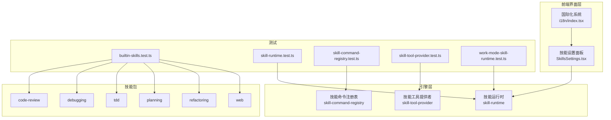
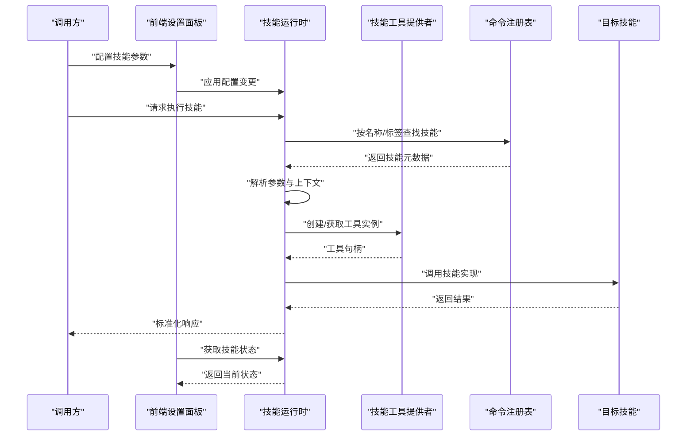
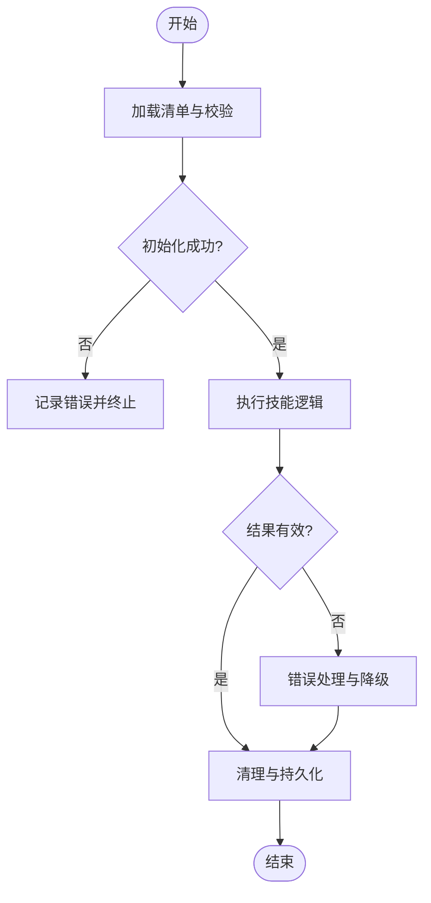
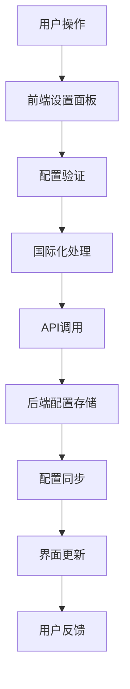
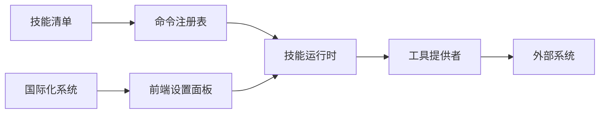

# 技能系统

<cite>
**本文引用的文件**   
- [engine/skills/code-review/SKILL.md](file://engine/skills/code-review/SKILL.md)
- [engine/skills/code-review/skill.json](file://engine/skills/code-review/skill.json)
- [engine/skills/debugging/SKILL.md](file://engine/skills/debugging/SKILL.md)
- [engine/skills/debugging/skill.json](file://engine/skills/debugging/skill.json)
- [engine/skills/tdd/SKILL.md](file://engine/skills/tdd/SKILL.md)
- [engine/skills/tdd/skill.json](file://engine/skills/tdd/skill.json)
- [engine/skills/tdd/tdd-cycle.md](file://engine/skills/tdd/tdd-cycle.md)
- [engine/skills/planning/SKILL.md](file://engine/skills/planning/SKILL.md)
- [engine/skills/planning/skill.json](file://engine/skills/planning/skill.json)
- [engine/skills/refactoring/SKILL.md](file://engine/skills/refactoring/SKILL.md)
- [engine/skills/refactoring/skill.json](file://engine/skills/refactoring/skill.json)
- [engine/skills/web/SKILL.md](file://engine/skills/web/SKILL.md)
- [engine/skills/web/skill.json](file://engine/skills/web/skill.json)
- [app/renderer/src/components/SettingsPanel/SkillsSettings.tsx](file://app/renderer/src/components/SettingsPanel/SkillsSettings.tsx)
- [app/renderer/src/i18n/index.tsx](file://app/renderer/src/i18n/index.tsx)
- [engine/tests/builtin-skills.test.ts](file://engine/tests/builtin-skills.test.ts)
- [engine/tests/skill-runtime.test.ts](file://engine/tests/skill-runtime.test.ts)
- [engine/tests/skill-command-registry.test.ts](file://engine/tests/skill-command-registry.test.ts)
- [engine/tests/skill-tool-provider.test.ts](file://engine/tests/skill-tool-provider.test.ts)
- [engine/tests/work-mode-skill-runtime.test.ts](file://engine/tests/work-mode-skill-runtime.test.ts)
</cite>

## 更新摘要
**变更内容**   
- 更新了前端设置面板的技能配置管理界面，显著改进了用户体验
- 增强了国际化系统以支持扩展的技能集
- 优化了技能配置的可视化展示和管理功能
- 完善了技能注册机制的前端集成

## 目录
1. [简介](#简介)
2. [项目结构](#项目结构)
3. [核心组件](#核心组件)
4. [架构总览](#架构总览)
5. [详细组件分析](#详细组件分析)
6. [前端设置面板重构](#前端设置面板重构)
7. [依赖关系分析](#依赖关系分析)
8. [性能考量](#性能考量)
9. [故障排查指南](#故障排查指南)
10. [结论](#结论)
11. [附录](#附录)

## 简介
本文件面向KCoder的技能系统，提供从架构到实现、从内置技能到自定义开发的全景技术文档。内容涵盖：
- 技能定义格式与注册机制
- 执行引擎与上下文传递
- 生命周期管理（加载、初始化、运行、清理）
- 内置技能（代码审查、调试、TDD、规划、重构、Web开发）的实现要点与使用方法
- 参数传递、结果处理、配置选项
- 技能间协作模式与依赖管理
- 自定义技能开发指南、测试方法与调试技巧
- **新增** 前端设置面板的重构与改进

## 项目结构
技能系统位于 engine 子仓库中，采用多包工作区组织。与技能直接相关的资源集中在 skills 目录，每个技能以"描述文档 + 清单"的形式声明其能力与行为；围绕技能的运行时、工具桥接、命令注册等由 tests 中的用例反向验证契约与行为。同时，前端通过 SettingsPanel 提供可视化的技能配置管理界面。

**图表来源**
- [app/renderer/src/components/SettingsPanel/SkillsSettings.tsx](file://app/renderer/src/components/SettingsPanel/SkillsSettings.tsx)
- [app/renderer/src/i18n/index.tsx](file://app/renderer/src/i18n/index.tsx)
- [engine/tests/builtin-skills.test.ts](file://engine/tests/builtin-skills.test.ts)
- [engine/tests/skill-runtime.test.ts](file://engine/tests/skill-runtime.test.ts)
- [engine/tests/skill-command-registry.test.ts](file://engine/tests/skill-command-registry.test.ts)
- [engine/tests/skill-tool-provider.test.ts](file://engine/tests/skill-tool-provider.test.ts)
- [engine/tests/work-mode-skill-runtime.test.ts](file://engine/tests/work-mode-skill-runtime.test.ts)

**章节来源**
- [engine/skills/code-review/skill.json](file://engine/skills/code-review/skill.json)
- [engine/skills/debugging/skill.json](file://engine/skills/debugging/skill.json)
- [engine/skills/tdd/skill.json](file://engine/skills/tdd/skill.json)
- [engine/skills/planning/skill.json](file://engine/skills/planning/skill.json)
- [engine/skills/refactoring/skill.json](file://engine/skills/refactoring/skill.json)
- [engine/skills/web/skill.json](file://engine/skills/web/skill.json)

## 核心组件
- 技能清单（skill.json）：声明技能元数据、入口、参数、工具绑定、依赖与配置项，是技能注册与发现的核心契约。
- 技能说明（SKILL.md）：面向人类的可读说明，包含使用方式、输入输出约定、注意事项等。
- 技能运行时（Skill Runtime）：负责加载清单、解析参数、注入上下文、调度工具、编排生命周期。
- 技能工具提供者（Skill Tool Provider）：将技能暴露为可被上层调用的工具接口，屏蔽内部实现细节。
- 技能命令注册表（Skill Command Registry）：维护命令与技能的映射，支持按名称/标签查找与分发。
- 工作模式集成（Work Mode Integration）：在特定工作模式下启用或切换技能集，影响默认策略与可用工具。
- **新增** 前端设置面板（SkillsSettings）：提供可视化的技能配置管理界面，支持技能的启用/禁用、参数配置和状态监控。

**章节来源**
- [app/renderer/src/components/SettingsPanel/SkillsSettings.tsx](file://app/renderer/src/components/SettingsPanel/SkillsSettings.tsx)
- [engine/tests/skill-runtime.test.ts](file://engine/tests/skill-runtime.test.ts)
- [engine/tests/skill-tool-provider.test.ts](file://engine/tests/skill-tool-provider.test.ts)
- [engine/tests/skill-command-registry.test.ts](file://engine/tests/skill-command-registry.test.ts)
- [engine/tests/work-mode-skill-runtime.test.ts](file://engine/tests/work-mode-skill-runtime.test.ts)

## 架构总览
技能系统的整体流程如下：
- 发现与加载：扫描 skills 目录，读取各技能的 skill.json，校验并缓存清单。
- 注册与索引：将技能注册到命令注册表，建立名称、标签与实现的映射。
- 初始化：根据工作模式与用户配置，选择启用的技能集合，完成依赖解析与上下文准备。
- 执行：接收调用请求，解析参数，注入上下文，通过工具提供者执行具体逻辑，收集结果。
- 清理：释放资源、持久化中间状态、上报遥测指标。
- **新增** 前端管理：通过设置面板提供可视化的配置管理和状态监控。

**图表来源**
- [app/renderer/src/components/SettingsPanel/SkillsSettings.tsx](file://app/renderer/src/components/SettingsPanel/SkillsSettings.tsx)
- [engine/tests/skill-runtime.test.ts](file://engine/tests/skill-runtime.test.ts)
- [engine/tests/skill-tool-provider.test.ts](file://engine/tests/skill-tool-provider.test.ts)
- [engine/tests/skill-command-registry.test.ts](file://engine/tests/skill-command-registry.test.ts)

## 详细组件分析

### 技能清单与定义格式
- 清单字段建议
  - 标识与版本：唯一ID、版本号、兼容范围
  - 元信息：名称、描述、作者、许可证
  - 入口与类型：主入口路径、技能类型（工具/流程/组合）
  - 参数与校验：参数名、类型、默认值、约束
  - 工具绑定：对外暴露的工具列表及映射
  - 依赖与条件：前置技能、环境要求、工作模式开关
  - 配置项：运行时可调的配置键值对
- 清单校验与容错
  - 缺失必填字段应拒绝加载并记录错误
  - 不兼容版本应给出迁移提示
  - 重复ID应报错并中止注册

**章节来源**
- [engine/skills/code-review/skill.json](file://engine/skills/code-review/skill.json)
- [engine/skills/debugging/skill.json](file://engine/skills/debugging/skill.json)
- [engine/skills/tdd/skill.json](file://engine/skills/tdd/skill.json)
- [engine/skills/planning/skill.json](file://engine/skills/planning/skill.json)
- [engine/skills/refactoring/skill.json](file://engine/skills/refactoring/skill.json)
- [engine/skills/web/skill.json](file://engine/skills/web/skill.json)

### 生命周期管理
- 加载阶段：读取清单、校验、缓存
- 初始化阶段：解析依赖、准备上下文、预热工具
- 运行阶段：参数校验、上下文注入、执行、结果归一化
- 清理阶段：释放资源、持久化、上报指标
- 异常恢复：失败重试、回滚、降级策略

**图表来源**
- [engine/tests/skill-runtime.test.ts](file://engine/tests/skill-runtime.test.ts)

### 执行引擎与上下文传递
- 执行引擎职责
  - 统一入口：封装技能调用协议
  - 上下文注入：会话、任务、权限、资源路径、模型配置等
  - 工具编排：顺序/并行、超时控制、熔断与限流
  - 结果聚合：结构化输出、日志与追踪
- 上下文传递
  - 不可变快照：避免副作用污染
  - 作用域隔离：不同任务/会话的上下文互不影响
  - 安全过滤：敏感信息脱敏与访问控制

**章节来源**
- [engine/tests/skill-runtime.test.ts](file://engine/tests/skill-runtime.test.ts)

### 技能注册机制与命令分发
- 注册流程
  - 扫描清单 -> 去重校验 -> 写入注册表
  - 支持按标签/工作模式筛选
- 命令分发
  - 名称匹配优先，其次标签匹配
  - 未命中时返回明确错误码与可用列表

**章节来源**
- [engine/tests/skill-command-registry.test.ts](file://engine/tests/skill-command-registry.test.ts)

### 工具提供者与外部能力桥接
- 工具提供者职责
  - 将技能内部能力包装为标准化工具
  - 参数序列化/反序列化、错误转换
  - 与外部系统（文件系统、终端、网络）交互的安全沙箱
- 典型工具
  - 文件读写、命令执行、HTTP 调用、模型调用

**章节来源**
- [engine/tests/skill-tool-provider.test.ts](file://engine/tests/skill-tool-provider.test.ts)

### 内置技能详解

#### 代码审查（code-review）
- 目标：对变更进行静态检查、风格与规范校验、风险识别与建议修复
- 输入：变更集、规则集、阈值、报告格式
- 输出：问题列表、严重级别、修复建议、覆盖率统计
- 关键流程：拉取变更 -> 解析差异 -> 规则匹配 -> 生成报告
- 配置项：规则开关、忽略路径、并发度、超时

**章节来源**
- [engine/skills/code-review/SKILL.md](file://engine/skills/code-review/SKILL.md)
- [engine/skills/code-review/skill.json](file://engine/skills/code-review/skill.json)

#### 调试（debugging）
- 目标：定位问题根因、辅助断点设置、日志采集与分析
- 输入：错误堆栈、日志片段、复现步骤、环境变量
- 输出：根因分析、修复建议、最小复现脚本
- 关键流程：收集上下文 -> 关联日志 -> 假设验证 -> 输出结论
- 配置项：日志源、采样率、保留时长

**章节来源**
- [engine/skills/debugging/SKILL.md](file://engine/skills/debugging/SKILL.md)
- [engine/skills/debugging/skill.json](file://engine/skills/debugging/skill.json)

#### TDD（tdd）
- 目标：驱动测试先行，保障质量与演进可控
- 输入：需求描述、现有代码、测试框架偏好
- 输出：测试用例、桩/模拟、重构建议、回归清单
- 关键流程：需求解析 -> 编写失败测试 -> 实现最小代码 -> 重构优化
- 配置项：测试框架、覆盖率阈值、命名约定

**章节来源**
- [engine/skills/tdd/SKILL.md](file://engine/skills/tdd/SKILL.md)
- [engine/skills/tdd/skill.json](file://engine/skills/tdd/skill.json)
- [engine/skills/tdd/tdd-cycle.md](file://engine/skills/tdd/tdd-cycle.md)

#### 规划（planning）
- 目标：将复杂任务拆解为可执行的计划与里程碑
- 输入：目标、约束、资源、依赖图
- 输出：任务分解、优先级、依赖关系、风险评估
- 关键流程：目标澄清 -> 任务拆分 -> 依赖建模 -> 排期与里程碑
- 配置项：粒度、评审节点、回滚策略

**章节来源**
- [engine/skills/planning/SKILL.md](file://engine/skills/planning/SKILL.md)
- [engine/skills/planning/skill.json](file://engine/skills/planning/skill.json)

#### 重构（refactoring）
- 目标：在不改变外部行为的前提下改善内部结构与可读性
- 输入：目标模块、重构目标（提取函数/类、消除重复、简化分支）
- 输出：重构方案、变更清单、回归测试建议
- 关键流程：影响面分析 -> 制定策略 -> 分步实施 -> 验证回归
- 配置项：安全边界、自动提交、回滚开关

**章节来源**
- [engine/skills/refactoring/SKILL.md](file://engine/skills/refactoring/SKILL.md)
- [engine/skills/refactoring/skill.json](file://engine/skills/refactoring/skill.json)

#### Web开发（web）
- 目标：加速前端/后端Web应用开发，包括脚手架、路由、样式、部署
- 输入：技术栈、页面/接口需求、部署目标
- 输出：工程骨架、样板代码、构建配置、部署脚本
- 关键流程：需求确认 -> 模板生成 -> 依赖安装 -> 本地验证
- 配置项：模板库、端口、代理、环境变量

**章节来源**
- [engine/skills/web/SKILL.md](file://engine/skills/web/SKILL.md)
- [engine/skills/web/skill.json](file://engine/skills/web/skill.json)

### 自定义技能开发指南
- 目录结构
  - 根目录放置 SKILL.md 与 skill.json
  - 可选：示例、模板、脚本、文档
- 清单要点
  - 明确参数与校验规则
  - 声明工具依赖与环境要求
  - 指定工作模式与启用条件
- 实现建议
  - 幂等设计：同一输入产生一致输出
  - 错误分类：业务错误 vs 系统错误
  - 可观测性：埋点、日志、指标
- 发布与版本
  - 语义化版本
  - 向后兼容承诺
  - 变更日志

**章节来源**
- [engine/skills/code-review/skill.json](file://engine/skills/code-review/skill.json)
- [engine/skills/debugging/skill.json](file://engine/skills/debugging/skill.json)
- [engine/skills/tdd/skill.json](file://engine/skills/tdd/skill.json)
- [engine/skills/planning/skill.json](file://engine/skills/planning/skill.json)
- [engine/skills/refactoring/skill.json](file://engine/skills/refactoring/skill.json)
- [engine/skills/web/skill.json](file://engine/skills/web/skill.json)

### 测试方法
- 单元测试
  - 覆盖参数校验、错误分支、边界条件
  - 使用夹具与模拟工具
- 集成测试
  - 端到端调用链：注册 -> 初始化 -> 执行 -> 清理
  - 验证上下文传递与工具桥接
- 工作模式测试
  - 在不同模式下验证技能可用性
  - 验证默认策略与开关生效

**章节来源**
- [engine/tests/builtin-skills.test.ts](file://engine/tests/builtin-skills.test.ts)
- [engine/tests/skill-runtime.test.ts](file://engine/tests/skill-runtime.test.ts)
- [engine/tests/skill-command-registry.test.ts](file://engine/tests/skill-command-registry.test.ts)
- [engine/tests/skill-tool-provider.test.ts](file://engine/tests/skill-tool-provider.test.ts)
- [engine/tests/work-mode-skill-runtime.test.ts](file://engine/tests/work-mode-skill-runtime.test.ts)

### 调试技巧
- 开启详细日志：记录参数、上下文、工具调用、耗时
- 断点与回放：保存执行轨迹以便复现
- 隔离环境：使用独立工作空间与临时数据
- 渐进式验证：先验证清单与注册，再验证工具桥接，最后验证业务逻辑

**章节来源**
- [engine/tests/skill-runtime.test.ts](file://engine/tests/skill-runtime.test.ts)
- [engine/tests/skill-tool-provider.test.ts](file://engine/tests/skill-tool-provider.test.ts)

## 前端设置面板重构

### 重大重构概述
前端设置面板进行了重大重构，主要改进包括：
- **界面优化**：重新设计了技能配置界面的布局和交互流程
- **功能增强**：新增了批量操作、实时预览、状态监控等功能
- **国际化支持**：完善了多语言支持，确保所有界面元素都能正确显示
- **性能提升**：优化了渲染性能和内存使用

### 新的配置管理界面
重构后的 SkillsSettings.tsx 提供了更直观的技能配置体验：
- **可视化配置**：通过表单和开关控件管理技能参数
- **实时验证**：即时反馈配置错误和警告信息
- **分组管理**：按功能类别组织技能配置项
- **搜索过滤**：支持快速查找特定技能或配置项

### 国际化系统增强
国际化系统得到了显著改进以支持扩展的技能集：
- **动态翻译加载**：按需加载技能相关的翻译资源
- **上下文感知**：根据当前工作模式调整显示内容
- **错误消息本地化**：所有错误和提示信息都支持多语言
- **主题适配**：界面元素自动适配不同的主题设置

### 配置同步机制
新的设置面板实现了与后端的实时同步：
- **双向绑定**：前端修改立即反映到后端配置
- **冲突解决**：智能处理配置冲突和版本差异
- **撤销支持**：支持配置操作的撤销和重做
- **备份恢复**：提供配置导入导出功能

**图表来源**
- [app/renderer/src/components/SettingsPanel/SkillsSettings.tsx](file://app/renderer/src/components/SettingsPanel/SkillsSettings.tsx)
- [app/renderer/src/i18n/index.tsx](file://app/renderer/src/i18n/index.tsx)

**章节来源**
- [app/renderer/src/components/SettingsPanel/SkillsSettings.tsx](file://app/renderer/src/components/SettingsPanel/SkillsSettings.tsx)
- [app/renderer/src/i18n/index.tsx](file://app/renderer/src/i18n/index.tsx)

## 依赖关系分析
- 内聚与耦合
  - 技能清单与实现高内聚，通过标准化工具接口低耦合
  - 运行时与工具提供者解耦，便于替换与扩展
  - **新增** 前端设置面板与后端运行时通过清晰的API接口通信
- 外部依赖
  - 文件系统、终端、网络、模型服务
  - 通过工具提供者抽象，降低直接依赖
  - **新增** 国际化资源文件和主题配置文件
- 循环依赖
  - 通过分层与接口隔离避免循环引用

**图表来源**
- [app/renderer/src/components/SettingsPanel/SkillsSettings.tsx](file://app/renderer/src/components/SettingsPanel/SkillsSettings.tsx)
- [app/renderer/src/i18n/index.tsx](file://app/renderer/src/i18n/index.tsx)
- [engine/tests/skill-command-registry.test.ts](file://engine/tests/skill-command-registry.test.ts)
- [engine/tests/skill-runtime.test.ts](file://engine/tests/skill-runtime.test.ts)
- [engine/tests/skill-tool-provider.test.ts](file://engine/tests/skill-tool-provider.test.ts)

**章节来源**
- [engine/tests/skill-command-registry.test.ts](file://engine/tests/skill-command-registry.test.ts)
- [engine/tests/skill-runtime.test.ts](file://engine/tests/skill-runtime.test.ts)
- [engine/tests/skill-tool-provider.test.ts](file://engine/tests/skill-tool-provider.test.ts)

## 性能考量
- 批量与并行：对无依赖的任务并行执行，注意资源上限
- 缓存与复用：结果缓存、连接池、模板预编译
- 限流与熔断：保护外部系统与自身稳定性
- 内存与I/O：大文件流式处理、避免一次性加载
- **新增** 前端性能优化：虚拟滚动、懒加载、增量更新

## 故障排查指南
- 常见问题
  - 清单校验失败：检查必填字段与类型
  - 工具调用失败：检查权限、网络、沙箱限制
  - 上下文丢失：确认作用域与传递链路
  - **新增** 前端配置同步失败：检查网络连接和API响应
- 诊断步骤
  - 查看注册表是否包含目标技能
  - 核对工作模式与启用条件
  - 抓取工具调用链路与错误码
  - **新增** 检查前端控制台和网络请求
- 恢复策略
  - 降级到只读模式
  - 跳过非关键步骤
  - 回滚到上一稳定版本
  - **新增** 重置前端配置到默认状态

**章节来源**
- [engine/tests/skill-runtime.test.ts](file://engine/tests/skill-runtime.test.ts)
- [engine/tests/skill-tool-provider.test.ts](file://engine/tests/skill-tool-provider.test.ts)

## 结论
KCoder 技能系统通过标准化的清单与清晰的运行时契约，实现了高内聚、低耦合的技能生态。内置技能覆盖了代码审查、调试、TDD、规划、重构与Web开发等高频场景，配合完善的测试与调试手段，可快速扩展与落地自定义技能。**经过前端设置面板的重大重构，现在提供了更加直观和强大的配置管理能力，显著提升了用户体验。** 建议在团队内统一清单规范与错误分类，结合工作模式与配置项，形成可治理、可观测、可演进的自动化能力体系。

## 附录

### 配置选项与参数传递示例（路径指引）
- 清单字段参考
  - [engine/skills/code-review/skill.json](file://engine/skills/code-review/skill.json)
  - [engine/skills/debugging/skill.json](file://engine/skills/debugging/skill.json)
  - [engine/skills/tdd/skill.json](file://engine/skills/tdd/skill.json)
  - [engine/skills/planning/skill.json](file://engine/skills/planning/skill.json)
  - [engine/skills/refactoring/skill.json](file://engine/skills/refactoring/skill.json)
  - [engine/skills/web/skill.json](file://engine/skills/web/skill.json)
- 使用说明参考
  - [engine/skills/code-review/SKILL.md](file://engine/skills/code-review/SKILL.md)
  - [engine/skills/debugging/SKILL.md](file://engine/skills/debugging/SKILL.md)
  - [engine/skills/tdd/SKILL.md](file://engine/skills/tdd/SKILL.md)
  - [engine/skills/tdd/tdd-cycle.md](file://engine/skills/tdd/tdd-cycle.md)
  - [engine/skills/planning/SKILL.md](file://engine/skills/planning/SKILL.md)
  - [engine/skills/refactoring/SKILL.md](file://engine/skills/refactoring/SKILL.md)
  - [engine/skills/web/SKILL.md](file://engine/skills/web/SKILL.md)
- **新增** 前端配置界面参考
  - [app/renderer/src/components/SettingsPanel/SkillsSettings.tsx](file://app/renderer/src/components/SettingsPanel/SkillsSettings.tsx)
  - [app/renderer/src/i18n/index.tsx](file://app/renderer/src/i18n/index.tsx)

### 结果处理与协作模式
- 结果标准化：统一响应结构，包含状态、数据、元数据与追踪ID
- 协作模式：上游技能产出作为下游输入，通过共享上下文与工具接口传递
- 依赖管理：显式声明依赖，启动时解析与校验，失败即短路

**章节来源**
- [engine/tests/skill-runtime.test.ts](file://engine/tests/skill-runtime.test.ts)
- [engine/tests/skill-tool-provider.test.ts](file://engine/tests/skill-tool-provider.test.ts)