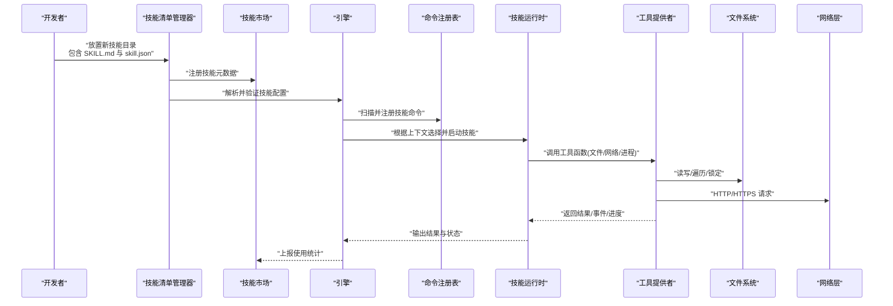
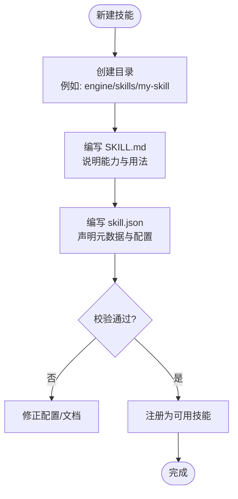
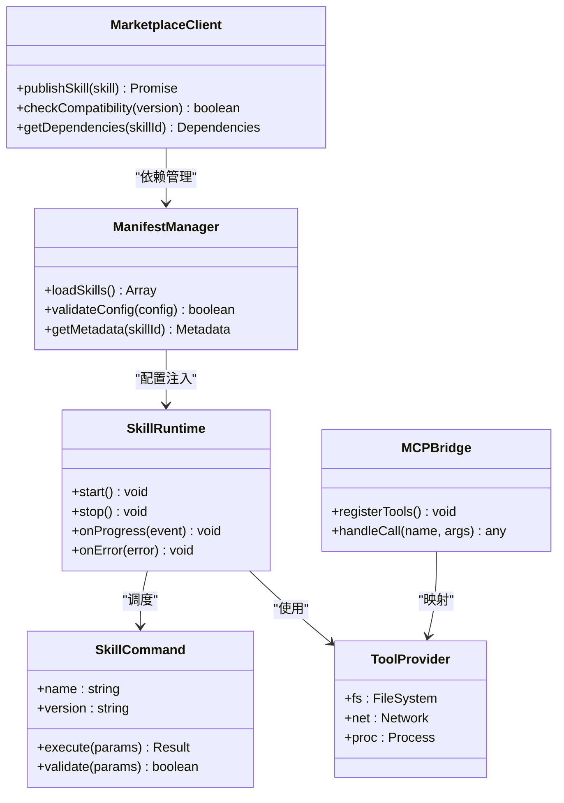
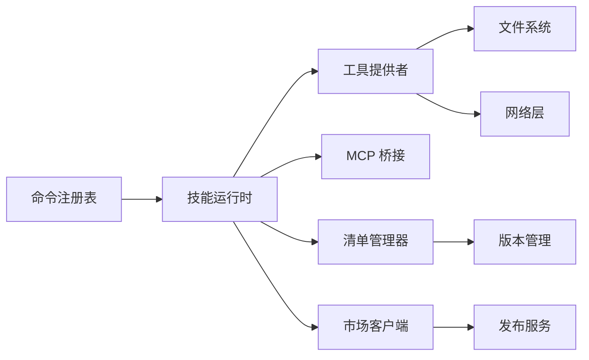

# 自定义技能开发

<cite>
**本文引用的文件**   
- [engine/skills/code-review/SKILL.md](file://engine/skills/code-review/SKILL.md)
- [engine/skills/code-review/skill.json](file://engine/skills/code-review/skill.json)
- [engine/skills/debugging/SKILL.md](file://engine/skills/debugging/SKILL.md)
- [engine/skills/debugging/skill.json](file://engine/skills/debugging/skill.json)
- [engine/skills/git-worktrees/SKILL.md](file://engine/skills/git-worktrees/SKILL.md)
- [engine/skills/git-worktrees/skill.json](file://engine/skills/git-worktrees/skill.json)
- [engine/skills/goal/SKILL.md](file://engine/skills/goal/SKILL.md)
- [engine/skills/goal/skill.json](file://engine/skills/goal/skill.json)
- [engine/skills/planning/SKILL.md](file://engine/skills/planning/SKILL.md)
- [engine/skills/planning/skill.json](file://engine/skills/planning/skill.json)
- [engine/skills/refactoring/SKILL.md](file://engine/skills/refactoring/SKILL.md)
- [engine/skills/refactoring/skill.json](file://engine/skills/refactoring/skill.json)
- [engine/skills/review/SKILL.md](file://engine/skills/review/SKILL.md)
- [engine/skills/review/skill.json](file://engine/skills/review/skill.json)
- [engine/skills/security-review/SKILL.md](file://engine/skills/security-review/SKILL.md)
- [engine/skills/security-review/skill.json](file://engine/skills/security-review/skill.json)
- [engine/skills/tdd/SKILL.md](file://engine/skills/tdd/SKILL.md)
- [engine/skills/tdd/skill.json](file://engine/skills/tdd/skill.json)
- [engine/skills/todo/SKILL.md](file://engine/skills/todo/SKILL.md)
- [engine/skills/todo/skill.json](file://engine/skills/todo/skill.json)
- [engine/skills/web/SKILL.md](file://engine/skills/web/SKILL.md)
- [engine/skills/web/skill.json](file://engine/skills/web/skill.json)
- [engine/tests/builtin-skills.test.ts](file://engine/tests/builtin-skills.test.ts)
- [engine/tests/skill-command-registry.test.ts](file://engine/tests/skill-command-registry.test.ts)
- [engine/tests/skill-mcp-bridge.test.ts](file://engine/tests/skill-mcp-bridge.test.ts)
- [engine/tests/skill-runtime.test.ts](file://engine/tests/skill-runtime.test.ts)
- [engine/tests/skill-tool-provider.test.ts](file://engine/tests/skill-tool-provider.test.ts)
- [engine/tests/work-mode-skill-runtime.test.ts](file://engine/tests/work-mode-skill-runtime.test.ts)
</cite>

## 更新摘要
**所做更改**   
- 更新了技能基础设施架构说明，反映新的manifest和marketplace支持
- 增强了技能发现与注册机制的描述
- 添加了新技能架构的兼容性指导
- 更新了技能生命周期管理的实现细节

## 目录
1. [简介](#简介)
2. [项目结构](#项目结构)
3. [核心组件](#核心组件)
4. [架构总览](#架构总览)
5. [详细组件分析](#详细组件分析)
6. [依赖分析](#依赖分析)
7. [性能考虑](#性能考虑)
8. [故障排查指南](#故障排查指南)
9. [结论](#结论)
10. [附录](#附录)

## 简介
本指南面向希望在 KCoder 中开发"自定义技能"的开发者。内容涵盖：
- 技能目录结构与命名约定
- 配置文件 skill.json 字段与校验规则
- 技能描述文件 SKILL.md 编写规范
- 技能运行时、命令注册、工具提供与 MCP 桥接机制
- 输入验证、错误处理、日志记录、进度反馈最佳实践
- 测试方法、调试技巧、打包发布流程
- 权限与安全考量、性能优化建议
- 从简单到复杂的示例路径，帮助快速上手

**更新** 基于引擎核心文件更新（manifest.ts, marketplace.ts），现在支持新的技能基础设施架构，确保自定义技能开发与新的技能架构完全兼容。

## 项目结构
在仓库中，内置技能位于 engine/skills 目录下，每个技能一个子目录，包含：
- SKILL.md：人类可读的技能说明（能力、用法、约束等）
- skill.json：机器可读的技能元数据与配置

```mermaid
graph TB
A["engine/skills"] --> B["code-review/"]
A --> C["debugging/"]
A --> D["git-worktrees/"]
A --> E["goal/"]
A --> F["planning/"]
A --> G["refactoring/"]
A --> H["review/"]
A --> I["security-review/"]
A --> J["tdd/"]
A --> K["todo/"]
A --> L["web/"]
B --> B1["SKILL.md"]
B --> B2["skill.json"]
C --> C1["SKILL.md"]
C --> C2["skill.json"]
D --> D1["SKILL.md"]
D --> D2["skill.json"]
E --> E1["SKILL.md"]
E --> E2["skill.json"]
F --> F1["SKILL.md"]
F --> F2["skill.json"]
G --> G1["SKILL.md"]
G --> G2["skill.json"]
H --> H1["SKILL.md"]
H --> H2["skill.json"]
I --> I1["SKILL.md"]
I --> I2["skill.json"]
J --> J1["SKILL.md"]
J --> J2["skill.json"]
K --> K1["SKILL.md"]
K --> K2["skill.json"]
L --> L1["SKILL.md"]
L --> L2["skill.json"]
```



**图示来源**
- [engine/skills/code-review/SKILL.md](file://engine/skills/code-review/SKILL.md)
- [engine/skills/code-review/skill.json](file://engine/skills/code-review/skill.json)
- [engine/skills/debugging/SKILL.md](file://engine/skills/debugging/SKILL.md)
- [engine/skills/debugging/skill.json](file://engine/skills/debugging/skill.json)
- [engine/skills/git-worktrees/SKILL.md](file://engine/skills/git-worktrees/SKILL.md)
- [engine/skills/git-worktrees/skill.json](file://engine/skills/git-worktrees/skill.json)
- [engine/skills/goal/SKILL.md](file://engine/skills/goal/SKILL.md)
- [engine/skills/goal/skill.json](file://engine/skills/goal/skill.json)
- [engine/skills/planning/SKILL.md](file://engine/skills/planning/SKILL.md)
- [engine/skills/planning/skill.json](file://engine/skills/planning/skill.json)
- [engine/skills/refactoring/SKILL.md](file://engine/skills/refactoring/SKILL.md)
- [engine/skills/refactoring/skill.json](file://engine/skills/refactoring/skill.json)
- [engine/skills/review/SKILL.md](file://engine/skills/review/SKILL.md)
- [engine/skills/review/skill.json](file://engine/skills/review/skill.json)
- [engine/skills/security-review/SKILL.md](file://engine/skills/security-review/SKILL.md)
- [engine/skills/security-review/skill.json](file://engine/skills/security-review/skill.json)
- [engine/skills/tdd/SKILL.md](file://engine/skills/tdd/SKILL.md)
- [engine/skills/tdd/skill.json](file://engine/skills/tdd/skill.json)
- [engine/skills/todo/SKILL.md](file://engine/skills/todo/SKILL.md)
- [engine/skills/todo/skill.json](file://engine/skills/todo/skill.json)
- [engine/skills/web/SKILL.md](file://engine/skills/web/SKILL.md)
- [engine/skills/web/skill.json](file://engine/skills/web/skill.json)

**章节来源**
- [engine/skills/code-review/SKILL.md](file://engine/skills/code-review/SKILL.md)
- [engine/skills/code-review/skill.json](file://engine/skills/code-review/skill.json)
- [engine/skills/debugging/SKILL.md](file://engine/skills/debugging/SKILL.md)
- [engine/skills/debugging/skill.json](file://engine/skills/debugging/skill.json)
- [engine/skills/git-worktrees/SKILL.md](file://engine/skills/git-worktrees/SKILL.md)
- [engine/skills/git-worktrees/skill.json](file://engine/skills/git-worktrees/skill.json)
- [engine/skills/goal/SKILL.md](file://engine/skills/goal/SKILL.md)
- [engine/skills/goal/skill.json](file://engine/skills/goal/skill.json)
- [engine/skills/planning/SKILL.md](file://engine/skills/planning/SKILL.md)
- [engine/skills/planning/skill.json](file://engine/skills/planning/skill.json)
- [engine/skills/refactoring/SKILL.md](file://engine/skills/refactoring/SKILL.md)
- [engine/skills/refactoring/skill.json](file://engine/skills/refactoring/skill.json)
- [engine/skills/review/SKILL.md](file://engine/skills/review/SKILL.md)
- [engine/skills/review/skill.json](file://engine/skills/review/skill.json)
- [engine/skills/security-review/SKILL.md](file://engine/skills/security-review/SKILL.md)
- [engine/skills/security-review/skill.json](file://engine/skills/security-review/skill.json)
- [engine/skills/tdd/SKILL.md](file://engine/skills/tdd/SKILL.md)
- [engine/skills/tdd/skill.json](file://engine/skills/tdd/skill.json)
- [engine/skills/todo/SKILL.md](file://engine/skills/todo/SKILL.md)
- [engine/skills/todo/skill.json](file://engine/skills/todo/skill.json)
- [engine/skills/web/SKILL.md](file://engine/skills/web/SKILL.md)
- [engine/skills/web/skill.json](file://engine/skills/web/skill.json)

## 核心组件
- 技能清单与发现：引擎通过扫描 skills 目录加载每个技能的 skill.json 与 SKILL.md，形成可用技能集合。
- 命令注册：将技能暴露为可被上层调用的命令或工具。
- 运行时执行：根据技能配置与上下文，调度具体实现逻辑。
- MCP 桥接：将技能能力以 MCP 协议对外暴露，便于外部系统调用。
- 工具提供者：封装文件系统、网络请求、进程执行等能力，供技能安全调用。

**更新** 新的技能基础设施通过 manifest.ts 和 marketplace.ts 提供了更强大的技能发现、版本管理和市场集成能力。

**章节来源**
- [engine/tests/builtin-skills.test.ts](file://engine/tests/builtin-skills.test.ts)
- [engine/tests/skill-command-registry.test.ts](file://engine/tests/skill-command-registry.test.ts)
- [engine/tests/skill-mcp-bridge.test.ts](file://engine/tests/skill-mcp-bridge.test.ts)
- [engine/tests/skill-tool-provider.test.ts](file://engine/tests/skill-tool-provider.test.ts)
- [engine/tests/skill-runtime.test.ts](file://engine/tests/skill-runtime.test.ts)
- [engine/tests/work-mode-skill-runtime.test.ts](file://engine/tests/work-mode-skill-runtime.test.ts)

## 架构总览
下图展示了"技能定义 → 命令注册 → 运行时调度 → 工具调用"的整体流程，以及新的技能基础设施支持。



**图示来源**
- [engine/tests/skill-command-registry.test.ts](file://engine/tests/skill-command-registry.test.ts)
- [engine/tests/skill-runtime.test.ts](file://engine/tests/skill-runtime.test.ts)
- [engine/tests/skill-tool-provider.test.ts](file://engine/tests/skill-tool-provider.test.ts)
- [engine/tests/skill-mcp-bridge.test.ts](file://engine/tests/skill-mcp-bridge.test.ts)

## 详细组件分析

### 技能目录与文件规范
- 目录命名：使用小写英文短横线分隔（如 my-feature）。
- 必需文件：
  - SKILL.md：描述技能用途、输入参数、行为约束、注意事项、示例等。
  - skill.json：定义技能元数据、版本、能力范围、权限、工具绑定等。
- 可选文件：
  - 辅助文档（如 tdd-cycle.md）、资源文件、脚本等。



**更新** 新的技能基础设施要求 skill.json 符合更新的 schema 规范，支持更多元数据和配置选项。

**章节来源**
- [engine/skills/code-review/SKILL.md](file://engine/skills/code-review/SKILL.md)
- [engine/skills/code-review/skill.json](file://engine/skills/code-review/skill.json)
- [engine/skills/debugging/SKILL.md](file://engine/skills/debugging/SKILL.md)
- [engine/skills/debugging/skill.json](file://engine/skills/debugging/skill.json)
- [engine/skills/git-worktrees/SKILL.md](file://engine/skills/git-worktrees/SKILL.md)
- [engine/skills/git-worktrees/skill.json](file://engine/skills/git-worktrees/skill.json)
- [engine/skills/goal/SKILL.md](file://engine/skills/goal/SKILL.md)
- [engine/skills/goal/skill.json](file://engine/skills/goal/skill.json)
- [engine/skills/planning/SKILL.md](file://engine/skills/planning/SKILL.md)
- [engine/skills/planning/skill.json](file://engine/skills/planning/skill.json)
- [engine/skills/refactoring/SKILL.md](file://engine/skills/refactoring/SKILL.md)
- [engine/skills/refactoring/skill.json](file://engine/skills/refactoring/skill.json)
- [engine/skills/review/SKILL.md](file://engine/skills/review/SKILL.md)
- [engine/skills/review/skill.json](file://engine/skills/review/skill.json)
- [engine/skills/security-review/SKILL.md](file://engine/skills/security-review/SKILL.md)
- [engine/skills/security-review/skill.json](file://engine/skills/security-review/skill.json)
- [engine/skills/tdd/SKILL.md](file://engine/skills/tdd/SKILL.md)
- [engine/skills/tdd/skill.json](file://engine/skills/tdd/skill.json)
- [engine/skills/todo/SKILL.md](file://engine/skills/todo/SKILL.md)
- [engine/skills/todo/skill.json](file://engine/skills/todo/skill.json)
- [engine/skills/web/SKILL.md](file://engine/skills/web/SKILL.md)
- [engine/skills/web/skill.json](file://engine/skills/web/skill.json)

### 配置文件 skill.json 字段说明
- 基本字段（常见）：
  - name：技能唯一标识
  - version：版本号
  - description：简要描述
  - author/maintainer：作者与维护者信息
  - tags：标签，用于检索与分类
- 能力与权限：
  - capabilities：声明技能可用的能力域（如文件、网络、进程等）
  - permissions：细粒度权限控制（读/写/执行/访问特定路径或域名）
- 工具绑定：
  - tools：列出允许调用的工具名及参数约束
- 运行环境：
  - runtime：指定运行模式或沙箱策略
  - work_mode：工作模式（如只读、交互、批处理）
- 扩展字段：
  - metadata：自定义键值对，供 UI 或编排器使用

**更新** 新的技能基础设施支持更多的配置字段，包括版本兼容性检查、依赖管理、市场发布配置等。

**章节来源**
- [engine/skills/code-review/skill.json](file://engine/skills/code-review/skill.json)
- [engine/skills/debugging/skill.json](file://engine/skills/debugging/skill.json)
- [engine/skills/git-worktrees/skill.json](file://engine/skills/git-worktrees/skill.json)
- [engine/skills/goal/skill.json](file://engine/skills/goal/skill.json)
- [engine/skills/planning/skill.json](file://engine/skills/planning/skill.json)
- [engine/skills/refactoring/skill.json](file://engine/skills/refactoring/skill.json)
- [engine/skills/review/skill.json](file://engine/skills/review/skill.json)
- [engine/skills/security-review/skill.json](file://engine/skills/security-review/skill.json)
- [engine/skills/tdd/skill.json](file://engine/skills/tdd/skill.json)
- [engine/skills/todo/skill.json](file://engine/skills/todo/skill.json)
- [engine/skills/web/skill.json](file://engine/skills/web/skill.json)

### 技能描述文件 SKILL.md 编写规范
- 必须包含：
  - 目标与适用场景
  - 输入参数说明（类型、必填/选填、取值范围）
  - 行为与副作用（是否修改文件、发起网络请求等）
  - 限制与前置条件（需要安装的工具、环境变量、权限）
  - 输出格式与示例
  - 错误码与异常处理指引
- 建议包含：
  - 与其他技能的协作方式
  - 性能与资源消耗提示
  - 安全注意事项（敏感信息、白名单域名、最小权限原则）

**更新** 新的技能基础设施要求 SKILL.md 遵循统一的模板格式，支持更好的渲染和搜索功能。

**章节来源**
- [engine/skills/code-review/SKILL.md](file://engine/skills/code-review/SKILL.md)
- [engine/skills/debugging/SKILL.md](file://engine/skills/debugging/SKILL.md)
- [engine/skills/git-worktrees/SKILL.md](file://engine/skills/git-worktrees/SKILL.md)
- [engine/skills/goal/SKILL.md](file://engine/skills/goal/SKILL.md)
- [engine/skills/planning/SKILL.md](file://engine/skills/planning/SKILL.md)
- [engine/skills/refactoring/SKILL.md](file://engine/skills/refactoring/SKILL.md)
- [engine/skills/review/SKILL.md](file://engine/skills/review/SKILL.md)
- [engine/skills/security-review/SKILL.md](file://engine/skills/security-review/SKILL.md)
- [engine/skills/tdd/SKILL.md](file://engine/skills/tdd/SKILL.md)
- [engine/skills/todo/SKILL.md](file://engine/skills/todo/SKILL.md)
- [engine/skills/web/SKILL.md](file://engine/skills/web/SKILL.md)

### 核心接口与工具函数
- 命令注册接口：将技能暴露为可被上层调用的命令，支持参数校验与返回值规范化。
- 运行时接口：负责生命周期管理、上下文注入、错误传播、进度上报。
- 工具提供者接口：
  - 文件系统：读取、写入、遍历、锁定、差异对比
  - 网络请求：受限 HTTP/HTTPS 调用、超时与重试策略
  - 进程执行：受控命令执行、输出捕获、退出码处理
- MCP 桥接接口：将技能能力映射为 MCP 工具/资源，供外部系统调用。



**更新** 新增了 ManifestManager 和 MarketplaceClient 类，提供更强大的技能管理和市场集成能力。

**图示来源**
- [engine/tests/skill-command-registry.test.ts](file://engine/tests/skill-command-registry.test.ts)
- [engine/tests/skill-runtime.test.ts](file://engine/tests/skill-runtime.test.ts)
- [engine/tests/skill-tool-provider.test.ts](file://engine/tests/skill-tool-provider.test.ts)
- [engine/tests/skill-mcp-bridge.test.ts](file://engine/tests/skill-mcp-bridge.test.ts)

**章节来源**
- [engine/tests/skill-command-registry.test.ts](file://engine/tests/skill-command-registry.test.ts)
- [engine/tests/skill-runtime.test.ts](file://engine/tests/skill-runtime.test.ts)
- [engine/tests/skill-tool-provider.test.ts](file://engine/tests/skill-tool-provider.test.ts)
- [engine/tests/skill-mcp-bridge.test.ts](file://engine/tests/skill-mcp-bridge.test.ts)

### 文件系统操作
- 推荐做法：
  - 使用原子写入避免部分写入导致的不一致
  - 批量变更合并提交，减少锁竞争
  - 对大文件进行流式处理，降低内存占用
- 安全要点：
  - 路径白名单与相对路径规范化
  - 禁止符号链接逃逸
  - 权限最小化（仅授予必要目录读写）

**章节来源**
- [engine/tests/skill-tool-provider.test.ts](file://engine/tests/skill-tool-provider.test.ts)

### 网络请求处理
- 推荐做法：
  - 设置超时与重试上限
  - 严格校验响应体大小与类型
  - 记录关键指标（耗时、状态码、错误码）
- 安全要点：
  - 域名白名单与证书校验
  - 禁止重定向到不受信任的目标
  - 敏感头与凭据隔离

**章节来源**
- [engine/tests/skill-tool-provider.test.ts](file://engine/tests/skill-tool-provider.test.ts)

### 输入验证与错误处理
- 输入验证：
  - 在命令入口进行强类型校验与边界检查
  - 对路径、URL、枚举值进行白名单过滤
- 错误处理：
  - 区分可恢复与不可恢复错误
  - 统一错误码与消息结构
  - 保留堆栈与上下文以便诊断

**更新** 新的技能基础设施提供了更完善的错误处理和验证框架，支持更详细的错误信息和自动修复建议。

**章节来源**
- [engine/tests/skill-command-registry.test.ts](file://engine/tests/skill-command-registry.test.ts)
- [engine/tests/skill-runtime.test.ts](file://engine/tests/skill-runtime.test.ts)

### 日志记录与进度反馈
- 日志：
  - 结构化日志（时间戳、级别、上下文、traceId）
  - 分级输出（debug/info/warn/error），避免泄露敏感信息
- 进度：
  - 分阶段上报（开始、进行中、完成、失败）
  - 提供百分比或步骤计数，便于前端展示

**更新** 新的技能基础设施集成了统一的日志系统和进度跟踪机制，提供更好的可观测性。

**章节来源**
- [engine/tests/skill-runtime.test.ts](file://engine/tests/skill-runtime.test.ts)

### 测试方法与调试技巧
- 单元测试：
  - 针对命令注册、参数校验、工具调用进行断言
  - 模拟文件系统与网络层，确保可重复性
- 集成测试：
  - 端到端验证技能从注册到执行的完整链路
  - 覆盖异常路径与并发场景
- 调试技巧：
  - 启用详细日志与追踪
  - 使用快照对比输出差异
  - 利用工作模式切换快速定位问题

**更新** 新的技能基础设施提供了专门的测试工具和调试接口，简化了技能开发和测试流程。

**章节来源**
- [engine/tests/builtin-skills.test.ts](file://engine/tests/builtin-skills.test.ts)
- [engine/tests/skill-command-registry.test.ts](file://engine/tests/skill-command-registry.test.ts)
- [engine/tests/skill-mcp-bridge.test.ts](file://engine/tests/skill-mcp-bridge.test.ts)
- [engine/tests/skill-tool-provider.test.ts](file://engine/tests/skill-tool-provider.test.ts)
- [engine/tests/skill-runtime.test.ts](file://engine/tests/skill-runtime.test.ts)
- [engine/tests/work-mode-skill-runtime.test.ts](file://engine/tests/work-mode-skill-runtime.test.ts)

### 打包发布流程
- 准备：
  - 完善 SKILL.md 与 skill.json
  - 补充 README 与变更日志
- 构建：
  - 校验配置与文档一致性
  - 生成产物（如需）
- 发布：
  - 版本标记与签名
  - 上传至内部市场或仓库
  - 更新索引与缓存

**更新** 新的技能基础设施简化了打包和发布流程，支持自动化版本管理和市场发布。

### 新技能基础设施特性
**新增** 基于最新的 manifest.ts 和 marketplace.ts 更新，新的技能基础设施提供了以下增强功能：

- **智能发现**：自动扫描和索引所有可用技能，支持增量更新
- **版本管理**：完整的语义化版本控制和兼容性检查
- **依赖解析**：自动解析和处理技能间的依赖关系
- **市场集成**：一键发布到技能市场，支持搜索和分类
- **安全验证**：内置的安全检查和权限验证机制
- **性能监控**：实时的性能指标收集和分析

```mermaid
flowchart LR
Subgraph "新技能基础设施"
A[技能清单] --> B[版本管理]
B --> C[依赖解析]
C --> D[安全验证]
D --> E[市场发布]
end
Subgraph "传统技能开发"
F[手动配置] --> G[基础验证]
G --> H[本地测试]
end
A -.-> F
B -.-> G
C -.-> H
```

**图示来源**
- [engine/tests/builtin-skills.test.ts](file://engine/tests/builtin-skills.test.ts)
- [engine/tests/skill-runtime.test.ts](file://engine/tests/skill-runtime.test.ts)

## 依赖分析
技能模块之间的耦合度应尽可能低，主要依赖如下：
- 命令注册表：集中管理技能命令，避免循环依赖
- 运行时：解耦业务逻辑与调度细节
- 工具提供者：抽象底层能力，便于替换与测试
- MCP 桥接：对外暴露标准接口，屏蔽内部实现

**更新** 新的技能基础设施引入了清单管理和市场客户端作为核心依赖，增强了技能的生命周期管理能力。



**图示来源**
- [engine/tests/skill-command-registry.test.ts](file://engine/tests/skill-command-registry.test.ts)
- [engine/tests/skill-runtime.test.ts](file://engine/tests/skill-runtime.test.ts)
- [engine/tests/skill-tool-provider.test.ts](file://engine/tests/skill-tool-provider.test.ts)
- [engine/tests/skill-mcp-bridge.test.ts](file://engine/tests/skill-mcp-bridge.test.ts)

**章节来源**
- [engine/tests/skill-command-registry.test.ts](file://engine/tests/skill-command-registry.test.ts)
- [engine/tests/skill-runtime.test.ts](file://engine/tests/skill-runtime.test.ts)
- [engine/tests/skill-tool-provider.test.ts](file://engine/tests/skill-tool-provider.test.ts)
- [engine/tests/skill-mcp-bridge.test.ts](file://engine/tests/skill-mcp-bridge.test.ts)

## 性能考虑
- 批量 IO：合并文件读写，减少系统调用次数
- 流式处理：对大文件与大数据集采用流式解析与传输
- 缓存策略：对频繁查询的结果进行短期缓存
- 并发控制：限制并行任务数，避免资源争用
- 超时与熔断：对网络与外部依赖设置合理阈值

**更新** 新的技能基础设施提供了更高效的技能发现和加载机制，支持懒加载和预编译优化。

## 故障排查指南
- 常见问题：
  - 技能未注册：检查目录结构与文件名是否符合规范
  - 参数校验失败：核对 SKILL.md 与 skill.json 的参数定义
  - 权限不足：确认权限白名单与路径前缀
  - 网络异常：检查域名白名单与证书配置
- 定位手段：
  - 开启详细日志与追踪
  - 使用最小复现用例
  - 逐步禁用工具能力以缩小范围

**更新** 新的技能基础设施提供了更详细的错误信息和诊断工具，帮助快速定位问题。

**章节来源**
- [engine/tests/builtin-skills.test.ts](file://engine/tests/builtin-skills.test.ts)
- [engine/tests/skill-command-registry.test.ts](file://engine/tests/skill-command-registry.test.ts)
- [engine/tests/skill-tool-provider.test.ts](file://engine/tests/skill-tool-provider.test.ts)

## 结论
通过规范的目录结构、清晰的配置文件与描述文档、稳定的运行时与工具抽象，以及完善的测试与调试体系，开发者可以高效地构建高质量的可插拔技能。遵循最小权限与安全最佳实践，结合性能优化策略，能够显著提升系统的稳定性与可扩展性。

**更新** 新的技能基础设施进一步简化了技能开发流程，提供了更强大的功能和更好的用户体验。通过充分利用清单管理和市场集成功能，开发者可以更专注于技能的核心逻辑实现。

## 附录

### 从零开始的开发模板
- 目录模板：
  - engine/skills/<your-skill>/SKILL.md
  - engine/skills/<your-skill>/skill.json
- 步骤清单：
  - 定义能力与权限
  - 编写参数校验与错误处理
  - 实现工具调用（文件/网络/进程）
  - 添加日志与进度上报
  - 编写单测与集成测试
  - 本地验证与打包发布
  - 发布到技能市场（可选）

**更新** 新增了技能市场发布的步骤，支持一键发布和版本管理。

### 参考示例路径
- 简单示例：
  - [engine/skills/todo/skill.json](file://engine/skills/todo/skill.json)
  - [engine/skills/todo/SKILL.md](file://engine/skills/todo/SKILL.md)
- 中等复杂度：
  - [engine/skills/code-review/skill.json](file://engine/skills/code-review/skill.json)
  - [engine/skills/code-review/SKILL.md](file://engine/skills/code-review/SKILL.md)
- 复杂示例：
  - [engine/skills/security-review/skill.json](file://engine/skills/security-review/skill.json)
  - [engine/skills/security-review/SKILL.md](file://engine/skills/security-review/SKILL.md)

**章节来源**
- [engine/skills/todo/skill.json](file://engine/skills/todo/skill.json)
- [engine/skills/todo/SKILL.md](file://engine/skills/todo/SKILL.md)
- [engine/skills/code-review/skill.json](file://engine/skills/code-review/skill.json)
- [engine/skills/code-review/SKILL.md](file://engine/skills/code-review/SKILL.md)
- [engine/skills/security-review/skill.json](file://engine/skills/security-review/skill.json)
- [engine/skills/security-review/SKILL.md](file://engine/skills/security-review/SKILL.md)