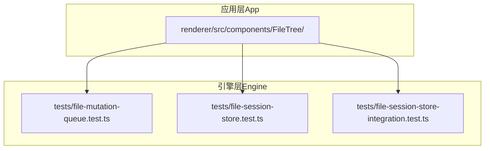
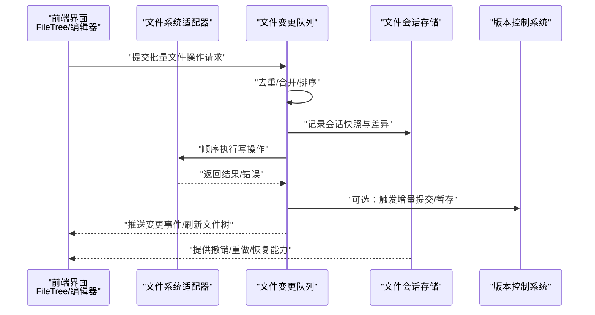
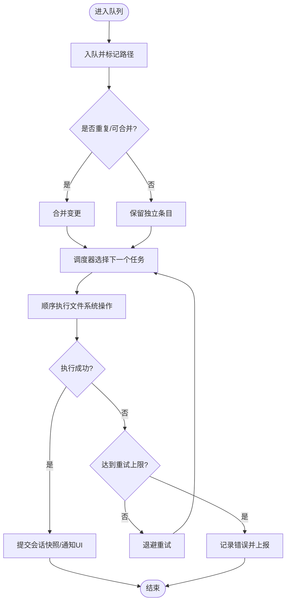
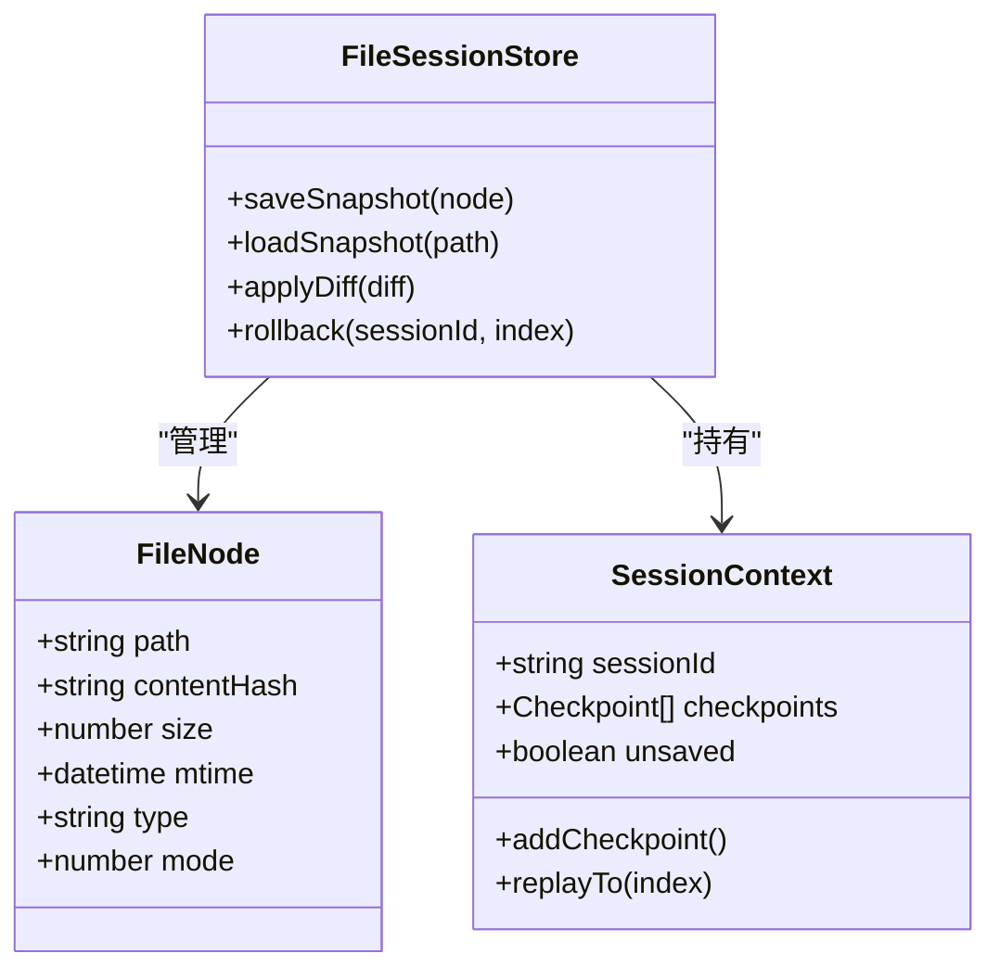
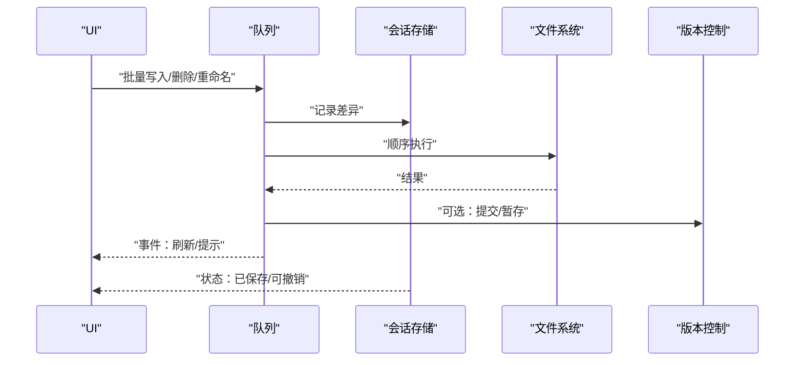
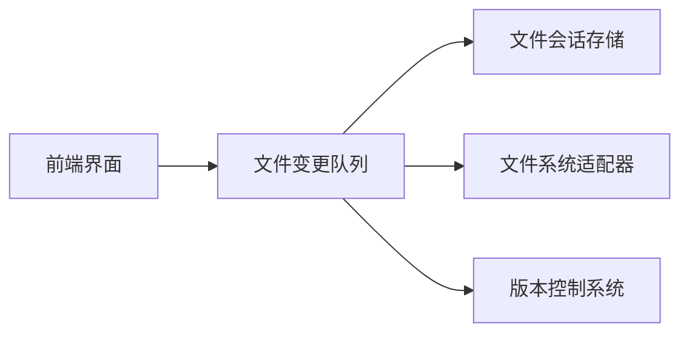

# 文件操作能力

<cite>
**本文引用的文件**   
- [engine/file-mutation-queue.test.ts](file://engine/tests/file-mutation-queue.test.ts)
- [engine/file-session-store-integration.test.ts](file://engine/tests/file-session-store-integration.test.ts)
- [engine/file-session-store.test.ts](file://engine/tests/file-session-store.test.ts)
</cite>

## 目录
1. [简介](#简介)
2. [项目结构](#项目结构)
3. [核心组件](#核心组件)
4. [架构总览](#架构总览)
5. [详细组件分析](#详细组件分析)
6. [依赖关系分析](#依赖关系分析)
7. [性能考量](#性能考量)
8. [故障排查指南](#故障排查指南)
9. [结论](#结论)
10. [附录：API 使用示例与最佳实践](#附录api-使用示例与最佳实践)

## 简介
本技术文档聚焦于 KCoder 的文件操作能力，围绕以下目标展开：文件系统访问机制、变更监听实现、文件操作队列管理；文件树渲染逻辑、目录结构解析、文件元数据管理；批量文件操作、冲突解决、版本控制集成；安全访问控制与权限管理、跨平台兼容性；并提供 API 使用示例与最佳实践，涵盖大文件与异步操作的策略。

由于仓库中直接可验证的实现集中在测试用例层面，本文以这些测试为权威来源进行架构与行为说明，并给出面向工程实践的扩展建议。

## 项目结构
从仓库结构看，与“文件操作”强相关的代码位于 engine 子工程的 tests 目录下，包含对文件变更队列与会话存储的测试。前端 app 层存在 FileTree 组件目录，但未见具体实现文件，因此本节仅做概念性说明。

图表来源
- [engine/file-mutation-queue.test.ts](file://engine/tests/file-mutation-queue.test.ts)
- [engine/file-session-store.test.ts](file://engine/tests/file-session-store.test.ts)
- [engine/file-session-store-integration.test.ts](file://engine/tests/file-session-store-integration.test.ts)

章节来源
- [engine/file-mutation-queue.test.ts](file://engine/tests/file-mutation-queue.test.ts)
- [engine/file-session-store.test.ts](file://engine/tests/file-session-store.test.ts)
- [engine/file-session-store-integration.test.ts](file://engine/tests/file-session-store-integration.test.ts)

## 核心组件
基于测试文件命名与职责划分，可将文件操作相关核心组件归纳如下：
- 文件变更队列（File Mutation Queue）：负责将并发或批量的文件写入/删除/重命名等操作入队、去重、合并与有序执行，保障最终一致性。
- 文件会话存储（File Session Store）：维护一次编辑会话内的文件状态快照、差异与回滚能力，支持断点恢复与多窗口协作。
- 集成测试（Integration Tests）：覆盖端到端流程，包括队列与存储的协同、事件传播、错误恢复等。

章节来源
- [engine/file-mutation-queue.test.ts](file://engine/tests/file-mutation-queue.test.ts)
- [engine/file-session-store.test.ts](file://engine/tests/file-session-store.test.ts)
- [engine/file-session-store-integration.test.ts](file://engine/tests/file-session-store-integration.test.ts)

## 架构总览
下图展示从 UI 到持久化的典型调用链，以及变更监听与队列化写入的关键路径。

图表来源
- [engine/file-mutation-queue.test.ts](file://engine/tests/file-mutation-queue.test.ts)
- [engine/file-session-store.test.ts](file://engine/tests/file-session-store.test.ts)
- [engine/file-session-store-integration.test.ts](file://engine/tests/file-session-store-integration.test.ts)

## 详细组件分析

### 文件变更队列（File Mutation Queue）
- 职责
  - 接收来自 UI 或工具链的文件变更请求（创建、写入、删除、重命名、移动）。
  - 对同一文件的多次变更进行合并与去重，降低 I/O 压力。
  - 保证跨线程/进程场景下的顺序性与幂等性。
  - 失败重试与错误隔离，避免单点失败阻塞整体流程。
- 关键特性
  - 批量聚合：将短时间内的多次写入合并为最小集。
  - 优先级与公平调度：区分用户交互与后台任务。
  - 事务语义：在会话内保持原子性，支持回滚。
- 复杂度与优化
  - 时间复杂度：合并阶段近似 O(n log n)（按路径排序），执行阶段线性扫描。
  - 空间复杂度：O(n) 存储待执行队列与中间状态。
  - 优化建议：引入 LRU 缓存最近路径索引、惰性加载目录项、增量 diff。

图表来源
- [engine/file-mutation-queue.test.ts](file://engine/tests/file-mutation-queue.test.ts)

章节来源
- [engine/file-mutation-queue.test.ts](file://engine/tests/file-mutation-queue.test.ts)

### 文件会话存储（File Session Store）
- 职责
  - 维护当前会话的文件状态快照、差异与元数据。
  - 支持撤销/重做、断点续编、多窗口同步。
  - 与队列协作，确保每次落盘后更新会话状态。
- 数据结构要点
  - 文件节点：路径、内容哈希、大小、修改时间、类型、权限位等。
  - 会话上下文：会话ID、时间线、检查点、未保存标记。
- 一致性模型
  - 最终一致：队列执行完成后统一推进会话状态。
  - 冲突检测：基于路径+内容哈希的乐观锁策略。

图表来源
- [engine/file-session-store.test.ts](file://engine/tests/file-session-store.test.ts)

章节来源
- [engine/file-session-store.test.ts](file://engine/tests/file-session-store.test.ts)

### 集成流程（端到端）
- 目标
  - 验证队列与存储的协同工作，包括事件传播、错误恢复、状态一致性。
- 关键路径
  - UI 发起批量操作 → 队列聚合 → 会话存储记录差异 → 顺序落盘 → 触发版本控制钩子 → 刷新 UI。

图表来源
- [engine/file-session-store-integration.test.ts](file://engine/tests/file-session-store-integration.test.ts)

章节来源
- [engine/file-session-store-integration.test.ts](file://engine/tests/file-session-store-integration.test.ts)

## 依赖关系分析
- 内部依赖
  - 队列依赖会话存储用于状态追踪与回滚。
  - 集成测试依赖队列与存储的组合契约。
- 外部依赖
  - 文件系统适配器（抽象接口，屏蔽平台差异）。
  - 版本控制系统（可选，通过钩子或命令驱动）。
- 耦合与内聚
  - 队列与存储之间通过明确的事件与快照接口解耦。
  - 对外暴露稳定的 API，便于替换底层实现。

图表来源
- [engine/file-mutation-queue.test.ts](file://engine/tests/file-mutation-queue.test.ts)
- [engine/file-session-store.test.ts](file://engine/tests/file-session-store.test.ts)
- [engine/file-session-store-integration.test.ts](file://engine/tests/file-session-store-integration.test.ts)

章节来源
- [engine/file-mutation-queue.test.ts](file://engine/tests/file-mutation-queue.test.ts)
- [engine/file-session-store.test.ts](file://engine/tests/file-session-store.test.ts)
- [engine/file-session-store-integration.test.ts](file://engine/tests/file-session-store-integration.test.ts)

## 性能考量
- 批量与合并
  - 短周期内合并同路径写入，减少磁盘抖动。
  - 采用增量 diff 而非全量重写，降低带宽与 CPU 消耗。
- 并发与顺序
  - 不同路径可并行，同路径严格串行，避免竞态。
- 内存与流式处理
  - 大文件采用流式读写，避免一次性载入内存。
  - 分页/分块读取目录项，按需懒加载。
- 缓存策略
  - 路径索引与最近访问缓存，提升遍历与查找效率。
- 监控与降级
  - 记录队列长度、执行耗时、失败率，设置阈值告警。
  - 高负载时降级为只读或延迟非关键操作。

[本节为通用指导，不直接分析具体文件]

## 故障排查指南
- 常见问题定位
  - 队列堆积：检查调度器与执行器健康度，确认是否有长时间阻塞的 I/O。
  - 会话不一致：核对快照序列号与检查点，必要时执行回放修复。
  - 权限错误：校验目标路径权限位与运行环境用户上下文。
  - 跨平台差异：注意路径分隔符、大小写敏感、符号链接与特殊字符。
- 日志与指标
  - 输出关键事件：入队、合并、执行、完成、失败、重试。
  - 采集指标：队列深度、P95/P99 延迟、错误分类占比。
- 恢复策略
  - 自动重试与退避，超过上限转人工介入。
  - 会话级回滚至最近稳定检查点。

章节来源
- [engine/file-mutation-queue.test.ts](file://engine/tests/file-mutation-queue.test.ts)
- [engine/file-session-store.test.ts](file://engine/tests/file-session-store.test.ts)
- [engine/file-session-store-integration.test.ts](file://engine/tests/file-session-store-integration.test.ts)

## 结论
KCoder 的文件操作能力以“队列化写入 + 会话存储”为核心，兼顾性能、一致性与可恢复性。通过批量合并、顺序执行、快照与检查点机制，能够在复杂场景下保持稳定体验。结合版本控制钩子与完善的监控/降级策略，可进一步扩展到企业级工程实践。

[本节为总结性内容，不直接分析具体文件]

## 附录：API 使用示例与最佳实践
- 批量文件操作
  - 将多个写入/删除/重命名打包为一个批次提交，由队列自动合并与调度。
  - 对同路径多次写入，优先合并为最后一次有效变更。
- 冲突解决
  - 基于路径+内容哈希的乐观锁，冲突时提示用户或自动采用“最新写入优先/三方合并”策略。
- 版本控制集成
  - 在队列执行成功后触发 VCS 钩子，支持暂存、提交、打标签等动作。
- 安全访问控制与权限管理
  - 在执行前校验目标路径白名单与权限位，拒绝越权操作。
  - 对敏感目录启用额外审批或审计日志。
- 跨平台兼容
  - 统一路径规范化、大小写处理、符号链接解析与特殊字符转义。
- 大文件与异步操作
  - 使用流式读写与分块传输，避免内存峰值。
  - 异步回调/事件驱动反馈进度，支持取消与中断。
- 文件树渲染与目录解析
  - 基于会话存储提供的节点视图渲染，懒加载子目录，增量更新。
  - 元数据（大小、类型、mtime、mode）用于图标与排序显示。
- 最佳实践
  - 小步提交、频繁合并，降低冲突概率。
  - 为长耗时任务设置超时与心跳，防止假死。
  - 对关键路径增加幂等键，避免重复执行造成副作用。

[本节为通用指导，不直接分析具体文件]