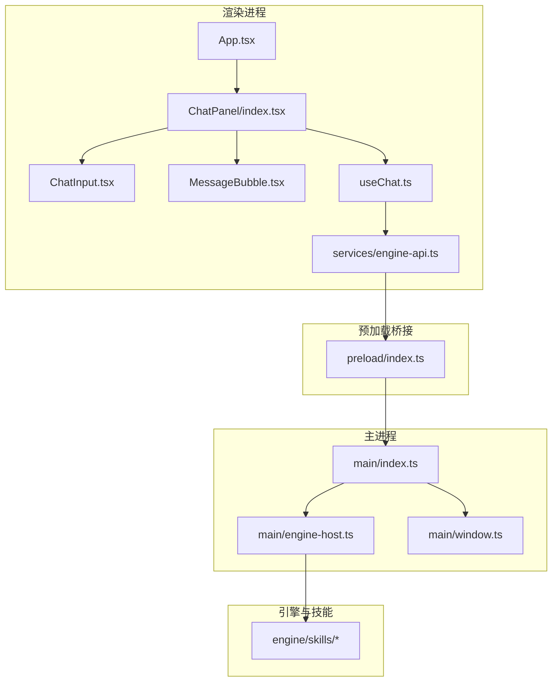
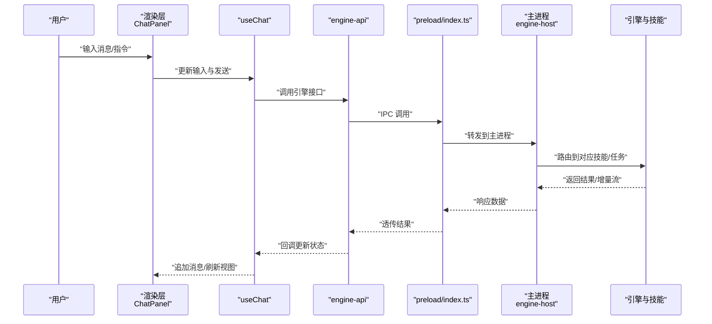
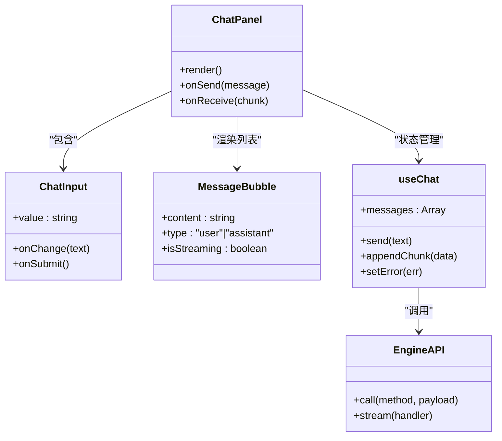
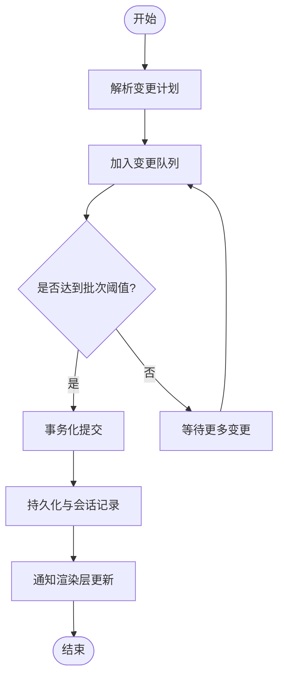
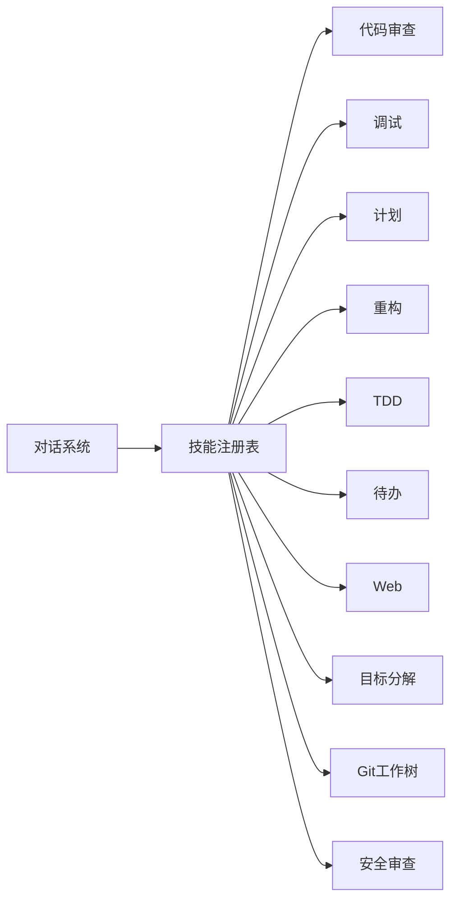
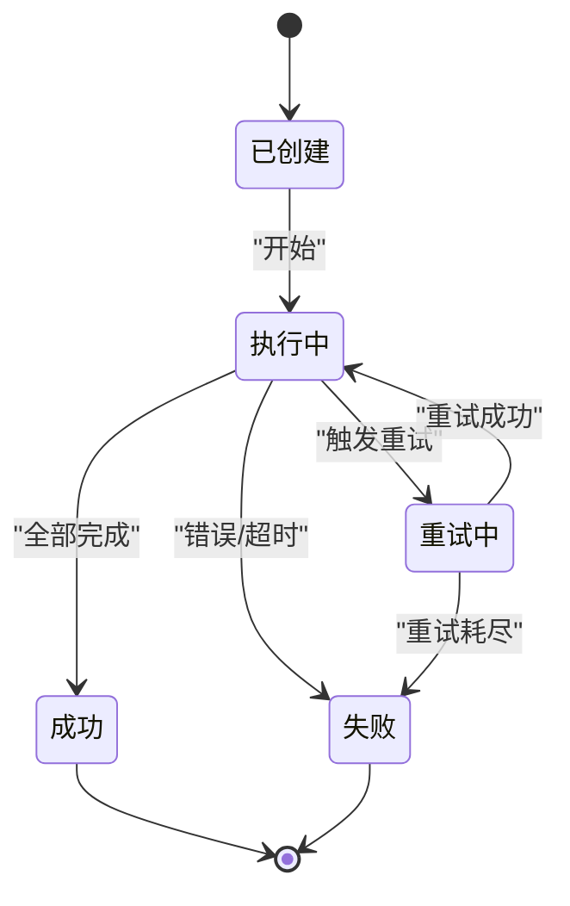
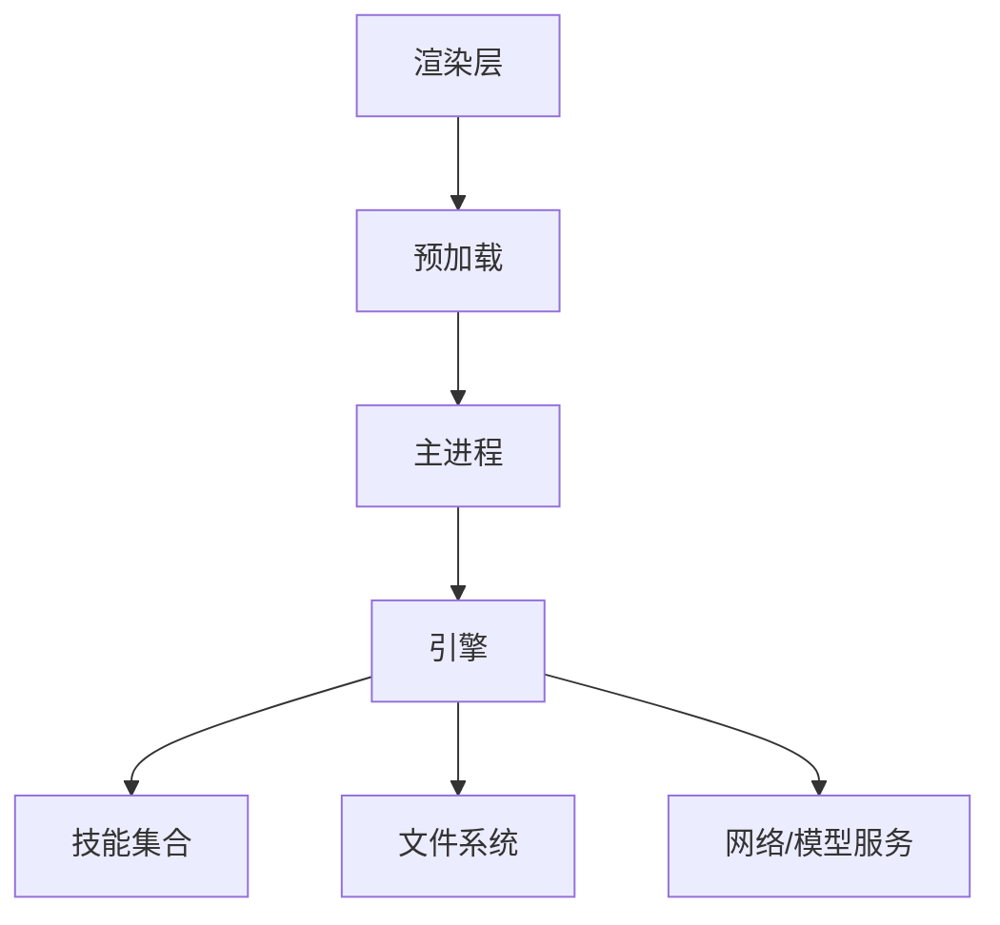

# 核心特性

<cite>
**本文引用的文件**   
- [app/main/index.ts](file://app/main/index.ts)
- [app/main/engine-host.ts](file://app/main/engine-host.ts)
- [app/main/window.ts](file://app/main/window.ts)
- [app/preload/index.ts](file://app/preload/index.ts)
- [app/renderer/src/App.tsx](file://app/renderer/src/App.tsx)
- [app/renderer/src/components/ChatPanel/index.tsx](file://app/renderer/src/components/ChatPanel/index.tsx)
- [app/renderer/src/components/ChatPanel/ChatInput.tsx](file://app/renderer/src/components/ChatPanel/ChatInput.tsx)
- [app/renderer/src/components/ChatPanel/MessageBubble.tsx](file://app/renderer/src/components/ChatPanel/MessageBubble.tsx)
- [app/renderer/src/hooks/useChat.ts](file://app/renderer/src/hooks/useChat.ts)
- [app/renderer/src/services/engine-api.ts](file://app/renderer/src/services/engine-api.ts)
- [engine/skills/code-review/SKILL.md](file://engine/skills/code-review/SKILL.md)
- [engine/skills/debugging/SKILL.md](file://engine/skills/debugging/SKILL.md)
- [engine/skills/planning/SKILL.md](file://engine/skills/planning/SKILL.md)
- [engine/skills/refactoring/SKILL.md](file://engine/skills/refactoring/SKILL.md)
- [engine/skills/tdd/SKILL.md](file://engine/skills/tdd/SKILL.md)
- [engine/skills/todo/SKILL.md](file://engine/skills/todo/SKILL.md)
- [engine/skills/web/SKILL.md](file://engine/skills/web/SKILL.md)
- [engine/skills/goal/SKILL.md](file://engine/skills/goal/SKILL.md)
- [engine/skills/git-worktrees/SKILL.md](file://engine/skills/git-worktrees/SKILL.md)
- [engine/skills/review/SKILL.md](file://engine/skills/review/SKILL.md)
- [engine/skills/security-review/SKILL.md](file://engine/skills/security-review/SKILL.md)
</cite>

## 目录
1. [简介](#简介)
2. [项目结构](#项目结构)
3. [核心组件](#核心组件)
4. [架构总览](#架构总览)
5. [详细组件分析](#详细组件分析)
6. [依赖关系分析](#依赖关系分析)
7. [性能考量](#性能考量)
8. [故障排查指南](#故障排查指南)
9. [结论](#结论)
10. [附录](#附录)

## 简介
本章节面向用户与开发者，系统性介绍KCoder的核心特性：AI智能对话系统、文件操作能力、技能系统与任务委派。文档从功能描述、使用场景、技术实现亮点、示例演示、协作关系与数据流转、性能特点、用户体验优势与差异化竞争力等维度展开，并辅以对比表格帮助快速选型。

## 项目结构
KCoder采用Electron多进程架构，前端渲染层通过预加载脚本与主进程通信，主进程负责引擎宿主管理与窗口生命周期；引擎侧以插件化“技能”组织能力，并通过HTTP/本地通道对外暴露工具与服务。

图示来源
- [app/renderer/src/App.tsx](file://app/renderer/src/App.tsx)
- [app/renderer/src/components/ChatPanel/index.tsx](file://app/renderer/src/components/ChatPanel/index.tsx)
- [app/renderer/src/components/ChatPanel/ChatInput.tsx](file://app/renderer/src/components/ChatPanel/ChatInput.tsx)
- [app/renderer/src/components/ChatPanel/MessageBubble.tsx](file://app/renderer/src/components/ChatPanel/MessageBubble.tsx)
- [app/renderer/src/hooks/useChat.ts](file://app/renderer/src/hooks/useChat.ts)
- [app/renderer/src/services/engine-api.ts](file://app/renderer/src/services/engine-api.ts)
- [app/preload/index.ts](file://app/preload/index.ts)
- [app/main/index.ts](file://app/main/index.ts)
- [app/main/engine-host.ts](file://app/main/engine-host.ts)
- [app/main/window.ts](file://app/main/window.ts)

章节来源
- [app/main/index.ts](file://app/main/index.ts)
- [app/main/engine-host.ts](file://app/main/engine-host.ts)
- [app/main/window.ts](file://app/main/window.ts)
- [app/preload/index.ts](file://app/preload/index.ts)
- [app/renderer/src/App.tsx](file://app/renderer/src/App.tsx)
- [app/renderer/src/components/ChatPanel/index.tsx](file://app/renderer/src/components/ChatPanel/index.tsx)
- [app/renderer/src/components/ChatPanel/ChatInput.tsx](file://app/renderer/src/components/ChatPanel/ChatInput.tsx)
- [app/renderer/src/components/ChatPanel/MessageBubble.tsx](file://app/renderer/src/components/ChatPanel/MessageBubble.tsx)
- [app/renderer/src/hooks/useChat.ts](file://app/renderer/src/hooks/useChat.ts)
- [app/renderer/src/services/engine-api.ts](file://app/renderer/src/services/engine-api.ts)

## 核心组件
本节聚焦四大核心特性：AI智能对话、文件操作、技能系统、任务委派。每个特性均给出功能描述、典型使用场景、技术实现亮点、示例演示要点以及与其他特性的协作方式。

- AI智能对话系统
  - 功能描述：提供自然语言交互界面，支持消息输入、流式输出、上下文记忆与工具调用反馈展示。
  - 使用场景：代码解释、方案讨论、错误诊断、生成片段、自动化建议。
  - 技术实现亮点：渲染层状态管理（hooks）、消息气泡组件、与引擎API的异步通信、事件驱动的消息追加与滚动定位。
  - 示例演示：在聊天面板输入问题，观察流式消息渲染与工具调用结果回显。
  - 协作关系：与技能系统联动，将意图路由到具体技能；与任务委派配合，将复杂请求拆分为子任务执行。

- 文件操作能力
  - 功能描述：对工程文件进行读取、写入、变更队列与持久化会话存储，保障原子性与一致性。
  - 使用场景：批量重构、自动补全、测试脚手架生成、安全扫描后的修复落地。
  - 技术实现亮点：变更队列与事务化提交、会话级缓存、跨进程安全访问控制。
  - 示例演示：通过对话触发“重构”技能后，查看文件树中受影响的文件被有序更新。
  - 协作关系：由技能系统发起，经引擎层落盘；任务委派可并行调度多个文件的批处理。

- 技能系统
  - 功能描述：以“技能”为粒度封装领域能力（如代码审查、调试、计划、重构、TDD、待办、Web、目标分解、Git工作树、安全审查等），通过声明式配置与运行时注册接入。
  - 使用场景：一键启动特定流程（如TDD循环、安全扫描+修复、PR评审）。
  - 技术实现亮点：技能清单与元数据驱动、命令注册表、MCP桥接扩展点、可插拔工具提供者。
  - 示例演示：选择“代码审查”技能，自动拉取差异并输出审查报告与建议。
  - 协作关系：作为AI对话的工具集，被对话系统按需调用；任务委派可将大目标拆解为多个技能组合执行。

- 任务委派
  - 功能描述：将复杂目标分解为可追踪的子任务，支持状态机、进度投影、超时与重试、结果聚合。
  - 使用场景：端到端开发流水线（规划→编码→测试→提交）、跨模块联调、持续集成前置检查。
  - 技术实现亮点：执行图与策略编排、中间件治理、预算与节流、可恢复的状态存储。
  - 示例演示：输入“完成某功能”，系统自动生成计划并分派至各技能节点，实时显示进度与产物。
  - 协作关系：消费技能能力，协调文件操作与对话反馈，形成闭环。

章节来源
- [app/renderer/src/hooks/useChat.ts](file://app/renderer/src/hooks/useChat.ts)
- [app/renderer/src/components/ChatPanel/index.tsx](file://app/renderer/src/components/ChatPanel/index.tsx)
- [app/renderer/src/components/ChatPanel/ChatInput.tsx](file://app/renderer/src/components/ChatPanel/ChatInput.tsx)
- [app/renderer/src/components/ChatPanel/MessageBubble.tsx](file://app/renderer/src/components/ChatPanel/MessageBubble.tsx)
- [app/renderer/src/services/engine-api.ts](file://app/renderer/src/services/engine-api.ts)
- [engine/skills/code-review/SKILL.md](file://engine/skills/code-review/SKILL.md)
- [engine/skills/debugging/SKILL.md](file://engine/skills/debugging/SKILL.md)
- [engine/skills/planning/SKILL.md](file://engine/skills/planning/SKILL.md)
- [engine/skills/refactoring/SKILL.md](file://engine/skills/refactoring/SKILL.md)
- [engine/skills/tdd/SKILL.md](file://engine/skills/tdd/SKILL.md)
- [engine/skills/todo/SKILL.md](file://engine/skills/todo/SKILL.md)
- [engine/skills/web/SKILL.md](file://engine/skills/web/SKILL.md)
- [engine/skills/goal/SKILL.md](file://engine/skills/goal/SKILL.md)
- [engine/skills/git-worktrees/SKILL.md](file://engine/skills/git-worktrees/SKILL.md)
- [engine/skills/review/SKILL.md](file://engine/skills/review/SKILL.md)
- [engine/skills/security-review/SKILL.md](file://engine/skills/security-review/SKILL.md)

## 架构总览
下图展示了从用户输入到引擎执行的端到端路径，体现对话、技能与任务委派的协同。

图示来源
- [app/renderer/src/components/ChatPanel/index.tsx](file://app/renderer/src/components/ChatPanel/index.tsx)
- [app/renderer/src/hooks/useChat.ts](file://app/renderer/src/hooks/useChat.ts)
- [app/renderer/src/services/engine-api.ts](file://app/renderer/src/services/engine-api.ts)
- [app/preload/index.ts](file://app/preload/index.ts)
- [app/main/engine-host.ts](file://app/main/engine-host.ts)

## 详细组件分析

### AI智能对话系统
- 功能描述：提供低延迟、高可用的对话体验，支持消息气泡、输入校验、流式渲染与上下文管理。
- 关键实现
  - 渲染层：聊天面板容器、消息气泡、输入框组件拆分清晰，职责单一。
  - 状态管理：自定义hook集中处理发送、接收、滚动与错误提示。
  - 通信层：统一封装引擎API，屏蔽底层IPC细节。
- 使用示例
  - 在聊天面板输入“帮我优化这段函数”，观察流式回复与后续文件变更提示。
- 协作关系
  - 与技能系统：根据意图匹配技能，调用其工具链。
  - 与任务委派：长链路任务以“计划-执行-汇报”模式呈现。

图示来源
- [app/renderer/src/components/ChatPanel/index.tsx](file://app/renderer/src/components/ChatPanel/index.tsx)
- [app/renderer/src/components/ChatPanel/ChatInput.tsx](file://app/renderer/src/components/ChatPanel/ChatInput.tsx)
- [app/renderer/src/components/ChatPanel/MessageBubble.tsx](file://app/renderer/src/components/ChatPanel/MessageBubble.tsx)
- [app/renderer/src/hooks/useChat.ts](file://app/renderer/src/hooks/useChat.ts)
- [app/renderer/src/services/engine-api.ts](file://app/renderer/src/services/engine-api.ts)

章节来源
- [app/renderer/src/components/ChatPanel/index.tsx](file://app/renderer/src/components/ChatPanel/index.tsx)
- [app/renderer/src/components/ChatPanel/ChatInput.tsx](file://app/renderer/src/components/ChatPanel/ChatInput.tsx)
- [app/renderer/src/components/ChatPanel/MessageBubble.tsx](file://app/renderer/src/components/ChatPanel/MessageBubble.tsx)
- [app/renderer/src/hooks/useChat.ts](file://app/renderer/src/hooks/useChat.ts)
- [app/renderer/src/services/engine-api.ts](file://app/renderer/src/services/engine-api.ts)

### 文件操作能力
- 功能描述：提供安全的文件读写、变更队列与持久化会话存储，确保大规模编辑的一致性与可恢复性。
- 关键实现
  - 变更队列：合并相近修改，减少I/O抖动。
  - 会话存储：按会话隔离，支持回放与断点续写。
  - 权限控制：通过主进程代理，避免渲染进程直接访问文件系统。
- 使用示例
  - 触发“重构”技能后，查看受影响文件顺序更新，失败时自动回滚或提示。
- 协作关系
  - 由技能系统发起，任务委派协调并发与顺序，对话层展示进度与结果。

图示来源
- [app/main/engine-host.ts](file://app/main/engine-host.ts)
- [app/preload/index.ts](file://app/preload/index.ts)

章节来源
- [app/main/engine-host.ts](file://app/main/engine-host.ts)
- [app/preload/index.ts](file://app/preload/index.ts)

### 技能系统
- 功能描述：以“技能”为单位封装领域能力，通过清单与元数据驱动注册，支持命令注册、工具提供者与MCP桥接。
- 关键实现
  - 清单驱动：每个技能包含说明与配置，便于发现与组合。
  - 命令注册表：将自然语言意图映射到具体工具链。
  - 可扩展性：通过MCP桥接第三方工具与服务。
- 使用示例
  - 选择“TDD”技能，自动创建测试骨架、运行用例并指导迭代。
- 协作关系
  - 被对话系统按需调用；任务委派将其编排为工作流。

图示来源
- [engine/skills/code-review/SKILL.md](file://engine/skills/code-review/SKILL.md)
- [engine/skills/debugging/SKILL.md](file://engine/skills/debugging/SKILL.md)
- [engine/skills/planning/SKILL.md](file://engine/skills/planning/SKILL.md)
- [engine/skills/refactoring/SKILL.md](file://engine/skills/refactoring/SKILL.md)
- [engine/skills/tdd/SKILL.md](file://engine/skills/tdd/SKILL.md)
- [engine/skills/todo/SKILL.md](file://engine/skills/todo/SKILL.md)
- [engine/skills/web/SKILL.md](file://engine/skills/web/SKILL.md)
- [engine/skills/goal/SKILL.md](file://engine/skills/goal/SKILL.md)
- [engine/skills/git-worktrees/SKILL.md](file://engine/skills/git-worktrees/SKILL.md)
- [engine/skills/review/SKILL.md](file://engine/skills/review/SKILL.md)
- [engine/skills/security-review/SKILL.md](file://engine/skills/security-review/SKILL.md)

章节来源
- [engine/skills/code-review/SKILL.md](file://engine/skills/code-review/SKILL.md)
- [engine/skills/debugging/SKILL.md](file://engine/skills/debugging/SKILL.md)
- [engine/skills/planning/SKILL.md](file://engine/skills/planning/SKILL.md)
- [engine/skills/refactoring/SKILL.md](file://engine/skills/refactoring/SKILL.md)
- [engine/skills/tdd/SKILL.md](file://engine/skills/tdd/SKILL.md)
- [engine/skills/todo/SKILL.md](file://engine/skills/todo/SKILL.md)
- [engine/skills/web/SKILL.md](file://engine/skills/web/SKILL.md)
- [engine/skills/goal/SKILL.md](file://engine/skills/goal/SKILL.md)
- [engine/skills/git-worktrees/SKILL.md](file://engine/skills/git-worktrees/SKILL.md)
- [engine/skills/review/SKILL.md](file://engine/skills/review/SKILL.md)
- [engine/skills/security-review/SKILL.md](file://engine/skills/security-review/SKILL.md)

### 任务委派
- 功能描述：将复杂目标拆解为可追踪的子任务，支持状态机、进度投影、超时重试与结果聚合。
- 关键实现
  - 执行图：有向无环图表达依赖与并行度。
  - 中间件治理：预算、节流、审计与可观测性。
  - 持久化：状态可恢复，支持中断后继续。
- 使用示例
  - 输入“完成登录模块”，系统生成计划并依次执行“计划→编码→测试→提交”，实时展示进度与产物。
- 协作关系
  - 消费技能能力，协调文件操作与对话反馈，形成闭环。

图示来源
- [app/main/engine-host.ts](file://app/main/engine-host.ts)

章节来源
- [app/main/engine-host.ts](file://app/main/engine-host.ts)

## 依赖关系分析
- 组件耦合
  - 渲染层与预加载强耦合用于IPC，主进程与引擎通过宿主抽象解耦。
  - 技能系统通过注册表与命令表松耦合对接对话与任务委派。
- 外部依赖
  - 文件系统、网络与模型服务通过引擎层统一接入，渲染层不直接感知。
- 潜在风险
  - IPC序列化开销需关注大数据传输；文件变更队列需保证幂等与去重。

图示来源
- [app/renderer/src/services/engine-api.ts](file://app/renderer/src/services/engine-api.ts)
- [app/preload/index.ts](file://app/preload/index.ts)
- [app/main/engine-host.ts](file://app/main/engine-host.ts)

章节来源
- [app/renderer/src/services/engine-api.ts](file://app/renderer/src/services/engine-api.ts)
- [app/preload/index.ts](file://app/preload/index.ts)
- [app/main/engine-host.ts](file://app/main/engine-host.ts)

## 性能考量
- 渲染层
  - 消息列表虚拟化与增量更新，降低DOM压力。
  - 流式渲染避免整段阻塞，提升首帧速度。
- 通信层
  - 批量IPC与压缩传输，减少往返次数。
- 引擎层
  - 变更队列批处理与事务提交，降低磁盘抖动。
  - 任务并行度与资源配额控制，避免过载。
- 可观测性
  - 关键路径埋点与指标上报，便于定位瓶颈。

[本节为通用性能建议，无需源码引用]

## 故障排查指南
- 常见问题
  - 对话无响应：检查IPC通道是否正常、引擎是否就绪。
  - 文件未保存：确认变更队列是否提交、会话存储是否可用。
  - 技能未生效：核对技能清单与命令注册表是否匹配。
- 定位步骤
  - 打开控制台查看错误堆栈与日志。
  - 验证引擎健康检查接口与端口。
  - 复现最小用例，逐步缩小范围。

章节来源
- [app/main/engine-host.ts](file://app/main/engine-host.ts)
- [app/preload/index.ts](file://app/preload/index.ts)

## 结论
KCoder通过“对话即入口、技能即能力、任务即流程、文件即产物”的设计，将AI智能与工程实践深度融合。其插件化技能体系与稳健的任务委派机制，使复杂开发任务可编排、可追踪、可恢复，显著提升研发效率与体验。

[本节为总结性内容，无需源码引用]

## 附录

### 特性对比与适用场景
- AI智能对话
  - 适用：即时问答、方案探讨、错误诊断、片段生成。
  - 优势：低延迟、流式反馈、上下文连贯。
- 文件操作
  - 适用：批量重构、自动化修复、测试脚手架生成。
  - 优势：变更队列、事务化提交、会话持久化。
- 技能系统
  - 适用：标准化流程（审查、调试、TDD、安全扫描等）。
  - 优势：清单驱动、可插拔、易扩展。
- 任务委派
  - 适用：端到端流水线、跨模块协作、复杂目标拆解。
  - 优势：执行图编排、可恢复、可观测。

[本节为概念性对比，无需源码引用]