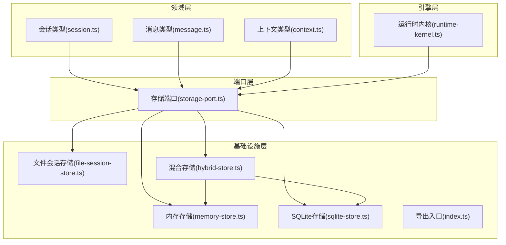
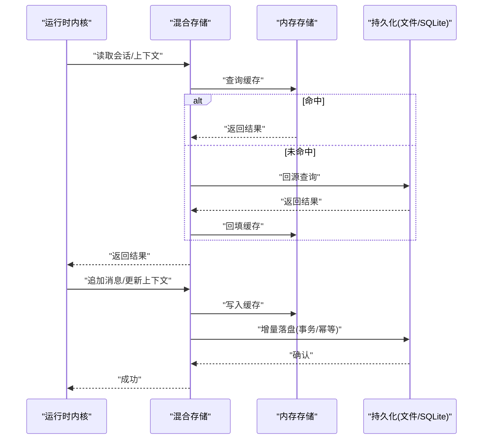
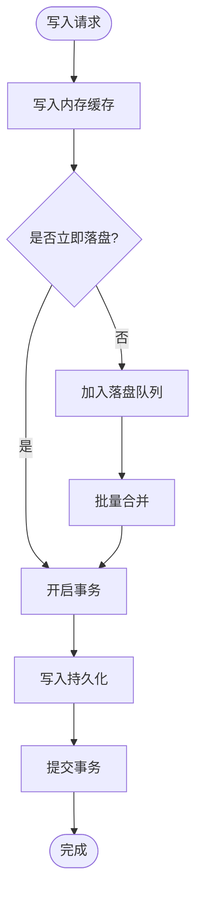
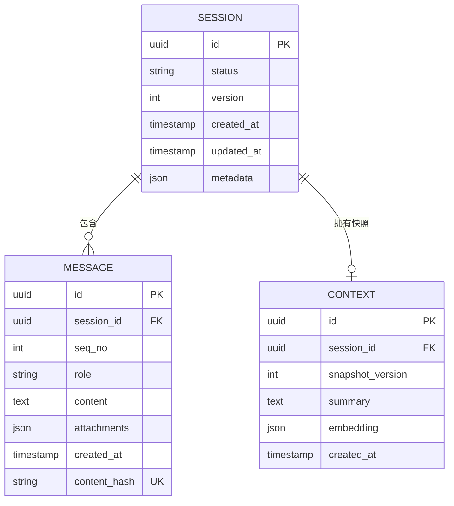
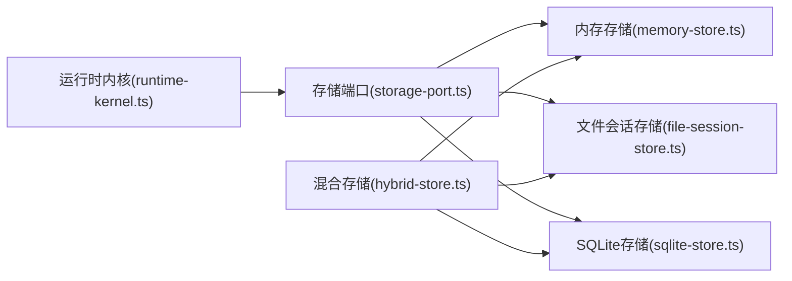

# 记忆存储系统

<cite>
**本文引用的文件**   
- [engine/packages/infrastructure/src/storage/hybrid-store.ts](file://engine/packages/infrastructure/src/storage/hybrid-store.ts)
- [engine/packages/infrastructure/src/storage/memory-store.ts](file://engine/packages/infrastructure/src/storage/memory-store.ts)
- [engine/packages/infrastructure/src/storage/file-session-store.ts](file://engine/packages/infrastructure/src/storage/file-session-store.ts)
- [engine/packages/infrastructure/src/storage/sqlite-store.ts](file://engine/packages/infrastructure/src/storage/sqlite-store.ts)
- [engine/packages/infrastructure/src/storage/index.ts](file://engine/packages/infrastructure/src/storage/index.ts)
- [engine/packages/domain-layer/src/types/session.ts](file://engine/packages/domain-layer/src/types/session.ts)
- [engine/packages/domain-layer/src/types/message.ts](file://engine/packages/domain-layer/src/types/message.ts)
- [engine/packages/domain-layer/src/types/context.ts](file://engine/packages/domain-layer/src/types/context.ts)
- [engine/packages/ports-layer/src/storage-port.ts](file://engine/packages/ports-layer/src/storage-port.ts)
- [engine/packages/engine/src/runtime-kernel.ts](file://engine/packages/engine/src/runtime-kernel.ts)
- [engine/tests/hybrid-store.test.ts](file://engine/tests/hybrid-store.test.ts)
- [engine/tests/memory-store.test.ts](file://engine/tests/memory-store.test.ts)
- [engine/tests/file-session-store.test.ts](file://engine/tests/file-session-store.test.ts)
- [engine/scripts/verify-sqlite.mjs](file://engine/scripts/verify-sqlite.mjs)
</cite>

## 目录
1. [简介](#简介)
2. [项目结构](#项目结构)
3. [核心组件](#核心组件)
4. [架构总览](#架构总览)
5. [详细组件分析](#详细组件分析)
6. [依赖关系分析](#依赖关系分析)
7. [性能与优化](#性能与优化)
8. [故障排查指南](#故障排查指南)
9. [结论](#结论)
10. [附录](#附录)

## 简介
本技术文档围绕 KCoder 的记忆存储系统，系统性阐述持久化存储架构、数据模型设计、索引策略、会话历史管理、上下文缓存、增量更新机制、混合存储方案、数据迁移与备份恢复策略、存储性能优化与查询加速、内存管理、存储适配器开发指南、配置选项与监控指标、数据一致性保证、事务处理与并发访问控制等主题。目标是帮助开发者快速理解并扩展该存储子系统，同时为运维与排障提供可操作指引。

## 项目结构
记忆存储系统位于 engine 子工程内，采用分层与端口-适配器的组织方式：
- 领域层（domain-layer）定义会话、消息、上下文等核心数据模型
- 端口层（ports-layer）定义存储抽象接口（StoragePort），屏蔽底层实现差异
- 基础设施层（infrastructure）提供多种具体存储实现：内存、文件、SQLite、以及混合存储协调器
- 引擎层（engine）通过运行时内核消费存储能力，驱动会话生命周期与上下文管理
- 测试与脚本覆盖关键路径验证与集成校验

图表来源
- [engine/packages/ports-layer/src/storage-port.ts](file://engine/packages/ports-layer/src/storage-port.ts)
- [engine/packages/infrastructure/src/storage/hybrid-store.ts](file://engine/packages/infrastructure/src/storage/hybrid-store.ts)
- [engine/packages/infrastructure/src/storage/memory-store.ts](file://engine/packages/infrastructure/src/storage/memory-store.ts)
- [engine/packages/infrastructure/src/storage/file-session-store.ts](file://engine/packages/infrastructure/src/storage/file-session-store.ts)
- [engine/packages/infrastructure/src/storage/sqlite-store.ts](file://engine/packages/infrastructure/src/storage/sqlite-store.ts)
- [engine/packages/engine/src/runtime-kernel.ts](file://engine/packages/engine/src/runtime-kernel.ts)

章节来源
- [engine/packages/ports-layer/src/storage-port.ts](file://engine/packages/ports-layer/src/storage-port.ts)
- [engine/packages/infrastructure/src/storage/index.ts](file://engine/packages/infrastructure/src/storage/index.ts)
- [engine/packages/engine/src/runtime-kernel.ts](file://engine/packages/engine/src/runtime-kernel.ts)

## 核心组件
- 存储端口（StoragePort）
  - 职责：定义统一的读写、查询、事务、元数据与统计接口，供上层调用
  - 典型能力：会话创建/读取/更新/删除、消息追加/分页检索、上下文快照存取、增量变更订阅、统计与指标上报
- 内存存储（MemoryStore）
  - 职责：进程内键值/列表缓存，适合热路径与上下文缓存
  - 特点：低延迟、无持久化、易失效、支持简单过期策略
- 文件会话存储（FileSessionStore）
  - 职责：以文件系统为介质持久化会话与消息，便于调试与离线分析
  - 特点：强一致写入、顺序追加、按会话分片、支持压缩归档
- SQLite 存储（SQLiteStore）
  - 职责：结构化持久化与会话/消息的复杂查询
  - 特点：ACID 事务、索引优化、分页与过滤、跨进程共享
- 混合存储（HybridStore）
  - 职责：协调内存与持久化后端，实现“读多写少”场景下的热点命中与增量落盘
  - 特点：读写分离、回源策略、合并窗口、幂等写入、降级保护

章节来源
- [engine/packages/ports-layer/src/storage-port.ts](file://engine/packages/ports-layer/src/storage-port.ts)
- [engine/packages/infrastructure/src/storage/memory-store.ts](file://engine/packages/infrastructure/src/storage/memory-store.ts)
- [engine/packages/infrastructure/src/storage/file-session-store.ts](file://engine/packages/infrastructure/src/storage/file-session-store.ts)
- [engine/packages/infrastructure/src/storage/sqlite-store.ts](file://engine/packages/infrastructure/src/storage/sqlite-store.ts)
- [engine/packages/infrastructure/src/storage/hybrid-store.ts](file://engine/packages/infrastructure/src/storage/hybrid-store.ts)

## 架构总览
混合存储作为统一门面，向上暴露一致的存储端口；向下根据策略路由到内存或持久化后端。引擎侧通过运行时内核发起会话与上下文操作，由混合存储负责一致性、缓存命中与增量落盘。

图表来源
- [engine/packages/engine/src/runtime-kernel.ts](file://engine/packages/engine/src/runtime-kernel.ts)
- [engine/packages/infrastructure/src/storage/hybrid-store.ts](file://engine/packages/infrastructure/src/storage/hybrid-store.ts)
- [engine/packages/infrastructure/src/storage/memory-store.ts](file://engine/packages/infrastructure/src/storage/memory-store.ts)
- [engine/packages/infrastructure/src/storage/sqlite-store.ts](file://engine/packages/infrastructure/src/storage/sqlite-store.ts)
- [engine/packages/infrastructure/src/storage/file-session-store.ts](file://engine/packages/infrastructure/src/storage/file-session-store.ts)

## 详细组件分析

### 存储端口（StoragePort）
- 设计要点
  - 面向会话与上下文的 CRUD 与查询 API
  - 明确事务边界与幂等语义
  - 提供统计与指标钩子，便于监控
- 关键能力
  - 会话生命周期：创建、加载、更新、归档、删除
  - 消息流式追加与分页检索
  - 上下文快照与增量补丁
  - 事件订阅：变更通知用于缓存失效与重放
- 错误与一致性
  - 失败重试与退避
  - 幂等键避免重复写入
  - 事务回滚与补偿

章节来源
- [engine/packages/ports-layer/src/storage-port.ts](file://engine/packages/ports-layer/src/storage-port.ts)

### 内存存储（MemoryStore）
- 数据结构
  - 会话索引：会话 ID -> 会话元信息
  - 消息队列：会话 ID -> 有序消息序列
  - 上下文缓存：会话 ID -> 上下文快照
- 复杂度
  - 插入 O(1)，读取 O(1)，分页 O(k)
- 适用场景
  - 高频读写的热点会话
  - 短期上下文缓存
- 注意事项
  - 进程重启丢失
  - 需配合持久化做回源与回填

章节来源
- [engine/packages/infrastructure/src/storage/memory-store.ts](file://engine/packages/infrastructure/src/storage/memory-store.ts)
- [engine/tests/memory-store.test.ts](file://engine/tests/memory-store.test.ts)

### 文件会话存储（FileSessionStore）
- 存储布局
  - 按会话分目录，消息按时间分片文件
  - 元数据与索引文件辅助定位
- 写入策略
  - 顺序追加、原子替换、校验和
- 读取策略
  - 基于索引快速定位分片，按需加载
- 适用场景
  - 需要离线分析与审计的场景
  - 轻量部署无需数据库

章节来源
- [engine/packages/infrastructure/src/storage/file-session-store.ts](file://engine/packages/infrastructure/src/storage/file-session-store.ts)
- [engine/tests/file-session-store.test.ts](file://engine/tests/file-session-store.test.ts)

### SQLite 存储（SQLiteStore）
- 表结构与索引
  - 会话表：主键、状态、版本、时间戳
  - 消息表：会话外键、序号、内容哈希、时间戳
  - 上下文表：会话外键、快照版本、内容
  - 索引：会话+时间戳复合索引、内容哈希唯一索引
- 事务与并发
  - 单写者模式，读多写少
  - 使用 WAL 提升并发读
- 查询优化
  - 分页、过滤、排序利用索引
  - 预编译语句减少解析开销

章节来源
- [engine/packages/infrastructure/src/storage/sqlite-store.ts](file://engine/packages/infrastructure/src/storage/sqlite-store.ts)
- [engine/scripts/verify-sqlite.mjs](file://engine/scripts/verify-sqlite.mjs)

### 混合存储（HybridStore）
- 读写流程
  - 读：优先命中内存，未命中回源持久化并回填
  - 写：先写内存，再异步/同步落盘持久化
- 增量更新
  - 基于版本号/时间戳的增量合并
  - 冲突检测与幂等去重
- 降级与容错
  - 持久化不可用时降级为纯内存
  - 回源失败时的重试与告警
- 监控指标
  - 命中率、回源次数、落盘延迟、错误率

图表来源
- [engine/packages/infrastructure/src/storage/hybrid-store.ts](file://engine/packages/infrastructure/src/storage/hybrid-store.ts)
- [engine/packages/infrastructure/src/storage/sqlite-store.ts](file://engine/packages/infrastructure/src/storage/sqlite-store.ts)
- [engine/packages/infrastructure/src/storage/file-session-store.ts](file://engine/packages/infrastructure/src/storage/file-session-store.ts)

章节来源
- [engine/packages/infrastructure/src/storage/hybrid-store.ts](file://engine/packages/infrastructure/src/storage/hybrid-store.ts)
- [engine/tests/hybrid-store.test.ts](file://engine/tests/hybrid-store.test.ts)

### 数据模型设计
- 会话（Session）
  - 标识、状态、版本、时间戳、元数据
- 消息（Message）
  - 会话关联、序号、角色、内容、附件、时间戳、哈希
- 上下文（Context）
  - 会话关联、快照版本、摘要、向量嵌入（可选）、时间戳
- 关系
  - 一对多：会话 -> 消息
  - 一对一/多：会话 -> 上下文快照

图表来源
- [engine/packages/domain-layer/src/types/session.ts](file://engine/packages/domain-layer/src/types/session.ts)
- [engine/packages/domain-layer/src/types/message.ts](file://engine/packages/domain-layer/src/types/message.ts)
- [engine/packages/domain-layer/src/types/context.ts](file://engine/packages/domain-layer/src/types/context.ts)

章节来源
- [engine/packages/domain-layer/src/types/session.ts](file://engine/packages/domain-layer/src/types/session.ts)
- [engine/packages/domain-layer/src/types/message.ts](file://engine/packages/domain-layer/src/types/message.ts)
- [engine/packages/domain-layer/src/types/context.ts](file://engine/packages/domain-layer/src/types/context.ts)

### 索引策略
- 会话维度
  - 会话 ID + 时间戳复合索引，支撑按会话的时间范围查询
- 消息维度
  - 内容哈希唯一索引，防重与去重
  - 角色与时间戳联合索引，支撑对话回放
- 上下文维度
  - 会话 ID + 快照版本唯一索引，保障快照一致性

章节来源
- [engine/packages/infrastructure/src/storage/sqlite-store.ts](file://engine/packages/infrastructure/src/storage/sqlite-store.ts)

### 会话历史管理与上下文缓存
- 会话历史
  - 追加式写入，分页拉取，冷热分层
- 上下文缓存
  - 最近 N 条消息摘要 + 关键实体抽取
  - 过期策略与懒加载
- 增量更新
  - 基于版本号合并，避免全量重写

章节来源
- [engine/packages/infrastructure/src/storage/hybrid-store.ts](file://engine/packages/infrastructure/src/storage/hybrid-store.ts)
- [engine/packages/infrastructure/src/storage/memory-store.ts](file://engine/packages/infrastructure/src/storage/memory-store.ts)

### 混合存储方案与数据迁移
- 混合方案
  - 读路径：内存优先，回源兜底
  - 写路径：内存即时生效，持久化异步/批量落盘
- 数据迁移
  - 版本化迁移脚本，向后兼容
  - 双写过渡期与校验比对
- 备份恢复
  - 文件存储：打包归档与校验
  - SQLite：WAL 快照与逻辑导出

章节来源
- [engine/packages/infrastructure/src/storage/hybrid-store.ts](file://engine/packages/infrastructure/src/storage/hybrid-store.ts)
- [engine/scripts/verify-sqlite.mjs](file://engine/scripts/verify-sqlite.mjs)

### 存储适配器开发指南
- 步骤
  - 实现 StoragePort 接口
  - 提供初始化、连接池、事务封装
  - 实现幂等写入与错误分类
  - 注册统计与日志埋点
- 接入
  - 在 index.ts 中导出新适配器
  - 在混合存储中注册路由策略
- 测试
  - 编写单元测试与集成测试
  - 覆盖异常路径与并发场景

章节来源
- [engine/packages/ports-layer/src/storage-port.ts](file://engine/packages/ports-layer/src/storage-port.ts)
- [engine/packages/infrastructure/src/storage/index.ts](file://engine/packages/infrastructure/src/storage/index.ts)

### 配置选项与监控指标
- 配置项
  - 后端选择：memory/file/sqlite
  - 缓存容量与过期时间
  - 落盘策略：同步/异步/批量大小
  - 事务超时与重试次数
- 监控指标
  - 缓存命中率、回源耗时、落盘延迟、错误率、事务成功率

章节来源
- [engine/packages/infrastructure/src/storage/hybrid-store.ts](file://engine/packages/infrastructure/src/storage/hybrid-store.ts)

### 数据一致性、事务与并发控制
- 一致性
  - 幂等键与版本号确保最终一致
  - 冲突检测与合并策略
- 事务
  - 短事务包裹写路径，失败回滚
  - 长事务拆分与补偿
- 并发
  - 单写者模式，读多写少
  - 锁粒度最小化，避免热点阻塞

章节来源
- [engine/packages/infrastructure/src/storage/sqlite-store.ts](file://engine/packages/infrastructure/src/storage/sqlite-store.ts)
- [engine/packages/infrastructure/src/storage/hybrid-store.ts](file://engine/packages/infrastructure/src/storage/hybrid-store.ts)

## 依赖关系分析
- 耦合与内聚
  - 端口层与实现解耦，高内聚于各自存储特性
  - 混合存储聚合多个后端，承担策略编排
- 外部依赖
  - SQLite 驱动、文件系统、内存对象
- 循环依赖
  - 通过端口层避免直接循环引用

图表来源
- [engine/packages/ports-layer/src/storage-port.ts](file://engine/packages/ports-layer/src/storage-port.ts)
- [engine/packages/infrastructure/src/storage/hybrid-store.ts](file://engine/packages/infrastructure/src/storage/hybrid-store.ts)
- [engine/packages/infrastructure/src/storage/memory-store.ts](file://engine/packages/infrastructure/src/storage/memory-store.ts)
- [engine/packages/infrastructure/src/storage/file-session-store.ts](file://engine/packages/infrastructure/src/storage/file-session-store.ts)
- [engine/packages/infrastructure/src/storage/sqlite-store.ts](file://engine/packages/infrastructure/src/storage/sqlite-store.ts)
- [engine/packages/engine/src/runtime-kernel.ts](file://engine/packages/engine/src/runtime-kernel.ts)

章节来源
- [engine/packages/infrastructure/src/storage/index.ts](file://engine/packages/infrastructure/src/storage/index.ts)

## 性能与优化
- 查询加速
  - 合理索引与覆盖索引
  - 分页与游标式遍历
  - 预编译语句与连接复用
- 内存管理
  - LRU/LFU 淘汰策略
  - 大对象外置与引用
  - 定期清理冷数据
- 落盘优化
  - 批量合并与刷盘阈值
  - WAL 模式与检查点
- 热点隔离
  - 会话级分片与独立事务
  - 读写分离与只读副本

[本节为通用指导，不直接分析具体文件]

## 故障排查指南
- 常见问题
  - 缓存不一致：核对版本号与幂等键
  - 回源失败：检查持久化连接与权限
  - 事务超时：缩短事务范围与拆分长事务
- 诊断手段
  - 启用详细日志与指标采集
  - 回放最近变更事件定位问题
  - 对比备份与当前状态差异

章节来源
- [engine/tests/hybrid-store.test.ts](file://engine/tests/hybrid-store.test.ts)
- [engine/tests/memory-store.test.ts](file://engine/tests/memory-store.test.ts)
- [engine/tests/file-session-store.test.ts](file://engine/tests/file-session-store.test.ts)
- [engine/scripts/verify-sqlite.mjs](file://engine/scripts/verify-sqlite.mjs)

## 结论
KCoder 的记忆存储系统通过端口-适配器与混合存储策略，实现了高性能、可扩展且可靠的会话与上下文管理能力。结合合理的索引、事务与并发控制，系统在读写性能与一致性之间取得良好平衡。建议在生产环境完善监控与告警，持续评估缓存命中率与落盘延迟，并根据业务特征调整策略参数。

## 附录
- 术语
  - 会话：一次用户交互的完整上下文集合
  - 上下文：对近期对话的摘要与关键信息抽取
  - 幂等：多次执行产生相同结果
- 参考
  - 存储端口定义与实现
  - 混合存储策略与测试用例
  - SQLite 验证脚本