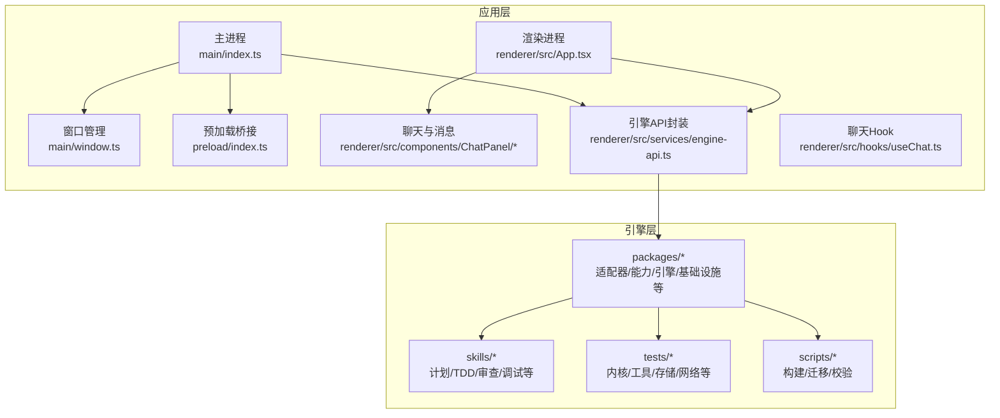
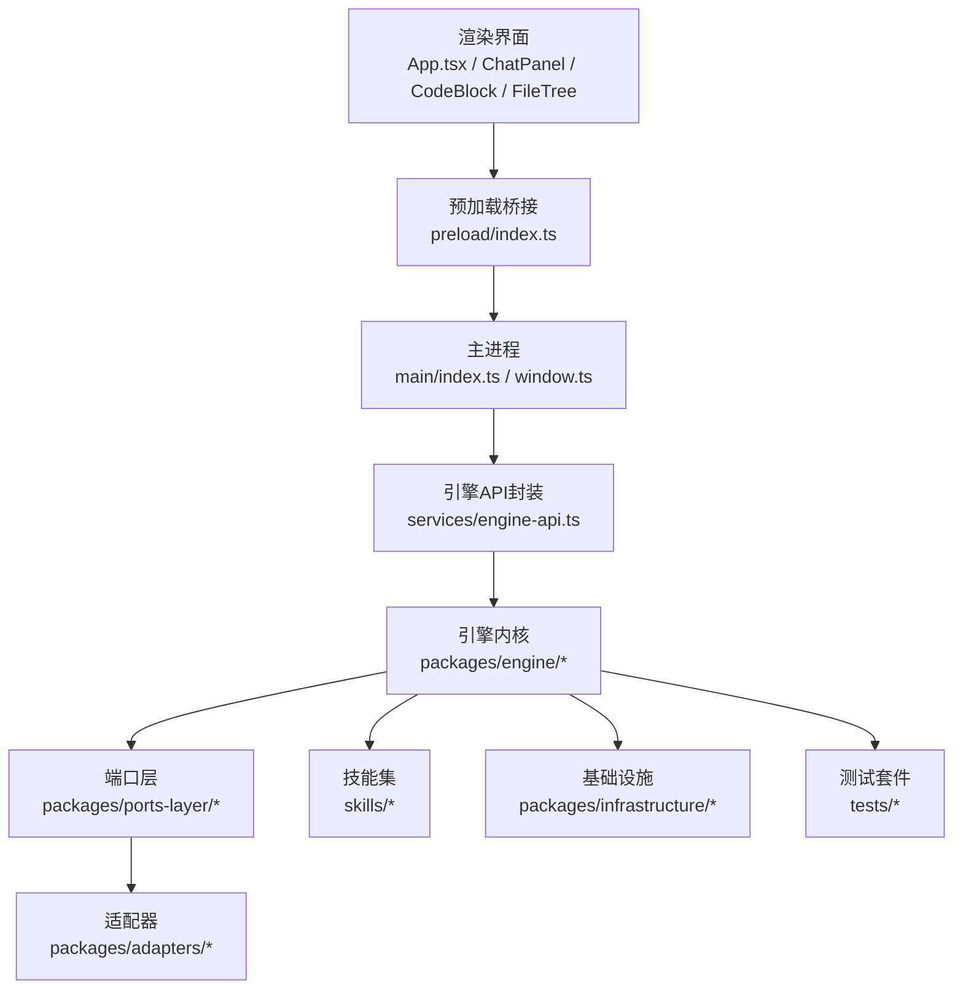
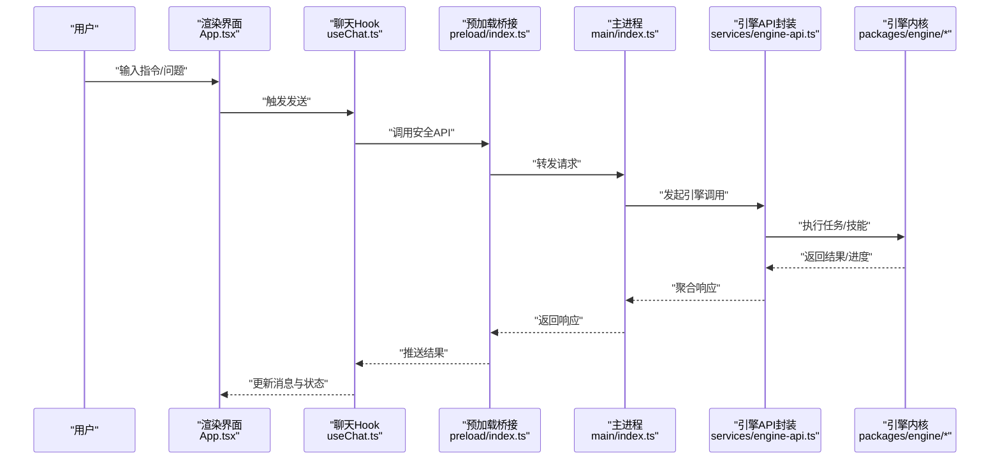
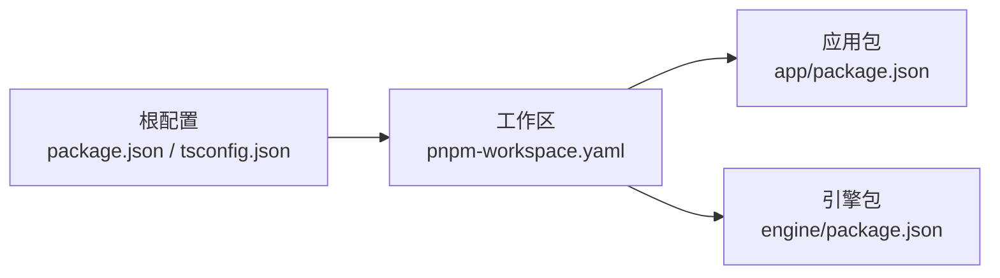

# 项目介绍

<cite>
**本文引用的文件**   
- [package.json](file://package.json)
- [pnpm-workspace.yaml](file://pnpm-workspace.yaml)
- [tsconfig.json](file://tsconfig.json)
- [app/package.json](file://app/package.json)
- [app/electron.vite.config.ts](file://app/electron.vite.config.ts)
- [app/main/index.ts](file://app/main/index.ts)
- [app/main/engine-host.ts](file://app/main/engine-host.ts)
- [app/main/window.ts](file://app/main/window.ts)
- [app/preload/index.ts](file://app/preload/index.ts)
- [app/renderer/src/App.tsx](file://app/renderer/src/App.tsx)
- [app/renderer/src/main.tsx](file://app/renderer/src/main.tsx)
- [app/renderer/src/services/engine-api.ts](file://app/renderer/src/services/engine-api.ts)
- [app/renderer/src/hooks/useChat.ts](file://app/renderer/src/hooks/useChat.ts)
- [engine/README.md](file://engine/README.md)
- [engine/README.en.md](file://engine/README.en.md)
- [engine/package.json](file://engine/package.json)
- [engine/pnpm-workspace.yaml](file://engine/pnpm-workspace.yaml)
- [engine/skills/code-review/SKILL.md](file://engine/skills/code-review/SKILL.md)
- [engine/skills/debugging/SKILL.md](file://engine/skills/debugging/SKILL.md)
- [engine/skills/planning/SKILL.md](file://engine/skills/planning/SKILL.md)
- [engine/skills/tdd/SKILL.md](file://engine/skills/tdd/SKILL.md)
</cite>

## 目录
1. [简介](#简介)
2. [项目结构](#项目结构)
3. [核心组件](#核心组件)
4. [架构总览](#架构总览)
5. [详细组件分析](#详细组件分析)
6. [依赖分析](#依赖分析)
7. [性能考量](#性能考量)
8. [故障排查指南](#故障排查指南)
9. [结论](#结论)
10. [附录](#附录)

## 简介
KCoder 是一个以 AI 为核心的桌面代码编辑器，旨在将“对话式智能”与“本地工程能力”深度融合，帮助开发者在真实项目中更高效地规划、编写、调试与重构代码。与传统编辑器相比，KCoder 的差异化在于：
- 以“任务与技能”为驱动：内置计划、TDD、代码审查、调试等可组合技能，让 AI 协助完成从需求到交付的完整闭环。
- 以“引擎 + 插件化能力”为核心：通过模块化引擎与适配器体系，灵活接入多种模型与服务，同时保持稳定的运行时契约。
- 以“安全可控”为前提：提供预算、治理、审计与隔离机制，确保 AI 行为可观测、可回滚、可恢复。

适用场景与目标用户：
- 个人开发者：快速原型、日常编码辅助、自动化脚本生成与测试用例补全。
- 团队与开源贡献者：代码审查、安全扫描、重构建议、文档与注释自动生成。
- 教学与培训：以对话方式讲解问题、引导 TDD 实践、演示最佳实践。

愿景与使命：
- 愿景：让每一位开发者都能拥有“懂你上下文”的智能编程伙伴。
- 使命：用可插拔的 AI 能力与严谨的工程化设计，降低复杂项目的认知负担与重复劳动。

与传统编辑器的区别：
- 传统编辑器侧重“文本编辑与工具链集成”，KCoder 在此基础上叠加“意图理解、任务编排、自动执行与结果验证”的全链路智能。
- 强调“可解释与可审计”：所有关键操作均可追踪、回放与回滚，避免黑盒风险。

历史背景与发展路线（概述）：
- 早期阶段聚焦于“对话式助手 + 基础文件读写”。
- 中期引入“技能系统、工具协调器、运行内核与持久化状态”，形成稳定内核。
- 当前阶段完善“多模型适配、治理与预算控制、事件总线与回放、MCP 桥接与扩展生态”。
- 未来规划包括更丰富的可视化工作流、更强的本地推理能力、跨平台优化与企业级治理特性。

[本节不直接分析具体源文件]

## 项目结构
仓库采用多包工作区组织，前端应用与后端引擎解耦，便于独立演进与复用。

- 根层
  - 工作区配置与 TypeScript 全局配置，统一构建与类型约束。
- app（Electron 桌面应用）
  - main：主进程入口、窗口管理、菜单与设置、与引擎通信的宿主。
  - preload：安全桥接，暴露最小 API 给渲染进程。
  - renderer：基于 Vite + React 的前端界面，包含聊天面板、代码块、文件树、状态栏、设置面板等。
- engine（AI 引擎）
  - packages：按职责划分的子包（适配器、能力、CLI、委托层、领域层、引擎、基础设施、HTTP 层、端口层、预设等）。
  - skills：内置技能（计划、TDD、代码审查、调试、Git 工作树、Web 等），每个技能包含说明与元数据。
  - tests：覆盖内核、工具、存储、网络、治理、回放等大量单元测试与集成测试。
  - scripts：构建、迁移、校验与示例脚本。

图表来源
- [app/main/index.ts](file://app/main/index.ts)
- [app/main/window.ts](file://app/main/window.ts)
- [app/preload/index.ts](file://app/preload/index.ts)
- [app/renderer/src/App.tsx](file://app/renderer/src/App.tsx)
- [app/renderer/src/services/engine-api.ts](file://app/renderer/src/services/engine-api.ts)
- [app/renderer/src/hooks/useChat.ts](file://app/renderer/src/hooks/useChat.ts)
- [engine/packages](file://engine/packages)
- [engine/skills](file://engine/skills)
- [engine/tests](file://engine/tests)
- [engine/scripts](file://engine/scripts)

章节来源
- [package.json](file://package.json)
- [pnpm-workspace.yaml](file://pnpm-workspace.yaml)
- [tsconfig.json](file://tsconfig.json)
- [app/package.json](file://app/package.json)
- [app/electron.vite.config.ts](file://app/electron.vite.config.ts)
- [engine/package.json](file://engine/package.json)
- [engine/pnpm-workspace.yaml](file://engine/pnpm-workspace.yaml)

## 核心组件
- 主进程与窗口管理
  - 负责应用生命周期、窗口创建与显示、菜单与快捷键、与引擎通信的初始化。
- 预加载桥接
  - 向渲染进程暴露最小、安全的 IPC 接口，屏蔽底层实现细节。
- 渲染界面
  - 基于 React 的聊天面板、代码块、文件树、设置面板与状态栏，提供直观的人机交互。
- 引擎 API 封装
  - 统一调用引擎服务，处理连接、错误重试、进度与结果聚合。
- 聊天 Hook
  - 封装会话状态、消息发送与接收、流式更新与错误提示。
- 引擎内核与技能
  - 内核负责任务编排、工具调度、持久化与治理；技能定义可复用的工作流与策略。

章节来源
- [app/main/index.ts](file://app/main/index.ts)
- [app/main/window.ts](file://app/main/window.ts)
- [app/preload/index.ts](file://app/preload/index.ts)
- [app/renderer/src/App.tsx](file://app/renderer/src/App.tsx)
- [app/renderer/src/services/engine-api.ts](file://app/renderer/src/services/engine-api.ts)
- [app/renderer/src/hooks/useChat.ts](file://app/renderer/src/hooks/useChat.ts)
- [engine/README.md](file://engine/README.md)
- [engine/README.en.md](file://engine/README.en.md)

## 架构总览
KCoder 采用“前端应用 + 引擎服务”的分层架构，前后端通过预加载桥接与 HTTP/IPC 进行通信。引擎内部以“领域层 + 端口层 + 适配器层”划分边界，结合“能力注册表”和“技能系统”实现可扩展的 AI 工作流。

图表来源
- [app/renderer/src/App.tsx](file://app/renderer/src/App.tsx)
- [app/preload/index.ts](file://app/preload/index.ts)
- [app/main/index.ts](file://app/main/index.ts)
- [app/main/window.ts](file://app/main/window.ts)
- [app/renderer/src/services/engine-api.ts](file://app/renderer/src/services/engine-api.ts)
- [engine/packages](file://engine/packages)
- [engine/skills](file://engine/skills)
- [engine/tests](file://engine/tests)

## 详细组件分析

### 主进程与窗口管理
- 职责
  - 初始化 Electron 主进程，创建并管理窗口，注入菜单与快捷键。
  - 启动或连接引擎服务，建立与渲染进程的通信通道。
- 关键点
  - 窗口生命周期与状态同步。
  - 与引擎宿主的对接（如进程间通信、资源路径、环境变量）。
- 典型流程
  - 启动 -> 创建窗口 -> 加载渲染页面 -> 初始化引擎 -> 监听事件 -> 响应渲染进程请求。

章节来源
- [app/main/index.ts](file://app/main/index.ts)
- [app/main/window.ts](file://app/main/window.ts)
- [app/main/engine-host.ts](file://app/main/engine-host.ts)

### 预加载桥接与渲染界面
- 职责
  - 预加载模块暴露最小 API，供渲染进程安全调用。
  - 渲染界面提供聊天、代码展示、文件浏览与设置等功能。
- 关键点
  - 最小权限原则：仅暴露必要方法。
  - 错误与状态反馈：统一的错误提示与加载态。
- 典型流程
  - 用户输入 -> Hook 封装发送 -> 预加载桥接 -> 主进程转发 -> 引擎处理 -> 返回结果 -> 界面更新。

章节来源
- [app/preload/index.ts](file://app/preload/index.ts)
- [app/renderer/src/App.tsx](file://app/renderer/src/App.tsx)
- [app/renderer/src/main.tsx](file://app/renderer/src/main.tsx)
- [app/renderer/src/hooks/useChat.ts](file://app/renderer/src/hooks/useChat.ts)
- [app/renderer/src/services/engine-api.ts](file://app/renderer/src/services/engine-api.ts)

### 引擎内核与技能系统
- 职责
  - 内核负责任务编排、工具协调、持久化、治理与回放。
  - 技能定义可复用的工作流（如计划、TDD、代码审查、调试）。
- 关键点
  - 能力注册表与协议标准化，保证不同适配器与工具的互操作。
  - 预算与审计：限制成本、记录操作轨迹、支持回滚。
- 典型流程
  - 收到任务 -> 解析意图 -> 选择技能 -> 编排步骤 -> 调用工具 -> 产出结果 -> 持久化与回放。

章节来源
- [engine/README.md](file://engine/README.md)
- [engine/README.en.md](file://engine/README.en.md)
- [engine/skills/planning/SKILL.md](file://engine/skills/planning/SKILL.md)
- [engine/skills/tdd/SKILL.md](file://engine/skills/tdd/SKILL.md)
- [engine/skills/code-review/SKILL.md](file://engine/skills/code-review/SKILL.md)
- [engine/skills/debugging/SKILL.md](file://engine/skills/debugging/SKILL.md)

### 聊天与消息流（序列图）

图表来源
- [app/renderer/src/App.tsx](file://app/renderer/src/App.tsx)
- [app/renderer/src/hooks/useChat.ts](file://app/renderer/src/hooks/useChat.ts)
- [app/preload/index.ts](file://app/preload/index.ts)
- [app/main/index.ts](file://app/main/index.ts)
- [app/renderer/src/services/engine-api.ts](file://app/renderer/src/services/engine-api.ts)
- [engine/packages](file://engine/packages)

## 依赖分析
- 工作区与包管理
  - 使用 pnpm 工作区统一管理前端与引擎子包，共享配置与脚本。
- 前端技术栈
  - Electron + Vite + React + TailwindCSS，提供高性能桌面体验与现代化样式。
- 引擎技术栈
  - TypeScript 多包架构，按领域与层次拆分，便于测试与演进。
- 外部依赖
  - 模型适配器、HTTP 客户端、持久化存储、事件总线与遥测等。

图表来源
- [package.json](file://package.json)
- [pnpm-workspace.yaml](file://pnpm-workspace.yaml)
- [tsconfig.json](file://tsconfig.json)
- [app/package.json](file://app/package.json)
- [engine/package.json](file://engine/package.json)
- [engine/pnpm-workspace.yaml](file://engine/pnpm-workspace.yaml)

章节来源
- [package.json](file://package.json)
- [pnpm-workspace.yaml](file://pnpm-workspace.yaml)
- [tsconfig.json](file://tsconfig.json)
- [app/package.json](file://app/package.json)
- [app/electron.vite.config.ts](file://app/electron.vite.config.ts)
- [engine/package.json](file://engine/package.json)
- [engine/pnpm-workspace.yaml](file://engine/pnpm-workspace.yaml)

## 性能考量
- 渲染性能
  - 使用 Vite 加速开发体验与打包体积优化；按需加载大组件（如文件树、代码块）。
- 引擎并发与吞吐
  - 通过事件总线与异步队列提升吞吐；对长耗时任务采用分片与进度上报。
- 内存与持久化
  - 合理缓存会话与中间结果；对大对象采用惰性加载与压缩存储。
- 网络与模型调用
  - 连接池与重试退避；失败降级与超时控制；可选本地模型以减少延迟。

[本节提供通用指导，不直接分析具体源文件]

## 故障排查指南
- 常见问题定位
  - 连接失败：检查引擎是否启动、端口与鉴权配置是否正确。
  - 消息未更新：确认预加载桥接与主进程路由是否正常。
  - 技能执行异常：查看技能日志与工具调用轨迹，核对参数与权限。
- 诊断手段
  - 启用调试模式与日志级别；使用回放功能重放关键事件。
  - 针对特定子系统（如存储、HTTP、工具协调器）运行对应测试用例。
- 恢复策略
  - 利用事务与快照机制回滚到最近一致状态；清理临时文件与缓存后重试。

章节来源
- [engine/tests](file://engine/tests)
- [engine/scripts](file://engine/scripts)

## 结论
KCoder 将“对话式智能”与“工程化内核”有机结合，既保留了传统编辑器的强大能力，又通过技能系统与治理能力显著提升了复杂任务的完成效率与可靠性。对于追求高效、可控与可演进的开发者与团队而言，KCoder 提供了面向未来的智能编程体验。

[本节为总结性内容，不直接分析具体源文件]

## 附录
- 术语说明
  - 技能：可复用的工作流与策略集合，用于完成特定任务（如计划、TDD、审查）。
  - 适配器：对不同模型或服务提供商的统一抽象与实现。
  - 端口层：定义内核对外部系统的契约，便于替换与扩展。
- 快速上手
  - 安装依赖 -> 启动引擎 -> 打开应用 -> 在聊天面板输入任务 -> 观察执行与结果。
- 参考文档
  - 引擎 README（中文/英文）
  - 各技能说明文档

章节来源
- [engine/README.md](file://engine/README.md)
- [engine/README.en.md](file://engine/README.en.md)
- [engine/skills](file://engine/skills)