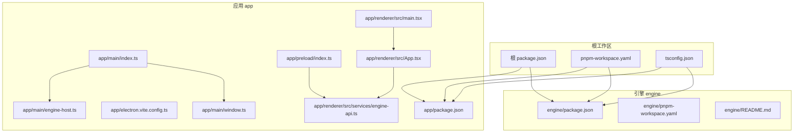
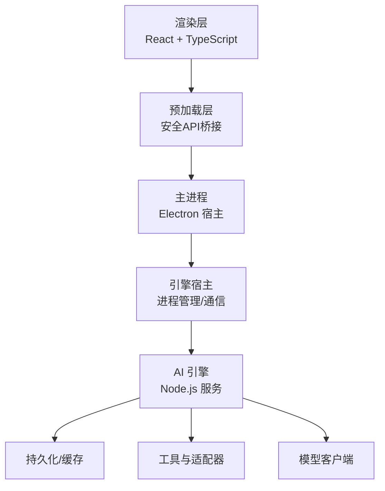
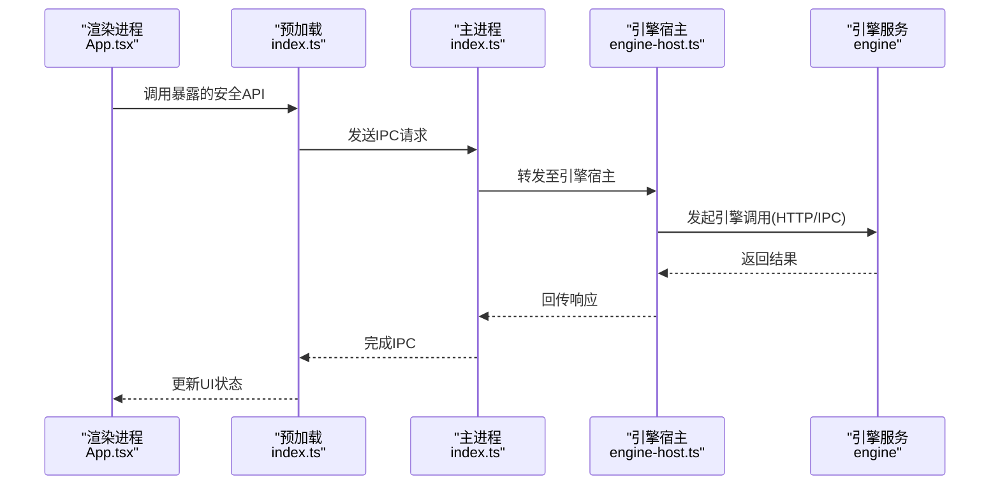
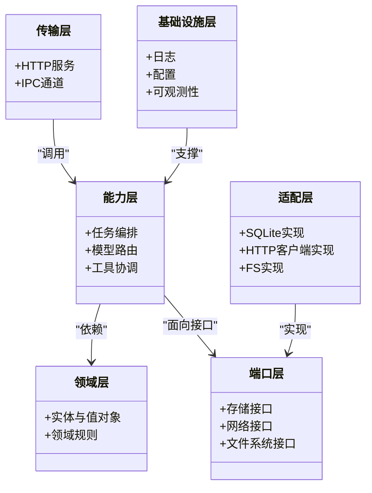
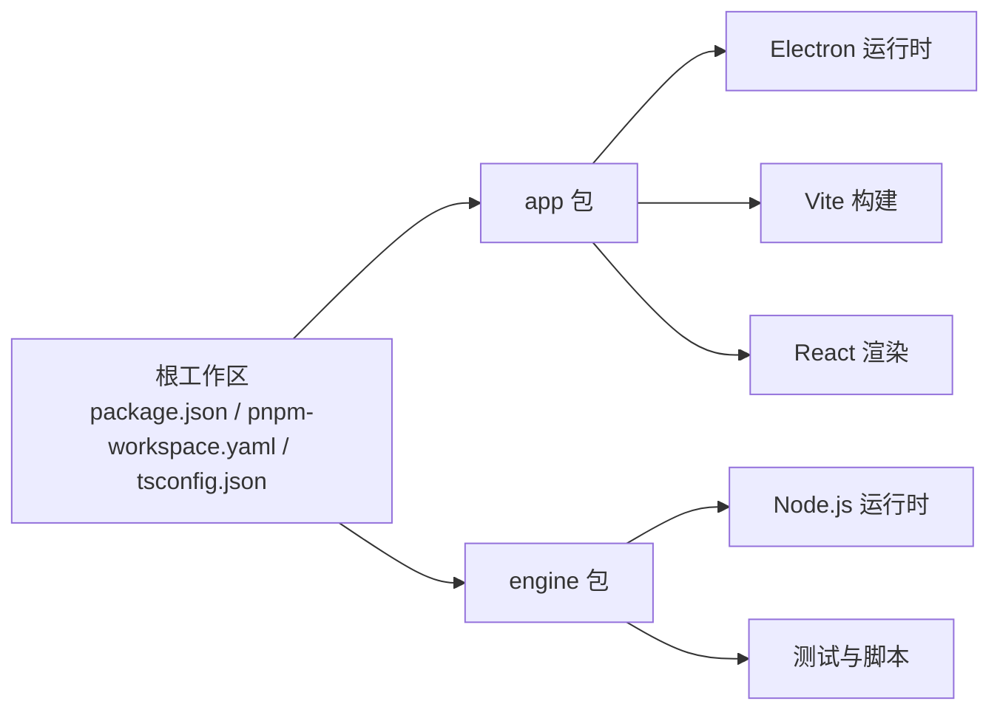

# 项目概述

<cite>
**本文引用的文件**   
- [package.json](file://package.json)
- [pnpm-workspace.yaml](file://pnpm-workspace.yaml)
- [tsconfig.json](file://tsconfig.json)
- [app/package.json](file://app/package.json)
- [app/electron.vite.config.ts](file://app/electron.vite.config.ts)
- [app/main/index.ts](file://app/main/index.ts)
- [app/main/engine-host.ts](file://app/main/engine-host.ts)
- [app/main/window.ts](file://app/main/window.ts)
- [app/preload/index.ts](file://app/preload/index.ts)
- [app/renderer/src/main.tsx](file://app/renderer/src/main.tsx)
- [app/renderer/src/App.tsx](file://app/renderer/src/App.tsx)
- [app/renderer/src/services/engine-api.ts](file://app/renderer/src/services/engine-api.ts)
- [engine/package.json](file://engine/package.json)
- [engine/pnpm-workspace.yaml](file://engine/pnpm-workspace.yaml)
- [engine/README.md](file://engine/README.md)
</cite>

## 目录
1. [简介](#简介)
2. [项目结构](#项目结构)
3. [核心组件](#核心组件)
4. [架构总览](#架构总览)
5. [详细组件分析](#详细组件分析)
6. [依赖分析](#依赖分析)
7. [性能考量](#性能考量)
8. [故障排查指南](#故障排查指南)
9. [结论](#结论)
10. [附录：快速开始](#附录快速开始)

## 简介
KCoder 是一个基于 Electron 的 AI 驱动代码编辑器，采用 Monorepo 组织方式，将“应用层（app）”与“AI 引擎（engine）”解耦。前端使用 React + TypeScript 构建用户界面，通过 Electron 主进程桥接 Node.js 运行时；后端引擎以 Node.js 实现，提供可插拔的模型适配、工具执行、任务编排与持久化等能力。整体采用分层架构设计，从表现层到基础设施层职责清晰，便于扩展与维护。

## 项目结构
仓库为顶层 pnpm monorepo，包含两个主要子包：
- app：Electron 桌面应用，含 main、preload、renderer 三层
- engine：AI 引擎，内部按领域分层组织多个 packages，并提供 CLI、HTTP 服务、测试与脚本

图表来源
- [package.json:1-200](file://package.json#L1-L200)
- [pnpm-workspace.yaml:1-200](file://pnpm-workspace.yaml#L1-L200)
- [tsconfig.json:1-200](file://tsconfig.json#L1-L200)
- [app/package.json:1-200](file://app/package.json#L1-L200)
- [app/electron.vite.config.ts:1-200](file://app/electron.vite.config.ts#L1-L200)
- [app/main/index.ts:1-200](file://app/main/index.ts#L1-L200)
- [app/main/engine-host.ts:1-200](file://app/main/engine-host.ts#L1-L200)
- [app/main/window.ts:1-200](file://app/main/window.ts#L1-L200)
- [app/preload/index.ts:1-200](file://app/preload/index.ts#L1-L200)
- [app/renderer/src/main.tsx:1-200](file://app/renderer/src/main.tsx#L1-L200)
- [app/renderer/src/App.tsx:1-200](file://app/renderer/src/App.tsx#L1-L200)
- [app/renderer/src/services/engine-api.ts:1-200](file://app/renderer/src/services/engine-api.ts#L1-L200)
- [engine/package.json:1-200](file://engine/package.json#L1-L200)
- [engine/pnpm-workspace.yaml:1-200](file://engine/pnpm-workspace.yaml#L1-L200)
- [engine/README.md:1-200](file://engine/README.md#L1-L200)

章节来源
- [package.json:1-200](file://package.json#L1-L200)
- [pnpm-workspace.yaml:1-200](file://pnpm-workspace.yaml#L1-L200)
- [tsconfig.json:1-200](file://tsconfig.json#L1-L200)
- [app/package.json:1-200](file://app/package.json#L1-L200)
- [app/electron.vite.config.ts:1-200](file://app/electron.vite.config.ts#L1-L200)
- [engine/package.json:1-200](file://engine/package.json#L1-L200)
- [engine/pnpm-workspace.yaml:1-200](file://engine/pnpm-workspace.yaml#L1-L200)
- [engine/README.md:1-200](file://engine/README.md#L1-L200)

## 核心组件
- 应用入口与窗口管理
  - 主进程负责创建窗口、加载渲染页面、启动并托管引擎进程
  - 预加载脚本暴露安全 API 给渲染进程调用
- 渲染层（React + TypeScript）
  - 应用初始化、路由与状态管理
  - 通过 services 层调用引擎接口
- 引擎（Node.js）
  - 提供 HTTP/IPC 接口、任务编排、模型适配、工具执行、持久化等能力
  - 内部按领域分层组织，具备可扩展的插件/技能体系

章节来源
- [app/main/index.ts:1-200](file://app/main/index.ts#L1-L200)
- [app/main/window.ts:1-200](file://app/main/window.ts#L1-L200)
- [app/main/engine-host.ts:1-200](file://app/main/engine-host.ts#L1-L200)
- [app/preload/index.ts:1-200](file://app/preload/index.ts#L1-L200)
- [app/renderer/src/main.tsx:1-200](file://app/renderer/src/main.tsx#L1-L200)
- [app/renderer/src/App.tsx:1-200](file://app/renderer/src/App.tsx#L1-L200)
- [app/renderer/src/services/engine-api.ts:1-200](file://app/renderer/src/services/engine-api.ts#L1-L200)
- [engine/README.md:1-200](file://engine/README.md#L1-L200)

## 架构总览
KCoder 采用分层架构与进程隔离策略：
- 表现层（Renderer）：React UI，处理交互与展示
- 桥接层（Preload）：仅暴露最小必要 API，避免直接访问 Node 环境
- 宿主层（Main/Electron）：生命周期管理、窗口与菜单、引擎进程托管
- 引擎层（Engine）：业务内核，提供 HTTP/IPC 接口、任务调度、模型与工具集成、存储与可观测性

图表来源
- [app/main/index.ts:1-200](file://app/main/index.ts#L1-L200)
- [app/main/engine-host.ts:1-200](file://app/main/engine-host.ts#L1-L200)
- [app/preload/index.ts:1-200](file://app/preload/index.ts#L1-L200)
- [app/renderer/src/services/engine-api.ts:1-200](file://app/renderer/src/services/engine-api.ts#L1-L200)
- [engine/README.md:1-200](file://engine/README.md#L1-L200)

## 详细组件分析

### 应用层（app）
- 主进程（main）
  - 负责应用启动、窗口创建、菜单配置、引擎进程托管与通信
  - 关键职责：生命周期、资源清理、错误上报、与渲染进程 IPC
- 预加载（preload）
  - 注入受限 API，供渲染进程安全调用
- 渲染（renderer）
  - 应用初始化、UI 组件树、状态管理、与服务层通信
  - 通过 services 层封装对引擎的调用

图表来源
- [app/renderer/src/App.tsx:1-200](file://app/renderer/src/App.tsx#L1-L200)
- [app/preload/index.ts:1-200](file://app/preload/index.ts#L1-L200)
- [app/main/index.ts:1-200](file://app/main/index.ts#L1-L200)
- [app/main/engine-host.ts:1-200](file://app/main/engine-host.ts#L1-L200)
- [app/renderer/src/services/engine-api.ts:1-200](file://app/renderer/src/services/engine-api.ts#L1-L200)

章节来源
- [app/main/index.ts:1-200](file://app/main/index.ts#L1-L200)
- [app/main/window.ts:1-200](file://app/main/window.ts#L1-L200)
- [app/main/engine-host.ts:1-200](file://app/main/engine-host.ts#L1-L200)
- [app/preload/index.ts:1-200](file://app/preload/index.ts#L1-L200)
- [app/renderer/src/main.tsx:1-200](file://app/renderer/src/main.tsx#L1-L200)
- [app/renderer/src/App.tsx:1-200](file://app/renderer/src/App.tsx#L1-L200)
- [app/renderer/src/services/engine-api.ts:1-200](file://app/renderer/src/services/engine-api.ts#L1-L200)

### 引擎层（engine）
- 分层组织
  - 领域层定义核心概念与契约
  - 端口层抽象外部系统（存储、网络、文件系统）
  - 适配层实现具体平台/协议细节
  - 能力层组合领域与端口，形成可复用业务能力
  - 传输层提供 HTTP/IPC 等通信机制
  - 基础设施层提供日志、配置、持久化等通用支撑
- 运行期
  - 提供 CLI 与 HTTP 服务
  - 支持多模型适配、工具编排、任务与事件流、预算与治理
- 可观测性与测试
  - 内置可观测性、端到端与单元测试覆盖

图表来源
- [engine/README.md:1-200](file://engine/README.md#L1-L200)
- [engine/package.json:1-200](file://engine/package.json#L1-L200)
- [engine/pnpm-workspace.yaml:1-200](file://engine/pnpm-workspace.yaml#L1-L200)

章节来源
- [engine/README.md:1-200](file://engine/README.md#L1-L200)
- [engine/package.json:1-200](file://engine/package.json#L1-L200)
- [engine/pnpm-workspace.yaml:1-200](file://engine/pnpm-workspace.yaml#L1-L200)

## 依赖分析
- 顶层工作区统一版本与脚本
  - 根 package.json 声明工作区成员与公共脚本
  - 根 tsconfig.json 提供跨包共享的编译选项
- app 与 engine 各自独立维护依赖
  - app 依赖 Electron、Vite、React、TypeScript 等
  - engine 依赖 Node.js 生态、测试框架、构建脚本与内部 packages

图表来源
- [package.json:1-200](file://package.json#L1-L200)
- [pnpm-workspace.yaml:1-200](file://pnpm-workspace.yaml#L1-L200)
- [tsconfig.json:1-200](file://tsconfig.json#L1-L200)
- [app/package.json:1-200](file://app/package.json#L1-L200)
- [engine/package.json:1-200](file://engine/package.json#L1-L200)

章节来源
- [package.json:1-200](file://package.json#L1-L200)
- [pnpm-workspace.yaml:1-200](file://pnpm-workspace.yaml#L1-L200)
- [tsconfig.json:1-200](file://tsconfig.json#L1-L200)
- [app/package.json:1-200](file://app/package.json#L1-L200)
- [engine/package.json:1-200](file://engine/package.json#L1-L200)

## 性能考量
- 渲染层
  - 合理拆分组件与懒加载，减少首屏体积
  - 使用虚拟列表与增量更新优化长列表
- 进程间通信
  - 合并消息、批处理与节流，降低 IPC 开销
  - 在预加载层做数据序列化与最小化暴露
- 引擎层
  - 连接池与并发控制，避免模型/IO 过载
  - 缓存热点数据，缩短响应时间
  - 异步任务队列与背压，保障稳定性

## 故障排查指南
- 启动失败
  - 检查 Electron 与 Node 版本匹配
  - 确认端口未被占用（引擎 HTTP 服务）
- 渲染无响应
  - 查看预加载是否成功注入 API
  - 检查 IPC 通道是否正常建立
- 引擎不可用
  - 验证引擎进程是否存活
  - 检查日志与可观测性指标定位问题
- 常见错误
  - 权限不足导致文件读写失败
  - 模型调用超时或鉴权失败

章节来源
- [app/main/index.ts:1-200](file://app/main/index.ts#L1-L200)
- [app/main/engine-host.ts:1-200](file://app/main/engine-host.ts#L1-L200)
- [app/preload/index.ts:1-200](file://app/preload/index.ts#L1-L200)
- [engine/README.md:1-200](file://engine/README.md#L1-L200)

## 结论
KCoder 通过清晰的 Monorepo 结构与分层架构，将“应用体验”和“AI 能力”解耦，既保证了桌面端的流畅交互，又提供了可扩展、可观测、可测试的引擎内核。开发者可在不侵入彼此边界的前提下，分别迭代 UI 与引擎能力，快速交付价值。

## 附录：快速开始
- 前置条件
  - Node.js 与 pnpm
  - 系统支持 Electron 运行环境
- 安装依赖
  - 在工作区根目录执行包管理器安装命令
- 启动开发环境
  - 先启动引擎服务（参考 engine 文档）
  - 再启动应用（Electron 主进程会托管引擎或与其通信）
- 常用命令
  - 构建、打包、测试等命令由根与工作区脚本提供
- 调试建议
  - 打开 Electron DevTools 调试渲染层
  - 查看引擎日志与 HTTP 接口响应

章节来源
- [package.json:1-200](file://package.json#L1-L200)
- [app/package.json:1-200](file://app/package.json#L1-L200)
- [engine/README.md:1-200](file://engine/README.md#L1-L200)