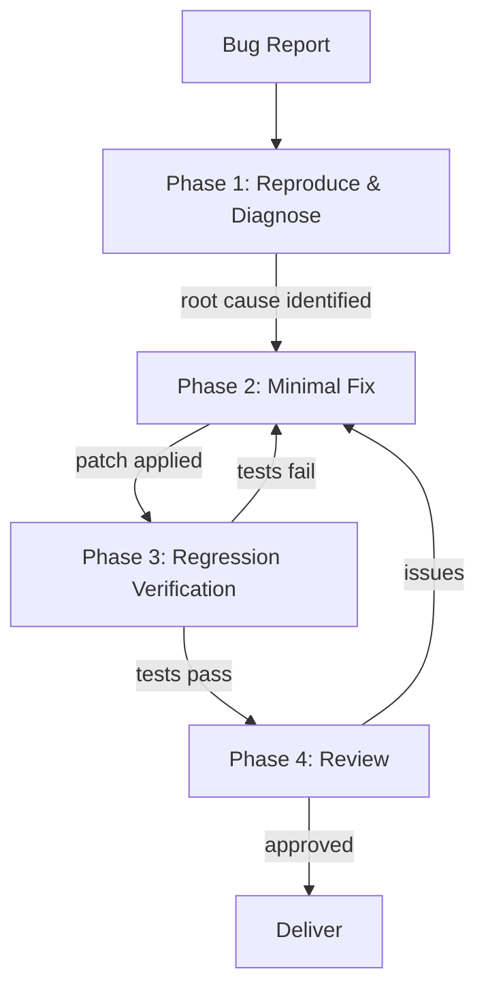

# Scenario: Systematic Bug Fix

## Trigger

Activate this skill when the user reports unexpected behavior, an error
message, a crash, or a failing test. Key phrases include "fix bug", "not
working", "error", "crash", "test failure", or any report of incorrect
runtime behavior.

**Do NOT activate** for: feature requests (use scenario-feature-development),
performance optimization (use scenario-code-review with vega), or
configuration issues that need no code change.

## Pipeline Overview



The pipeline runs 4 phases with 4 subagent delegations. Each phase is
strictly sequential — each depends on the prior phase's output.

## Phase 1: Reproduce and Diagnose

**Delegate to**: `cole` (Debugger)

**Load skills**: `systematic-debugging`, `debugging`, `bug-hunt`, `codebase-analysis`

**Task prompt template**:
```
Investigate the following bug report:

{BUG_REPORT}

Follow systematic debugging methodology:
1. REPRODUCE: Find the minimal reproduction steps. If you cannot reproduce,
   ask for more information via ask_clarification.
2. ISOLATE: Use binary search to narrow down the root cause. Check logs,
   stack traces, and recent changes (git log/diff).
3. DIAGNOSE: Identify the exact root cause. Distinguish symptoms from cause.
   Do NOT skip to a fix — confirm you understand WHY the bug occurs.

Output a diagnostic report:
- Root cause (specific file, function, line range)
- Reproduction steps (numbered, minimal)
- Why the bug occurs (not just WHAT happens)
- Suggested fix approach (describe the fix, do NOT implement it)
- Confidence level: high / medium / low

Do NOT fix the bug yourself. Diagnosis only.
```

**Verification gate**: Root cause identified with specific file:line. Minimal
reproduction steps documented. Fix approach described.

## Phase 2: Minimal Fix Implementation

**Delegate to**: `victor` (Backend Developer)

**Load skills**: `patch-authoring`, `error-handling`

**Task prompt template**:
```
Apply a minimal fix based on the following diagnostic report:

{PHASE_1_DIAGNOSTIC_REPORT}

Constraints:
- Fix ONLY the identified root cause. Do not refactor surrounding code.
- The diff must be as small as possible while fully resolving the bug.
- Add or improve input validation only if the root cause is missing validation.
- Do NOT add unrelated improvements, even if tempting.
- If the fix touches shared interfaces, verify backward compatibility.

Output:
- Summary of changes (file:line for each modification)
- Rationale: why this fix addresses the root cause
- Backward compatibility assessment
```

**Verification gate**: Fix compiles successfully. Diff touches only the
necessary code. No unrelated changes.

## Phase 3: Regression Verification

**Delegate to**: `quinn` (Test Engineer)

**Load skills**: `test-driven-development`, `test-writer`, `verification-before-completion`

**Task prompt template**:
```
Verify the bug fix and prevent regression:

Bug report: {BUG_REPORT}
Diagnostic: {PHASE_1_DIAGNOSTIC_REPORT}
Fix summary: {PHASE_2_FIX_SUMMARY}

Tasks:
1. Write a regression test that reproduces the original bug. Confirm it
   FAILS without the fix and PASSES with the fix.
2. Run the full existing test suite. All tests must pass — any failure
   is a regression caused by the fix.
3. Test edge cases related to the fix: boundary values, null/empty input,
   concurrent access patterns.
4. Report any regressions or new failures.

Do NOT fix regressions yourself — report them for re-evaluation.
Output: test results summary + any new test files created.
```

**Verification gate**: Regression test added. Full test suite passes. No
regressions detected.

## Phase 4: Review and Confirm

**Delegate to**: `marcus` (Code Reviewer)

**Load skills**: `code-review`, `diff-analysis`

**Task prompt template**:
```
Review the bug fix for correctness and safety:

Diagnostic: {PHASE_1_DIAGNOSTIC_REPORT}
Fix diff: {PHASE_2_CHANGES}
Test results: {PHASE_3_RESULTS}

Review checklist:
1. Does the fix address the diagnosed root cause? (not just symptoms)
2. Is the fix minimal? (no unnecessary changes in the diff)
3. Could the fix introduce side effects? (check all callers of modified code)
4. Is the regression test adequate? (covers the original bug scenario)
5. Are there similar bugs elsewhere in the codebase that share the same
   root cause pattern?

Output:
- APPROVED or CHANGES_REQUESTED
- If CHANGES_REQUESTED: specific issues with file:line and expected fix
- List of any similar-bug locations for future investigation
```

**Verification gate**: Review status APPROVED. No unresolved issues.

## Completion Criteria

- Root cause diagnosed with reproduction steps
- Minimal fix applied and compiles
- Regression test added, full suite passes
- Code review approved
- Diff is minimal (no scope creep)

## Boundary

Do NOT use this scenario when:
- The issue is a missing feature, not a bug (use scenario-feature-development)
- The fix requires architectural changes (use scenario-refactor first)
- Multiple unrelated bugs need fixing (dispatch parallel cole subagents directly)
- The bug is in third-party code and cannot be fixed locally (report to user)

## Parallel Dispatch Notes

- All 4 phases are sequential — no parallel dispatch
- Total subagent calls: 4 (within the 6-per-run limit)
- If Phase 3 finds regressions, loop back to Phase 2 with the regression
  details — track additional calls against budget
- For multiple independent bugs: consider running multiple scenario-bug-fix
  instances in parallel (dispatch separate cole subagents first for diagnosis)
