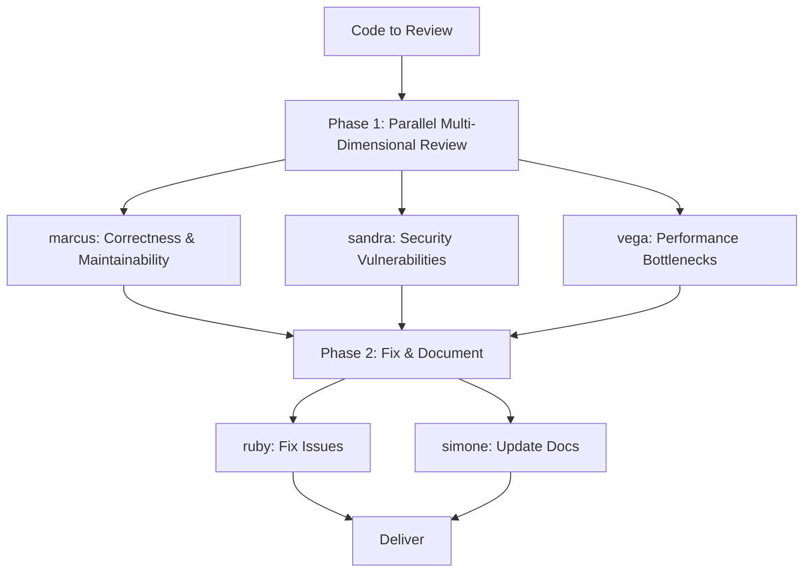

# Scenario: Multi-Dimensional Code Review

## Trigger

Activate this skill when the user asks for a code review, PR review, or
quality assessment of existing or changed code. Key phrases include "review
my code", "check this PR", "audit code quality", "review the changes", or
any request focused on evaluating (not building) code.

**Do NOT activate** for: implementing new features (use scenario-feature-
development), fixing a specific bug (use scenario-bug-fix), or focused
security audits (use scenario-security-audit).

## Pipeline Overview



The pipeline runs 2 phases with 5 subagent delegations. Phase 1 dispatches
3 review subagents in parallel. Phase 2 dispatches 2 fix subagents in
parallel.

## Phase 1: Parallel Multi-Dimensional Review

**Three subagents in parallel** (single turn, 3 task calls — maximum per turn):

### 1a. Correctness and Maintainability

**Delegate to**: `marcus` (Code Reviewer)

**Load skills**: `code-review`, `pr-review-advanced`, `diff-analysis`

**Task prompt template**:
```
Review the following code changes for correctness and maintainability:

{CODE_DIFF_OR_FILES}

Review dimensions:
1. Logic correctness: off-by-one, null dereference, race conditions,
   incorrect conditional logic
2. Error handling: uncaught exceptions, swallowed errors, missing fallback
3. API contract: parameter validation, return type consistency, backward
   compatibility
4. Maintainability: naming clarity, cyclomatic complexity, coupling between
   modules, dead code
5. Test coverage: are the changes adequately tested?

Output a structured report:
- BLOCKER: correctness issues that will cause runtime failures
- WARNING: maintainability issues that increase technical debt
- SUGGESTION: optional improvements
- APPROVED: if no BLOCKERs found
```

### 1b. Security Vulnerability Scan

**Delegate to**: `sandra` (Security Specialist)

**Load skills**: `security-review`, `security-hardening`, `owasp-top-10`

**Task prompt template**:
```
Perform a security audit on the following code:

{CODE_DIFF_OR_FILES}

Check against OWASP Top 10 and common vulnerability patterns:
1. Injection (SQL, command, XSS, path traversal)
2. Broken authentication or authorization
3. Sensitive data exposure (hardcoded secrets, logging, insecure storage)
4. Insecure dependencies (known CVEs in imported packages)
5. Security misconfiguration (CORS, headers, TLS)

Output a structured report:
- CRITICAL: exploitable vulnerability, fix immediately
- HIGH: likely exploitable, fix before release
- MEDIUM: requires specific conditions to exploit
- INFO: hardening recommendations
- CLEAN: if no issues found
```

### 1c. Performance Bottleneck Analysis

**Delegate to**: `vega` (Performance Engineer)

**Load skills**: `performance`, `profiling`, `optimization`

**Task prompt template**:
```
Analyze the following code for performance issues:

{CODE_DIFF_OR_FILES}

Evaluate:
1. Algorithmic complexity: O(n) vs O(n²) in hot paths, unnecessary loops
2. Resource usage: memory allocations, file handles, DB connections
3. I/O patterns: N+1 queries, synchronous I/O in async context, chatty APIs
4. Caching: missed cache opportunities, cache invalidation correctness
5. Scalability: will this code degrade under high load or large datasets?

Output a structured report:
- BOTTLENECK: confirmed performance issue with measurable impact
- RISK: potential issue under specific conditions
- OPTIMIZATION: actionable improvement suggestion
- EFFICIENT: if code meets performance expectations
```

**Verification gate**: All three reports are returned. Consolidate into a
unified issue list sorted by severity: CRITICAL > BLOCKER > HIGH >
BOTTLENECK > WARNING > RISK > SUGGESTION.

## Phase 2: Fix and Document

**Two subagents in parallel** (single turn, 2 task calls):

### 2a. Fix Issues

**Delegate to**: `ruby` (Refactoring Specialist)

**Load skills**: `refactoring`, `patch-authoring`, `clean-code`

**Task prompt template**:
```
Fix the issues identified in the code review. Work through them in priority
order:

{CONSOLIDATED_ISSUE_LIST}

Constraints:
- Fix CRITICAL and BLOCKER issues first — these are mandatory.
- Fix HIGH and BOTTLENECK issues if time permits.
- Skip SUGGESTION and INFO items unless trivial.
- Each fix must be minimal and targeted — do not refactor unrelated code.
- Preserve all existing tests. If a fix requires test changes, update them.
- Run the test suite after all fixes to confirm no regressions.

Output: summary of each fix applied (issue ID, file, change description),
and final test results.
```

### 2b. Update Documentation

**Delegate to**: `simone` (Technical Writer)

**Load skills**: `docs`, `api-documentation`, `readme-writing`

**Task prompt template**:
```
Update documentation to reflect the reviewed code changes:

{CODE_CHANGES_SUMMARY}

Tasks:
1. Update inline code comments where logic has changed
2. Update API documentation (endpoints, parameters, response schemas)
3. Update README or relevant docs if user-facing behavior changed
4. Add CHANGELOG entries for significant modifications
5. Ensure documentation is consistent with the actual code behavior

Do NOT document issues or review findings — only the final state of the code.
Output: list of files updated and a summary of documentation changes.
```

**Verification gate**: All CRITICAL/BLOCKER issues are fixed. Tests pass.
Documentation is updated to match the final code state.

## Completion Criteria

The scenario is complete when ALL of the following hold:
- All three review dimensions have been assessed (correctness, security, performance)
- Every CRITICAL and BLOCKER issue has a corresponding fix
- Test suite passes after fixes
- Documentation reflects the current code state
- Consolidated report is available to the user

## Boundary

Do NOT use this scenario when:
- The task is implementing a new feature (use scenario-feature-development)
- The task is fixing a known bug with a clear repro (use scenario-bug-fix)
- A pure security audit is needed without code fixes (dispatch sandra directly)
- The code is being refactored for structure without review focus (use scenario-refactor)
- Only documentation review is needed (dispatch simone directly)

## Parallel Dispatch Notes

- Phase 1 dispatches 3 subagents in a single turn — this is the maximum per turn
- Phase 2 dispatches 2 subagents in a single turn — within the 3-per-turn limit
- Total subagent calls: 5 (within the 6-per-run limit)
- If only one review dimension is needed (e.g., security-only), skip Phase 1's
  other subagents — total drops to 3 calls
- If no issues are found in Phase 1, skip Phase 2a (fix) but still run Phase 2b
  (documentation) if the code has user-facing changes
