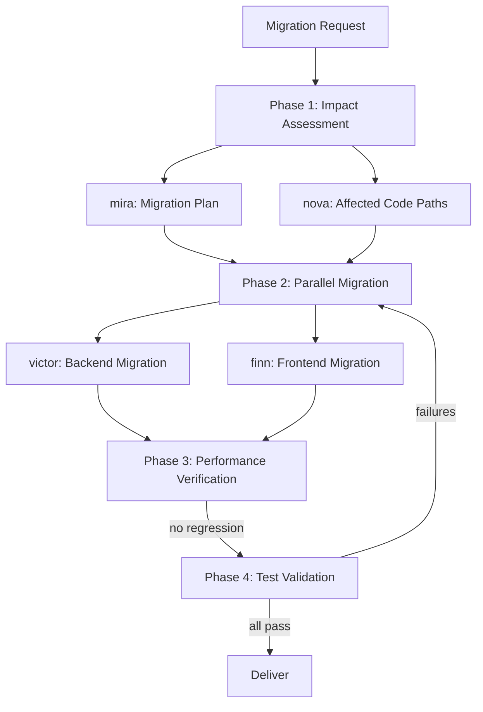

# Scenario: Dependency Migration

## Trigger

Activate this skill when the user wants to upgrade dependencies, migrate
frameworks, or change the technology stack. Key phrases include "upgrade
dependencies", "migrate to [framework] v[N]", "update [library]", "version
bump", "switch from X to Y", or any request involving changing external
dependencies or core technology choices.

**Do NOT activate** for: adding a new dependency to a project (use
scenario-feature-development), or security-patching a single dependency
(use scenario-security-audit Phase 2).

## Pipeline Overview



The pipeline runs 4 phases with 6 subagent delegations. Phase 1 dispatches
2 subagents in parallel. Phase 2 dispatches 2 subagents in parallel.
Phases 3-4 are sequential.

## Phase 1: Impact Assessment

**Two subagents in parallel** (single turn, 2 task calls):

### 1a. Migration Impact and Plan

**Delegate to**: `mira` (Migration Specialist)

**Load skills**: `migration`, `dependency-upgrade`, `breaking-changes-analysis`

**Task prompt template**:
```
Assess the impact and create a migration plan for the following change:

{MIGRATION_REQUEST}
Examples: "upgrade React 17 to 18", "migrate from Express to Fastify",
"update Python 3.9 to 3.12", "switch from Jest to Vitest"

Tasks:
1. Identify the current state: exact versions of affected dependencies,
   lock files, and configuration
2. Research breaking changes:
   - Read the target version's changelog/migration guide
   - List all breaking changes that affect this project
   - Identify deprecated APIs currently in use
3. Categorize breaking changes by effort:
   - TRIVIAL: rename or automatic codemod available
   - MODERATE: requires manual code changes in specific patterns
   - SIGNIFICANT: requires architectural changes or rewrites
4. Produce a step-by-step migration plan:
   - Order steps to maintain a working state at each point
   - Identify which steps can be done in parallel (backend vs frontend)
   - Estimate effort per step (S/M/L)
   - Flag high-risk steps that may break the build
5. Identify rollback strategy: can we revert if migration stalls?

Output: migration plan document with ordered steps, effort estimates, and
risk flags. Do NOT start the migration — planning only.
```

### 1b. Affected Code Path Analysis

**Delegate to**: `nova` (Code Explorer)

**Load skills**: `codebase-analysis`, `dependency-analysis`, `code-review`

**Task prompt template**:
```
Analyze the codebase to find all code affected by the following migration:

{MIGRATION_REQUEST}

Tasks:
1. Find all files that import or use the affected dependency/framework
2. For each file, identify specific usage patterns:
   - APIs being called
   - Configuration options used
   - Custom wrappers or abstractions around the dependency
3. Check for patterns known to break in the target version (based on
   breaking changes from migration guides)
4. Identify test files that need updating:
   - Tests that mock the old API
   - Integration tests that depend on old behavior
   - Snapshot files that may need regeneration
5. Map cross-cutting concerns:
   - Shared config files (webpack, tsconfig, babel, etc.)
   - Build scripts and CI pipeline
   - Documentation referencing the old version

Output: an affected-files inventory grouped by:
- Backend files (server, API, data layer)
- Frontend files (UI, components, routing)
- Config and build files
- Test files
- Documentation files

For each group, list the specific changes needed.
```

**Verification gate**: Migration plan is complete with ordered steps.
Affected-files inventory covers all usage of the old dependency. Breaking
changes are mapped to specific code locations.

## Phase 2: Parallel Migration

**Two subagents in parallel** (single turn, 2 task calls):

### 2a. Backend Migration

**Delegate to**: `victor` (Backend Developer)

**Load skills**: `implement`, `patch-authoring`, `migration`

**Task prompt template**:
```
Execute the backend portion of the migration plan:

Migration plan: {PHASE_1A_MIGRATION_PLAN}
Affected backend files: {PHASE_1B_BACKEND_FILES}

Execution rules:
1. Update dependency versions in the backend package/lock files first
2. Apply changes in the order specified by the migration plan
3. For each breaking change:
   - Update all affected code in the backend
   - Run backend tests after each significant change
   - If a change breaks the build, fix it immediately before proceeding
4. Update backend configuration files (tsconfig, babel, etc.) as needed
5. Update backend test files: fix mocks, regenerate snapshots
6. Do NOT touch frontend files — the frontend subagent handles those
7. Do NOT update shared lock files if they contain frontend dependencies

Output:
- List of files modified (file: change description)
- Build status (compiles or errors)
- Test results (pass/fail counts)
- Any blocking issues encountered
```

### 2b. Frontend Migration

**Delegate to**: `finn` (Frontend Developer)

**Load skills**: `frontend-engineering`, `implement`, `migration`

**Task prompt template**:
```
Execute the frontend portion of the migration plan:

Migration plan: {PHASE_1A_MIGRATION_PLAN}
Affected frontend files: {PHASE_1B_FRONTEND_FILES}

Execution rules:
1. Update dependency versions in the frontend package/lock files first
2. Apply changes in the order specified by the migration plan
3. For each breaking change:
   - Update all affected code in the frontend
   - Run frontend tests after each significant change
   - If a change breaks the build, fix it immediately before proceeding
4. Update frontend configuration files (webpack, vite, postcss, etc.)
5. Update frontend test files: fix mocks, regenerate snapshots
6. Do NOT touch backend files — the backend subagent handles those
7. If frontend and backend share a lock file, coordinate via the plan

Output:
- List of files modified (file: change description)
- Build status (compiles or errors)
- Test results (pass/fail counts)
- Any blocking issues encountered
```

**Verification gate**: Both subagents return success. Backend and frontend
compile independently. No file conflicts. Remaining issues are documented
for Phase 3-4 to catch.

## Phase 3: Performance Verification

**Delegate to**: `vega` (Performance Engineer)

**Load skills**: `performance`, `profiling`, `benchmarking`

**Task prompt template**:
```
Verify that the migration did not introduce performance regressions:

Migration: {MIGRATION_REQUEST}
Changes made: {PHASE_2_OUTPUTS}

Tasks:
1. Identify key performance metrics for this project:
   - Response time (API endpoints)
   - Page load time / bundle size (frontend)
   - Memory usage
   - Startup time
2. Run performance benchmarks:
   - If baseline benchmarks exist, run them and compare
   - If no benchmarks exist, create simple ones for critical paths
3. Compare before/after:
   - Run the same benchmarks on the pre-migration version (git stash/checkout)
   - Record metrics for both versions
   - Calculate delta percentage
4. Assess significance:
   - < 5% change: acceptable noise
   - 5-15% regression: investigate and flag
   - > 15% regression: BLOCKER — must address before completing migration
5. Check bundle size changes (frontend) and dependency tree bloat

Output:
- Performance comparison table (metric, before, after, delta)
- VERDICT: NO_REGRESSION / ACCEPTABLE / REGRESSION_DETECTED
- For any regression: root cause analysis and remediation suggestion
```

**Verification gate**: No significant performance regressions (> 15%). If
regressions exist, they are documented with mitigation plan or flagged as
BLOCKER.

## Phase 4: Full Test Validation

**Delegate to**: `quinn` (Test Engineer)

**Load skills**: `test-driven-development`, `verification-before-completion`, `regression-testing`

**Task prompt template**:
```
Run the full test suite to validate the migration is complete and stable:

Migration: {MIGRATION_REQUEST}
Changes made: {PHASE_2_OUTPUTS}
Performance check: {PHASE_3_RESULTS}

Tasks:
1. Run the COMPLETE test suite (unit, integration, end-to-end)
2. For any failures:
   a) Determine if it's a test issue (test depends on old API) or a real
      regression (migration broke functionality)
   b) Fix test issues — update the test to match new API behavior
   c) Report real regressions with full context for re-evaluation
3. Verify all previously-passing tests still pass (or have documented
   reasons for change)
4. Check for warnings: deprecation warnings from the new dependency version
   that need future attention
5. Generate a final test coverage report — ensure coverage did not drop
6. Run any smoke tests or manual verification scripts

Output:
- Test results: total / passed / failed / skipped
- List of test files updated (with reason)
- List of real regressions (if any) with severity
- Coverage before vs after
- OVERALL VERDICT: MIGRATION_SUCCESSFUL / ISSUES_FOUND
```

**Verification gate**: Full test suite passes (or documented acceptable
failures). No real regressions. Coverage maintained or improved.

## Completion Criteria

The scenario is complete when ALL of the following hold:
- Migration plan is documented with all breaking changes addressed
- All affected files are updated (backend, frontend, config, tests)
- Project compiles/builds successfully
- No significant performance regressions (> 15%)
- Full test suite passes with no real regressions
- Test coverage maintained or improved
- Remaining deprecation warnings are documented for future cleanup

## Boundary

Do NOT use this scenario when:
- Only a single patch-level dependency bump is needed (execute directly)
- The migration is security-motivated for a single package (use scenario-
  security-audit)
- The user wants to add a new dependency (use scenario-feature-development)
- The project is too small to warrant full assessment (execute directly)
- The migration involves a complete rewrite in a new language (use
  scenario-project-bootstrap)

## Parallel Dispatch Notes

- Phase 1: 2 parallel tasks (within 3-per-turn limit)
- Phase 2: 2 parallel tasks (within 3-per-turn limit)
- Phase 3: 1 task (sequential)
- Phase 4: 1 task (sequential)
- Total subagent calls: 6 (at the 6-per-run limit — no room for rework loops)
- If Phase 4 finds regressions, there is NO budget left for another fix
  iteration — report to user and let them decide next steps
- **Budget management**: if the migration is backend-only or frontend-only,
  skip the unused Phase 2 subagent — total drops to 5, leaving room for one
  rework iteration
- If Phase 1 reveals the migration is trivial (few affected files, no
  breaking changes), collapse to a 2-phase pipeline: Phase 1 analysis +
  combined Phase 2-4 (single subagent executes and verifies)
