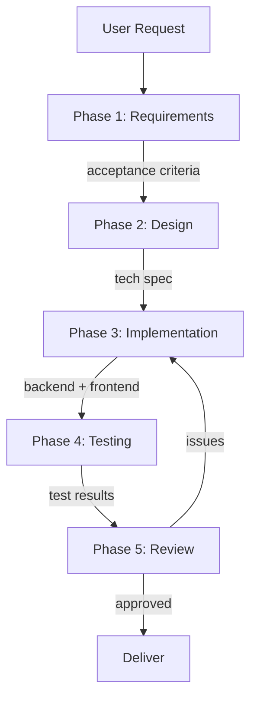

# Scenario: Feature Development

## Trigger

Activate this skill when the user requests implementing a new feature, adding
new capability, or supporting a new use case. Key phrases include "implement a
feature", "add support for", "create a new module", or any request that
involves building new functionality end-to-end.

**Do NOT activate** for: single-file edits, quick fixes (use scenario-bug-fix),
or pure refactoring (use scenario-refactor).

## Pipeline Overview



The pipeline runs 5 phases with 6 subagent delegations. Phases 1-2 are
sequential (each depends on prior output). Phase 3 dispatches two subagents in
parallel. Phases 4-5 are sequential.

## Phase 1: Requirements Clarification

**Delegate to**: `iris` (Requirements Analyst)

**Load skills**: `requirements-analysis`, `acceptance-criteria`, `brainstorming`

**Task prompt template**:
```
Analyze the following feature request and produce:
1. A clear problem statement
2. Functional requirements (numbered, testable)
3. Non-functional requirements (performance, security, compatibility)
4. Acceptance criteria (Given/When/Then format)
5. Explicit list of out-of-scope items
6. Open questions that need user clarification

Feature request: {USER_REQUEST}

If the request is ambiguous, use ask_clarification to resolve before proceeding.
Output a structured requirements document.
```

**Verification gate**: Requirements document exists with at least 3 acceptance
criteria. All open questions resolved.

## Phase 2: Technical Design

**Delegate to**: `atlas` (Architect)

**Load skills**: `technical-design`, `architecture`, `api-design`

**Task prompt template**:
```
Based on the following requirements, design a technical solution:

{PHASE_1_OUTPUT}

Produce:
1. Component diagram showing new and modified modules
2. API contract (if applicable): endpoints, request/response schemas
3. Data model changes (if applicable)
4. Key design decisions and trade-offs
5. Implementation plan: ordered list of tasks, each with estimated complexity
6. Risk assessment: what could go wrong, mitigation strategies

Keep the design minimal — prefer the simplest solution that satisfies all
acceptance criteria. Avoid speculative abstractions.
```

**Verification gate**: Design document covers all functional requirements. No
unanswered design questions. Implementation tasks are ordered and scoped.

## Phase 3: Parallel Implementation

**Two subagents in parallel** (single turn, 2 task calls):

### 3a. Backend Implementation

**Delegate to**: `victor` (Backend Developer)

**Load skills**: `implement`, `test-driven-development`, `vertical-slice-development`

**Task prompt template**:
```
Implement the backend portion of the following design:

{PHASE_2_OUTPUT}

Follow vertical-slice-development: implement one slice at a time, each
slice independently testable. Write unit tests alongside implementation.
Do NOT touch frontend files. Do NOT modify shared config unless the
design explicitly requires it.

Output: summary of files created/modified, and test results.
```

### 3b. Frontend Implementation

**Delegate to**: `finn` (Frontend Developer)

**Load skills**: `frontend-engineering`, `implement`, `frontend-design`

**Task prompt template**:
```
Implement the frontend portion of the following design:

{PHASE_2_OUTPUT}

Follow component-driven design: build reusable, composable components.
Ensure responsive layout and accessibility (ARIA, semantic HTML). Do NOT
touch backend files. If a required API is not yet available, mock it and
note the dependency.

Output: summary of components created/modified, and any mocked APIs.
```

**Verification gate**: Both subagents return success. Backend code compiles and
unit tests pass. Frontend builds without errors. No file conflicts between
the two implementations.

## Phase 4: Testing and Validation

**Delegate to**: `quinn` (Test Engineer)

**Load skills**: `test-driven-development`, `test-writer`, `webapp-testing`

**Task prompt template**:
```
Validate the feature implementation against the acceptance criteria:

{ACCEPTANCE_CRITERIA_FROM_PHASE_1}

Implementation summary:
{PHASE_3_OUTPUTS}

Tasks:
1. Write integration tests covering all acceptance criteria
2. Write edge-case tests (empty input, boundary values, concurrent access)
3. Run the full test suite and report results
4. Identify any gaps between implementation and acceptance criteria
5. For each gap: file a clear bug report with reproduction steps

Do NOT fix bugs yourself — only report them. The orchestrator decides
whether to fix or accept as known limitation.
```

**Verification gate**: All acceptance criteria have corresponding test cases.
Test suite passes (or documented failures with root cause analysis). Coverage
meets project baseline.

## Phase 5: Code Review and Delivery

**Delegate to**: `marcus` (Code Reviewer)

**Load skills**: `code-review`, `pr-review-advanced`, `verification-before-completion`

**Task prompt template**:
```
Review the complete feature implementation:

Design: {PHASE_2_OUTPUT}
Implementation: {PHASE_3_OUTPUTS}
Test results: {PHASE_4_OUTPUT}

Review dimensions:
1. Correctness: logic errors, edge cases, race conditions
2. Security: input validation, auth bypass, data leakage
3. Maintainability: naming, complexity, coupling
4. Performance: N+1 queries, unnecessary allocations, hot-path overhead
5. Test coverage: are critical paths covered?

Output a structured review:
- BLOCKER: must fix before merge (with specific file:line and fix suggestion)
- SUGGESTION: recommended improvements (optional)
- QUESTION: items needing author clarification

If no BLOCKERs: approve the feature for delivery.
```

**Verification gate**: No unresolved BLOCKER items. Feature is approved.

## Completion Criteria

The scenario is complete when ALL of the following hold:
- Phase 1 output has resolved acceptance criteria
- Phase 2 output covers all functional requirements
- Phase 3 code compiles and passes unit tests (both backend and frontend)
- Phase 4 tests pass for all acceptance criteria
- Phase 5 review has zero BLOCKERs
- All changes are committed

## Boundary

Do NOT use this scenario when:
- The task is a bug fix (use scenario-bug-fix)
- The task is pure refactoring with no new functionality (use scenario-refactor)
- The task is a single-file edit or trivial change (execute directly)
- The project does not exist yet (use scenario-project-bootstrap)

## Parallel Dispatch Notes

- Phase 3 dispatches 2 subagents in a single turn (within the 3-per-turn limit)
- Total subagent calls: 6 (within the 6-per-run limit)
- If the feature is backend-only or frontend-only, skip the unused parallel
  task in Phase 3 — total drops to 5 calls
- If Phase 5 review finds BLOCKERs, loop back to Phase 3 with focused fix
  prompts — but track the additional task calls against the run budget
