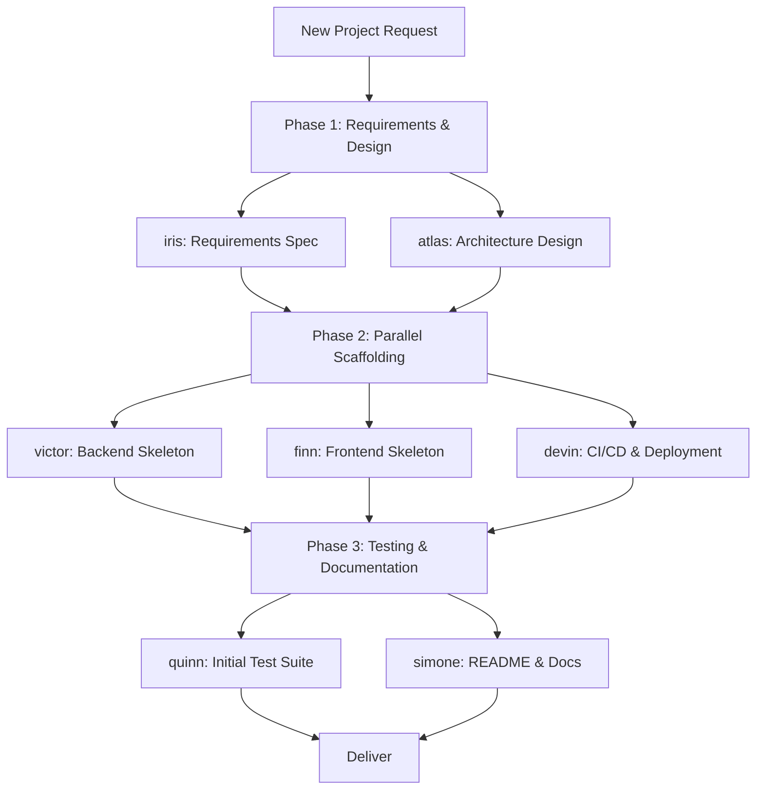

# Scenario: New Project Bootstrap

## Trigger

Activate this skill when the user wants to create a new project, scaffold
an application, or initialize a new service. Key phrases include "create a
new project", "scaffold an app", "initialize a service", "set up a new
repository", or any request that starts from an empty directory.

**Do NOT activate** for: adding features to an existing project (use
scenario-feature-development), or exploring an existing codebase (use
nova subagent directly).

## Pipeline Overview



The pipeline runs 3 phases with 7 subagent delegations. Phase 1 dispatches
2 subagents in parallel. Phase 2 dispatches 3 subagents in parallel. Phase
3 dispatches 2 subagents in parallel.

> **Engine budget note**: 7 delegations exceed the 6-per-run limit. Split
> Phase 3 into a second turn or merge one task (e.g., assign quinn to also
> draft a minimal README if simone is skipped). See Parallel Dispatch Notes.

## Phase 1: Requirements and Design

**Two subagents in parallel** (single turn, 2 task calls):

### 1a. Requirements Specification

**Delegate to**: `iris` (Requirements Analyst)

**Load skills**: `requirements-analysis`, `product-spec`, `acceptance-criteria`

**Task prompt template**:
```
Define the product specification for a new project:

{USER_PROJECT_DESCRIPTION}

Produce:
1. Product vision: one-paragraph description of what this project is and
   why it exists
2. Core features: the minimum viable feature set (MVP) — number each
3. Non-functional requirements: tech stack preferences, performance targets,
   scalability expectations
4. User stories: "As a [role], I want [action] so that [benefit]" for each
   core feature
5. Acceptance criteria: Given/When/Then for each user story
6. Out of scope: what this project is NOT (at least for v1)
7. Open questions for the user

Keep the spec lean — this is for an MVP, not a full product roadmap.
```

### 1b. Architecture Design

**Delegate to**: `atlas` (Architect)

**Load skills**: `architecture`, `technical-design`, `project-scaffolding`

**Task prompt template**:
```
Design the technical architecture for a new project:

{USER_PROJECT_DESCRIPTION}

Produce:
1. Tech stack recommendation: language, framework, database, deployment
   platform — with brief justification for each choice
2. Project structure: directory layout following the framework's conventions
   (show the tree)
3. Component diagram: major modules and their relationships (Mermaid)
4. Data model: core entities and their relationships (if applicable)
5. API design: key endpoints or interfaces (if applicable)
6. Infrastructure: build tooling, package manager, environment management
7. Development workflow: how to run locally, run tests, deploy

Design for simplicity. Prefer proven defaults over novel choices.
The architecture must support the MVP features without speculative
generality.
```

**Verification gate**: Both outputs exist. Product spec has at least 3
core features with acceptance criteria. Architecture has a clear project
structure and tech stack. No unresolved blockers between spec and design.

## Phase 2: Parallel Scaffolding

**Three subagents in parallel** (single turn, 3 task calls — maximum per turn):

### 2a. Backend Skeleton

**Delegate to**: `victor` (Backend Developer)

**Load skills**: `environment-setup`, `build-system`, `project-scaffolding`

**Task prompt template**:
```
Scaffold the backend of a new project based on the following design:

{PHASE_1B_ARCHITECTURE}

Tasks:
1. Initialize the project with the chosen language and framework
2. Create the directory structure from the architecture design
3. Set up the entry point (main/server/index file)
4. Configure the build system and dependency management
5. Create placeholder modules for each component in the design
6. Set up environment configuration (.env, config files)
7. Verify the project runs: "hello world" endpoint or equivalent
8. Initialize git repository (if not already done)

Output: project tree, how to run instructions, and verification result.
Do NOT implement business logic — this is skeleton only.
```

### 2b. Frontend Skeleton

**Delegate to**: `finn` (Frontend Developer)

**Load skills**: `frontend-engineering`, `environment-setup`, `build-system`

**Task prompt template**:
```
Scaffold the frontend of a new project based on the following design:

{PHASE_1B_ARCHITECTURE}

Tasks:
1. Initialize the frontend project with the chosen framework
2. Create the directory structure (components, pages, services, utils)
3. Set up the entry point (App/index component)
4. Configure the build system (bundler, dev server)
5. Create placeholder components for key UI areas
6. Set up routing (if applicable)
7. Configure styling approach (CSS modules, Tailwind, styled-components)
8. Verify the frontend dev server starts without errors

Output: project tree, dev server start command, and verification result.
Do NOT implement actual UI components — this is skeleton only.
If the project has no frontend, return "no frontend needed".
```

### 2c. CI/CD and Deployment

**Delegate to**: `devin` (DevOps Engineer)

**Load skills**: `ci-cd`, `release-engineering`, `docker`

**Task prompt template**:
```
Set up CI/CD and deployment infrastructure for a new project:

{PHASE_1B_ARCHITECTURE}

Tasks:
1. Create CI pipeline config (GitHub Actions / GitLab CI / equivalent):
   - Lint check
   - Build step
   - Test step
   - Trigger on push to main + pull requests
2. Create Dockerfile for containerized deployment (if applicable)
3. Create docker-compose.yml for local development (if multi-service)
4. Set up environment variable management (.env.example, secrets guidance)
5. Configure deployment target (staging/production) — documentation only,
   do NOT deploy
6. Add basic health check endpoint or monitoring hook

Output: list of infrastructure files created and deployment instructions.
Do NOT implement business logic or actual deployment — this is setup only.
```

**Verification gate**: All three subagents return success. Backend project
runs (local server starts). Frontend dev server starts. CI config is valid
syntax. Project tree is coherent across all three outputs.

## Phase 3: Testing and Documentation

**Two subagents in parallel** (single turn, 2 task calls):

### 3a. Initial Test Suite

**Delegate to**: `quinn` (Test Engineer)

**Load skills**: `test-driven-development`, `test-writer`, `test-framework-setup`

**Task prompt template**:
```
Set up the testing infrastructure and write initial tests for the new project:

Project structure: {PHASE_2_OUTPUTS}

Tasks:
1. Configure the test framework for the chosen tech stack
2. Create a test directory structure mirroring the source structure
3. Write smoke tests verifying the project boots correctly
4. Write placeholder unit tests for each core module (test that the module
   exports/loads correctly)
5. Configure test runner in the build system (npm scripts, Makefile, etc.)
6. Verify all tests pass
7. Add test coverage reporting if supported by the framework

Output: test structure, test runner command, and test results.
This establishes the testing pattern for future feature development.
```

### 3b. README and Documentation

**Delegate to**: `simone` (Technical Writer)

**Load skills**: `docs`, `readme-writing`, `api-documentation`

**Task prompt template**:
```
Create comprehensive documentation for the new project:

Project: {USER_PROJECT_DESCRIPTION}
Architecture: {PHASE_1B_ARCHITECTURE}
Structure: {PHASE_2_OUTPUTS}

Tasks:
1. Write README.md with:
   - Project name and one-paragraph description
   - Prerequisites (language version, tools, dependencies)
   - Quick start (clone, install, run)
   - Development workflow (run tests, build, lint)
   - Project structure overview
   - Contributing guidelines (brief)
2. Create docs/ directory with:
   - architecture.md (from atlas's design)
   - development.md (setup, conventions, workflow)
3. Add inline README or doc files in each major module directory
4. Add LICENSE file if specified

Output: list of documentation files created with brief descriptions.
```

**Verification gate**: Test suite is set up and passes. README.md exists
with quick-start instructions. Documentation covers setup, architecture,
and development workflow.

## Completion Criteria

The scenario is complete when ALL of the following hold:
- Product spec and architecture design are documented
- Backend project runs locally (boot verification passes)
- Frontend dev server starts (or explicitly "no frontend needed")
- CI pipeline config is syntactically valid and covers lint/build/test
- Initial test suite passes
- README.md exists with working quick-start instructions
- Project is a valid git repository with initial commit

## Boundary

Do NOT use this scenario when:
- The project already exists and needs features (use scenario-feature-development)
- The task is a single configuration change to an existing project (execute directly)
- The user wants to explore existing code (dispatch nova directly)
- The project requires proprietary or non-standard tooling not supported by any subagent

## Parallel Dispatch Notes

- Phase 1: 2 parallel tasks (within 3-per-turn limit)
- Phase 2: 3 parallel tasks (maximum per turn)
- Phase 3: 2 parallel tasks (within 3-per-turn limit)
- **Budget warning**: 7 total delegations exceed the 6-per-run limit. Options:
  a) **Recommended**: Merge Phase 3 into Phase 2 — have victor/finn set up
     their own smoke tests (removes quinn, total = 6)
  b) Split Phase 3 across two turns (Phase 3a in turn 3, Phase 3b in turn 4)
  c) Skip simone and have the orchestrator write the README from Phase 1/2
     outputs (total = 6)
- If backend and frontend are the same codebase (e.g., Next.js full-stack),
  merge 2a and 2b into a single task (total drops to 6)
