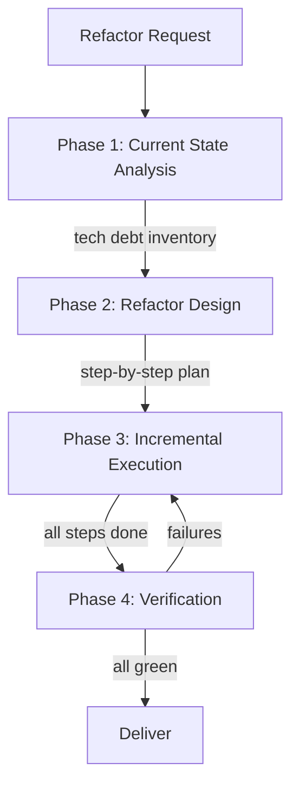

# Scenario: Safe Incremental Refactor

## Trigger

Activate this skill when the user requests restructuring existing code
without changing its behavior. Key phrases include "refactor", "improve
code structure", "clean up", "eliminate technical debt", "modernize",
"decouple", or any request focused on improving code quality while
preserving functionality.

**Do NOT activate** for: bug fixes (use scenario-bug-fix), new features
(use scenario-feature-development), or rewriting from scratch (use
scenario-project-bootstrap).

## Pipeline Overview



The pipeline runs 4 phases with 4 subagent delegations. All phases are
strictly sequential — each depends on the prior phase's output.

## Phase 1: Current State Analysis

**Delegate to**: `nova` (Code Explorer)

**Load skills**: `codebase-analysis`, `code-review`, `code-smells`

**Task prompt template**:
```
Analyze the codebase to establish a baseline for refactoring:

Target: {TARGET_MODULE_OR_AREA}

Tasks:
1. Map the current structure: list all files, classes, and key functions
   in the target area. Note their responsibilities and dependencies.
2. Identify code smells: duplication, long methods, large classes, deep
   nesting, feature envy, shotgun surgery, dead code, god objects.
3. Assess test coverage: what tests exist? Are they reliable? This is
   critical — safe refactoring requires a safety net.
4. Identify coupling points: external callers, shared state, cross-module
   dependencies that constrain refactoring.
5. Rank issues by impact: which problems cause the most pain (bugs, slow
   development, hard to understand)?

Output a technical debt inventory:
- Area (file/module)
- Issue (code smell category + specific description)
- Impact (severity: high/medium/low)
- Current test coverage (adequate / partial / none)
- Refactoring constraint (what makes this hard to change)
```

**Verification gate**: Technical debt inventory is complete. Target area is
fully mapped. Test coverage baseline is established.

## Phase 2: Refactor Design

**Delegate to**: `atlas` (Architect)

**Load skills**: `architecture`, `technical-design`, `refactoring-patterns`

**Task prompt template**:
```
Design an incremental refactoring plan based on the following analysis:

{PHASE_1_TECH_DEBT_INVENTORY}

Design principles:
- Behavior preservation: each step MUST leave the code fully functional.
  No "big bang" rewrites.
- Test-driven: each step must be verifiable by existing or new tests.
  If current tests are inadequate, the FIRST step is to add tests.
- Minimal steps: prefer the smallest change that moves toward the goal.
- Reversible: each step should be independently revertable via git.

Produce a refactoring plan as an ordered list of steps:
For each step:
1. Step name and objective (one sentence)
2. Files affected (list)
3. Specific changes (what to extract, rename, move, split)
4. Verification method (which tests to run, what to check)
5. Risk level (low/medium/high) and rollback strategy
6. Dependency: does this step require a prior step to be complete?

Order steps from lowest-risk to highest-risk. Group independent steps that
can be verified together. Ensure the plan stays within a single working
session.
```

**Verification gate**: Refactoring plan covers all high-impact issues. Each
step is independently verifiable. Steps are ordered with dependencies clear.

## Phase 3: Incremental Execution

**Delegate to**: `ruby` (Refactoring Specialist)

**Load skills**: `refactoring`, `vertical-slice-development`, `clean-code`

**Task prompt template**:
```
Execute the following refactoring plan step by step:

{PHASE_2_REFACTOR_PLAN}

Execution rules:
- Execute steps in order. Do NOT skip ahead or batch steps.
- After EACH step:
  a) Run the full test suite. All tests must pass.
  b) If tests fail: REVERT the step immediately and report the failure.
     Do NOT attempt to fix tests that break due to refactoring errors.
  c) If tests pass: commit the step with a descriptive message.
- If a step is blocked (unexpected coupling, missing test coverage), STOP
  and report the blocker rather than forcing through.
- Preserve public API contracts unless the plan explicitly modifies them.
- Do NOT add new features or fix bugs — this is pure refactoring.

Output for each step:
- Step number and status (DONE / REVERTED / BLOCKED)
- Files changed
- Test results (pass count / fail count)
- Commit hash (if committed)
- Any deviations from the plan and why
```

**Verification gate**: All planned steps are DONE or explicitly deferred
with justification. Each completed step has a passing test suite and a git
commit. No steps were left in a broken state.

## Phase 4: Verification and Confirmation

**Delegate to**: `quinn` (Test Engineer)

**Load skills**: `test-driven-development`, `verification-before-completion`, `regression-testing`

**Task prompt template**:
```
Verify that the refactoring preserved behavior and improved code quality:

Refactoring plan: {PHASE_2_REFACTOR_PLAN}
Execution log: {PHASE_3_EXECUTION_LOG}

Verification tasks:
1. Run the FULL test suite from the project root. Compare pass/fail counts
   with the pre-refactoring baseline. Any new failure is a regression.
2. Run any integration/end-to-end tests that cover the refactored area.
3. Check for behavioral changes: review the cumulative diff (git diff
   against the pre-refactoring commit). Flag any logic changes that go
   beyond structural refactoring.
4. Verify no public API contracts were broken (unless planned).
5. Assess improvement: did the refactoring address the issues identified
   in Phase 1? Rate improvement for each high-impact issue.

Output:
- PASS / FAIL verdict
- If FAIL: list each regression with file:line and reproduction steps
- Quality assessment: before/after comparison for each tech debt item
- Confidence level: high / medium / low
```

**Verification gate**: Full test suite passes (zero regressions). No
unintended behavioral changes. Technical debt inventory items are resolved
or have documented reasons for partial resolution.

## Completion Criteria

The scenario is complete when ALL of the following hold:
- Phase 1 inventory identifies and ranks all technical debt in the target area
- Phase 2 plan covers all high-impact items with verifiable steps
- Phase 3 execution completes all steps (or defers with justification)
- Phase 4 verification confirms zero regressions
- Each refactoring step has a dedicated commit for easy rollback
- Public API contracts are preserved (or explicitly updated in the plan)

## Boundary

Do NOT use this scenario when:
- The code has no tests and adding tests is not desired (refactoring without
  tests is unsafe — warn the user instead)
- The task changes behavior (use scenario-feature-development or scenario-bug-fix)
- The entire codebase is being rewritten from scratch (use scenario-project-bootstrap)
- Only a single function needs renaming (execute directly without pipeline)
- The refactoring spans multiple independent modules (run separate instances
  per module or split into sequential scenarios)

## Parallel Dispatch Notes

- All 4 phases are sequential — no parallel dispatch
- Total subagent calls: 4 (within the 6-per-run limit)
- If Phase 3 encounters blockers, loop back to Phase 2 for replanning —
  track additional calls against budget
- For large refactors exceeding 6 steps: consider splitting into multiple
  scenario instances, each handling a subset of the plan
- Phase 3 and Phase 4 can optionally be combined for small refactors (single
  subagent that executes and verifies) — but separation is preferred for safety
