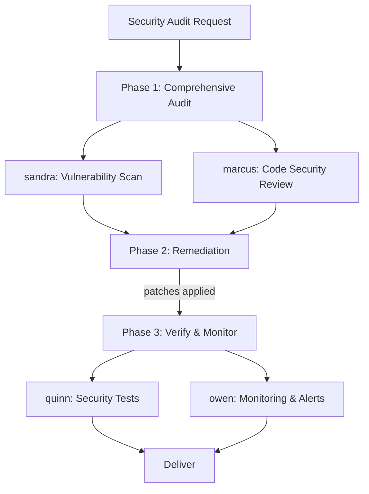

# Scenario: Security Audit and Hardening

## Trigger

Activate this skill when the user requests a security review, vulnerability
assessment, security hardening, or compliance check. Key phrases include
"security audit", "check for vulnerabilities", "security review",
"harden the application", "OWASP check", or any request focused on
identifying and fixing security issues.

**Do NOT activate** for: general code review without security focus (use
scenario-code-review), or implementing a specific security feature like
authentication (use scenario-feature-development).

## Pipeline Overview



The pipeline runs 3 phases with 5 subagent delegations. Phase 1 dispatches
2 subagents in parallel. Phase 2 is a single subagent. Phase 3 dispatches
2 subagents in parallel.

## Phase 1: Comprehensive Security Audit

**Two subagents in parallel** (single turn, 2 task calls):

### 1a. Vulnerability and Dependency Scan

**Delegate to**: `sandra` (Security Specialist)

**Load skills**: `security-review`, `security-hardening`, `dependency-scanning`

**Task prompt template**:
```
Perform a comprehensive security scan of the codebase:

{CODEBASE_CONTEXT}

Scan dimensions:
1. OWASP Top 10 systematic check:
   - A01 Broken Access Control
   - A02 Cryptographic Failures
   - A03 Injection (SQL, NoSQL, command, LDAP, XSS)
   - A04 Insecure Design
   - A05 Security Misconfiguration
   - A06 Vulnerable Components (dependency CVEs)
   - A07 Authentication Failures
   - A08 Software/Data Integrity Failures
   - A09 Logging/Monitoring Failures
   - A10 Server-Side Request Forgery
2. Dependency vulnerabilities: scan all package files (package.json,
   requirements.txt, go.mod, etc.) against known CVE databases
3. Secret detection: hardcoded API keys, passwords, tokens, certificates
4. Configuration audit: CORS, CSP, TLS, headers, cookie settings
5. Infrastructure: Docker, cloud configs, IAM policies (if present)

For each finding, report:
- Severity: CRITICAL / HIGH / MEDIUM / LOW
- Category: OWASP category or other
- Location: file:line or config section
- Description: what the vulnerability is and how it can be exploited
- Evidence: the actual code or config snippet
- Remediation: specific fix recommendation
```

### 1b. Code-Level Security Review

**Delegate to**: `marcus` (Code Reviewer)

**Load skills**: `code-review`, `security-review`, `secure-coding`

**Task prompt template**:
```
Review the codebase for security issues at the implementation level:

{CODEBASE_CONTEXT}

Focus on:
1. Input validation: all external inputs validated and sanitized?
2. Output encoding: data properly escaped before rendering (XSS)?
3. Authentication/authorization: session management, token handling,
   permission checks on every protected route
4. Data handling: sensitive data in memory, logs, error messages, or
   database stored insecurely?
5. Error handling: do error messages leak sensitive info (stack traces,
   internal paths)?
6. Race conditions and TOCTOU in security-critical paths
7. Unsafe deserialization, eval, or dynamic code execution
8. File operations: path traversal, file upload handling

For each finding, report:
- Severity: CRITICAL / HIGH / MEDIUM / LOW
- Location: file:line
- Description and attack scenario
- Code fix recommendation (specific change needed)
```

**Verification gate**: Both audit reports are complete. All findings are
consolidated and sorted by severity. Each CRITICAL and HIGH finding has a
specific remediation recommendation.

## Phase 2: Prioritized Remediation

**Delegate to**: `victor` (Backend Developer)

**Load skills**: `patch-authoring`, `security-hardening`, `error-handling`

**Task prompt template**:
```
Fix all security vulnerabilities identified in the audit, prioritized by
severity:

{CONSOLIDATED_AUDIT_FINDINGS}

Remediation rules:
1. Fix CRITICAL issues first — these are actively exploitable.
2. Fix HIGH issues next — likely exploitable.
3. Fix MEDIUM issues if budget allows.
4. Document LOW issues for future consideration (do NOT fix in this pass).
5. For each fix:
   a) Implement the minimal change that resolves the vulnerability
   b) Ensure the fix does not break existing functionality
   c) Run the test suite to verify no regression
   d) Note any fix that changes public API behavior
6. If a CRITICAL issue requires architectural changes, document the
   required change and implement a temporary mitigation instead.
7. For dependency vulnerabilities: upgrade to the patched version. If
   breaking changes exist, pin to the lowest safe version and document
   the upgrade path.

Output for each fix:
- Finding ID and severity
- Files changed (file:line)
- Fix description (what changed and why it resolves the vulnerability)
- Test results after the fix
- Any residual risk or follow-up needed
```

**Verification gate**: All CRITICAL and HIGH issues are fixed. Test suite
passes. Each fix has a documented change description. Remaining MEDIUM/LOW
issues are listed for future work.

## Phase 3: Verification and Monitoring

**Two subagents in parallel** (single turn, 2 task calls):

### 3a. Security Test Verification

**Delegate to**: `quinn` (Test Engineer)

**Load skills**: `test-driven-development`, `security-testing`, `verification-before-completion`

**Task prompt template**:
```
Verify that security fixes are effective and add regression protection:

Audit findings: {CONSOLIDATED_AUDIT_FINDINGS}
Fixes applied: {PHASE_2_REMEDIATION_LOG}

Tasks:
1. For each CRITICAL/HIGH fix, write a test that:
   a) Reproduces the original vulnerability (fails without the fix)
   b) Passes with the fix applied
2. Run the full existing test suite — all must pass
3. Run any security-specific tests (SAST, dependency scan) if configured
4. Verify no new vulnerabilities were introduced by the fixes
5. Check for incomplete fixes: did any remediation introduce a new attack
   surface?

Output:
- Test coverage for each security fix (verified / untested)
- Full test suite results
- Any residual security concerns detected during testing
- Overall security posture: IMPROVED / PARTIAL / INSUFFICIENT
```

### 3b. Monitoring and Alerting Configuration

**Delegate to**: `owen` (Observability Engineer)

**Load skills**: `observability`, `monitoring`, `alerting`

**Task prompt template**:
```
Configure security monitoring and alerting for the codebase:

Security findings: {CONSOLIDATED_AUDIT_FINDINGS}
Fixes applied: {PHASE_2_REMEDIATION_LOG}

Tasks:
1. Set up logging for security-critical events:
   - Authentication failures (brute force detection)
   - Authorization denials (privilege escalation attempts)
   - Input validation failures (injection attempts)
   - Rate limit triggers
2. Configure alerts for:
   - Abnormal error rates in security-critical endpoints
   - Suspicious request patterns ( scanners, SQLi probes)
   - Dependency vulnerability notifications (Dependabot/Snyk equivalent)
3. Document the security monitoring runbook:
   - What events to watch
   - Alert thresholds
   - Incident response procedure (first 15 minutes)
4. If the project has no monitoring infrastructure, document the
   recommended setup (tooling, config) without implementing it.

Output: monitoring configuration files, alert rules, and runbook document.
```

**Verification gate**: Security tests pass for all fixes. No regressions.
Monitoring configuration is documented or implemented. Security posture is
rated IMPROVED or better.

## Completion Criteria

The scenario is complete when ALL of the following hold:
- All CRITICAL and HIGH vulnerabilities are fixed and verified
- Security regression tests exist for each fixed CRITICAL/HIGH issue
- Full test suite passes with zero regressions
- Security monitoring recommendations or configuration is documented
- Remaining MEDIUM/LOW issues are listed with remediation plan
- Audit report and fix log are available to the user

## Boundary

Do NOT use this scenario when:
- The task is implementing a security feature (use scenario-feature-development)
- A quick dependency upgrade is needed (dispatch victor directly)
- The user wants a compliance-specific audit (e.g., SOC2, PCI-DSS) — this
  scenario covers OWASP Top 10, not regulatory frameworks
- The codebase has no authentication or sensitive data (report "minimal
  attack surface" and suggest a lighter review)

## Parallel Dispatch Notes

- Phase 1: 2 parallel tasks (within 3-per-turn limit)
- Phase 2: 1 task (sequential by nature — fixes depend on full audit)
- Phase 3: 2 parallel tasks (within 3-per-turn limit)
- Total subagent calls: 5 (within the 6-per-run limit)
- If the codebase is small (single service, no external dependencies), skip
  Phase 1b (code review) — sandra's scan covers most issues — total drops
  to 4
- If monitoring infrastructure does not exist, Phase 3b is documentation-only
  — consider merging into Phase 3a for efficiency
