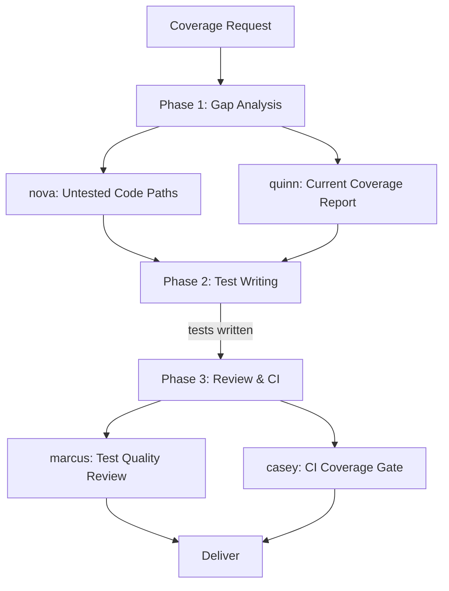

# Scenario: Test Coverage Improvement

## Trigger

Activate this skill when the user wants to improve test coverage, add
missing tests, or strengthen the existing test suite. Key phrases include
"improve test coverage", "add tests", "test coverage is low", "write more
tests", "tests are missing", or any request focused on expanding test
coverage without changing production code.

**Do NOT activate** for: writing tests for a new feature being built (use
scenario-feature-development), or verifying a bug fix (use scenario-bug-fix).

## Pipeline Overview



The pipeline runs 3 phases with 5 subagent delegations. Phase 1 dispatches
2 subagents in parallel. Phase 2 is a single subagent. Phase 3 dispatches
2 subagents in parallel.

## Phase 1: Coverage Gap Analysis

**Two subagents in parallel** (single turn, 2 task calls):

### 1a. Untested Code Path Identification

**Delegate to**: `nova` (Code Explorer)

**Load skills**: `codebase-analysis`, `test-coverage`, `code-review`

**Task prompt template**:
```
Analyze the codebase to identify untested and under-tested code:

Target area: {TARGET_MODULE_OR_ENTIRE_CODEBASE}

Tasks:
1. Map all source files and their public functions/methods/classes
2. Map all existing test files and what they cover
3. Identify gaps:
   - Files with zero test coverage
   - Functions/methods with no corresponding test
   - Branch paths not exercised (error handling, edge cases, conditions)
   - Integration points not tested (API calls, DB queries, external services)
4. Prioritize gaps by risk:
   - HIGH: core business logic with no tests
   - MEDIUM: utility/helper functions with partial tests
   - LOW: trivial getters/setters or framework boilerplate
5. For each gap, note:
   - File and function/method name
   - What behavior should be tested
   - Test difficulty (easy/medium/hard) — based on dependencies and setup

Output a prioritized coverage gap list, ordered by risk.
Do NOT write tests — analysis only.
```

### 1b. Current Coverage Measurement

**Delegate to**: `quinn` (Test Engineer)

**Load skills**: `test-driven-development`, `test-coverage`, `test-runner`

**Task prompt template**:
```
Measure the current test coverage baseline:

Target: {TARGET_MODULE_OR_ENTIRE_CODEBASE}

Tasks:
1. Identify the test framework and coverage tool for this project
2. Run the existing test suite with coverage reporting enabled
3. Capture baseline metrics:
   - Overall line coverage percentage
   - Overall branch coverage percentage
   - Per-file coverage breakdown (top 10 least-covered files)
   - Number of tests, pass/fail count
4. Identify any tests that are skipped, pending, or flaky
5. Assess test quality:
   - Are assertions meaningful or just smoke tests?
   - Are tests isolated or do they share mutable state?
   - Are tests fast enough for a tight feedback loop?

Output a coverage baseline report with:
- Metrics (percentages, counts)
- Per-file breakdown
- Quality assessment (strong / adequate / weak)
- Recommendations for what coverage tooling to configure (if missing)
```

**Verification gate**: Coverage gap list is complete and prioritized.
Baseline metrics are captured. Together these form the work plan for
Phase 2.

## Phase 2: Targeted Test Writing

**Delegate to**: `quinn` (Test Engineer)

**Load skills**: `test-writer`, `test-driven-development`, `webapp-testing`

**Task prompt template**:
```
Write tests to close the coverage gaps identified in Phase 1:

Coverage gaps (priority order): {PHASE_1A_GAP_LIST}
Baseline metrics: {PHASE_1B_BASELINE}

Writing rules:
1. Work through gaps in priority order (HIGH first, then MEDIUM).
2. For each gap, write tests covering:
   - Happy path (normal expected behavior)
   - Edge cases (empty input, boundary values, maximum/minimum)
   - Error paths (invalid input, failure scenarios, exceptions)
   - Integration points (if the function calls external services)
3. Follow existing test conventions in the project:
   - Same test framework, same assertion style, same file naming
   - Place test files in the conventional test directory
4. Each test must have a clear name describing what it verifies
5. Each test must have meaningful assertions — not just "does not throw"
6. Mock external dependencies (DB, HTTP, file system) where appropriate
7. Skip LOW priority gaps if budget is limited — document them as remaining

After writing all tests, run the full suite and report:
- New coverage metrics (compare with Phase 1 baseline)
- Number of tests added
- Any tests that fail or are flaky
- Remaining gaps (LOW priority, skipped)
```

**Verification gate**: Coverage has measurably increased. All HIGH priority
gaps have corresponding tests. Test suite passes. New coverage percentage
meets or exceeds the target.

## Phase 3: Review and CI Integration

**Two subagents in parallel** (single turn, 2 task calls):

### 3a. Test Quality Review

**Delegate to**: `marcus` (Code Reviewer)

**Load skills**: `code-review`, `test-quality`, `verification-before-completion`

**Task prompt template**:
```
Review the newly written tests for quality and effectiveness:

Tests added: {PHASE_2_TEST_FILES}
Coverage gaps targeted: {PHASE_1A_GAP_LIST}

Review checklist:
1. Do tests verify correct behavior, or just execution paths?
2. Are assertions specific enough to catch regressions?
3. Are test names descriptive and accurate?
4. Are tests independent (no execution order dependency)?
5. Are mocks appropriate (not over-mocked to the point of testing nothing)?
6. Are edge cases genuinely edge cases, or trivial noise?
7. Do any tests duplicate existing coverage unnecessarily?

Output:
- TEST QUALITY: STRONG / ADEQUATE / WEAK
- Issues found (file:line + specific concern)
- Suggestions for improvement
- Coverage delta confirmation (before vs after)
```

### 3b. CI Coverage Gate Configuration

**Delegate to**: `casey` (CI/CD Engineer)

**Load skills**: `ci-cd`, `test-coverage`, `build-system`

**Task prompt template**:
```
Configure CI pipeline to enforce coverage thresholds and prevent regressions:

Project CI config: {EXISTING_CI_CONFIG}
New coverage baseline: {PHASE_2_NEW_METRICS}

Tasks:
1. Add coverage reporting to the CI test step (if not already present)
2. Configure coverage threshold enforcement:
   - Set the minimum coverage to the new baseline (prevents regression)
   - Fail the build if coverage drops below threshold
3. Add coverage trend reporting (if supported by the CI platform)
4. Configure PR annotations for uncovered lines (if supported)
5. Document the coverage policy:
   - What the threshold is and why
   - How to check coverage locally before pushing
   - What to do if a PR legitimately needs to lower coverage

If the project has no CI pipeline, document the recommended setup.
Output: CI config changes, coverage policy document, and verification that
the pipeline runs successfully.
```

**Verification gate**: Test quality is rated ADEQUATE or higher. CI
coverage gate is configured. Coverage threshold prevents future regressions.

## Completion Criteria

The scenario is complete when ALL of the following hold:
- Coverage baseline is measured and documented
- All HIGH priority gaps have meaningful tests
- Coverage has measurably increased compared to baseline
- Full test suite passes (including new tests)
- Test quality review rates the tests ADEQUATE or higher
- CI pipeline enforces a coverage threshold (or setup is documented)
- Remaining LOW priority gaps are documented for future work

## Boundary

Do NOT use this scenario when:
- Tests are needed for a feature being actively developed (use scenario-
  feature-development Phase 4)
- The user wants to fix a specific bug (use scenario-bug-fix — includes
  regression test)
- The project has no test framework and the user doesn't want one (suggest
  setting up test infrastructure first)
- Only a single function needs a test (dispatch quinn directly)
- The focus is on test performance optimization, not coverage (dispatch vega)

## Parallel Dispatch Notes

- Phase 1: 2 parallel tasks (within 3-per-turn limit)
- Phase 2: 1 task (quinn writes tests — sequential by nature)
- Phase 3: 2 parallel tasks (within 3-per-turn limit)
- Total subagent calls: 5 (within the 6-per-run limit)
- If the project has no coverage tooling, Phase 1b may need to set it up
  first — this could consume more of quinn's time in Phase 2
- If coverage gaps are minimal (few gaps, all LOW priority), skip Phase 2
  entirely and report "coverage is already adequate"
- For very large codebases: scope Phase 1 to specific modules rather than
  the entire codebase to stay within token limits
